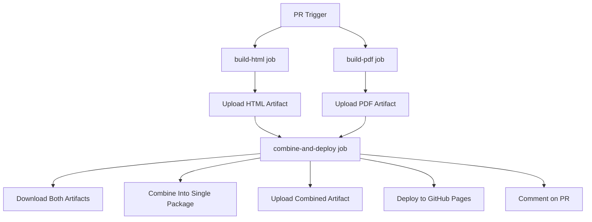

# Combined Documentation Workflow

## Problem Solved

The original CI had two separate workflows:
- `pr-build-docs.yml` (HTML documentation)
- `pr-build-docs-pdf.yml` (PDF documentation)

Both workflows tried to upload artifacts with similar names, but **GitHub Actions v4 no longer allows multiple artifacts with the same name** from different jobs. This caused the second workflow to fail with:

```
Error: Failed to CreateArtifact: Received non-retryable error: Failed request: (409) Conflict: an artifact with this name already exists on the workflow run
```

## Solution: Combined Parallel Workflow

The new `pr-build-docs-combined.yml` workflow solves this by:

1. **Running HTML and PDF builds in parallel** (faster execution)
2. **Using unique artifact names** for each build type:
   - `html-documentation-pr-{PR_NUMBER}`
   - `pdf-documentation-pr-{PR_NUMBER}`
3. **Combining artifacts** in a final deployment job
4. **Single combined artifact** for download: `documentation-pr-{PR_NUMBER}`
5. **Unified GitHub Pages deployment** with both HTML and PDF access

## Architecture



## Benefits

### ✅ **Fixes the Core Issue**
- No more artifact name conflicts
- Both workflows run successfully in parallel
- Faster overall execution (parallel vs sequential)

### 🌐 **Better User Experience**
- Single unified preview site with both HTML and PDF
- Direct PDF downloads from the preview site
- Combined download artifact with everything included
- Comprehensive PR comments with all links

### 🔧 **Maintainability**
- Single workflow file to maintain
- Consistent build environment
- Shared configuration and dependencies
- Better error handling and reporting

## Migration Steps

### 1. Test the New Workflow
The new workflow is in `.github/workflows/pr-build-docs-combined.yml`. Create a test PR to verify it works correctly.

### 2. Update Branch Protection Rules
If you have branch protection rules that require the old workflow checks, update them to require:
- `build-html` (instead of `build-docs`)
- `build-pdf` (instead of `build-docs-pdf`)
- `combine-and-deploy` (new combined deployment step)

### 3. Remove Old Workflows
Once you've confirmed the new workflow works, delete:
- `.github/workflows/pr-build-docs.yml`
- `.github/workflows/pr-build-docs-pdf.yml`

### 4. Update Documentation
Update any references to the old workflow names in documentation.

## New Artifact Structure

### Individual Artifacts (temporary, for processing):
- `html-documentation-pr-{PR_NUMBER}` - HTML documentation only
- `pdf-documentation-pr-{PR_NUMBER}` - PDF documentation only

### Combined Artifact (for download):
- `documentation-pr-{PR_NUMBER}` - Complete package with both HTML and PDF

### Directory Structure:
```
documentation-pr-123/
├── index.html              # Main landing page
├── project1/               # HTML documentation for project1
│   ├── index.html
│   └── ...
├── project2/               # HTML documentation for project2
│   ├── index.html
│   └── ...
└── pdf/                    # PDF documentation folder
    ├── index.html          # PDF download page
    ├── project1.pdf
    └── project2.pdf
```

## Preview Site Structure

The GitHub Pages deployment creates:
- `https://your-org.github.io/your-repo/pr-123/` - Main PR preview
- `https://your-org.github.io/your-repo/pr-123/project1/` - Project 1 HTML docs
- `https://your-org.github.io/your-repo/pr-123/pdf/` - PDF download page
- `https://your-org.github.io/your-repo/pr-123/pdf/project1.pdf` - Direct PDF download

## Troubleshooting

### Build Failures
If either build fails, the entire workflow fails, which is the desired behavior for quality control.

### Artifact Size Limits
GitHub has artifact size limits. If your documentation is very large, consider:
- Using `compression-level: 9` for maximum compression
- Splitting very large projects into separate workflows if needed

### Missing Dependencies
The workflow installs the same dependencies as the original workflows. If you have custom requirements, update the dependency installation steps.

## Configuration

### Concurrency
The workflow uses `pr-docs-combined-{PR_NUMBER}` as the concurrency group to prevent multiple runs for the same PR.

### Retention
Artifacts are retained for 30 days. GitHub Pages deployments persist until the PR is closed.

### Permissions
The workflow requires:
- `contents: read` - To checkout code
- `pull-requests: write` - To comment on PRs
- `pages: write` - To deploy to GitHub Pages
- `id-token: write` - For GitHub Pages authentication

## Customization

### Adding More Build Types
To add additional build types (e.g., EPUB), follow this pattern:
1. Add a new parallel job (e.g., `build-epub`)
2. Use a unique artifact name (e.g., `epub-documentation-pr-{PR_NUMBER}`)
3. Update `combine-and-deploy` to download and include the new artifact
4. Update the preview site structure as needed

### Changing Output Directories
Update the paths in the `collect-artifacts` steps to match your build system's output directories.

### Custom Build Commands
Replace `make all-html` and `make all-pdf` with your custom build commands as needed.