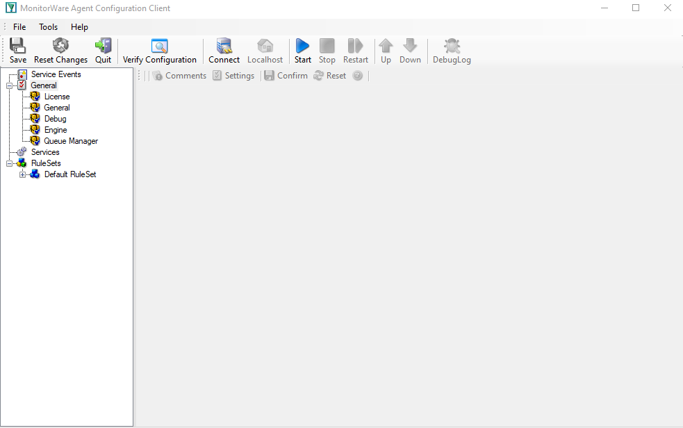

.. _eventreporter-configuring-tree:

Configuring EventReporter
=========================

This page explains how the EventReporter Configuration Client is organized and
how its tree structure maps to the running EventReporter service.

The EventReporter service runs in the background after configuration. The
Configuration Client is the administrative interface you use to define that
configuration.

The tree structure
------------------

The Configuration Client is organized around three main areas:

- **General** for global options and defaults
- **Services** for the active event collection services
- **RuleSets** for filtering and actions

How configuration changes take effect
-------------------------------------

Configuration changes are made in the Configuration Client and then applied so
that the EventReporter service can use them. Until you apply or save the
changes, the running service continues using the previously active
configuration.

Defaults versus instances
-------------------------

Defaults under **General** are templates. They do not collect, filter, or
forward anything by themselves. They only provide default values for new
service and action instances.

Services
--------

Each configured service instance appears under **Services**. For EventReporter,
this usually means one or more Event Log Monitor instances that collect Windows
Event Log data and bind that data to a ruleset.

Rulesets, rules, filters, and actions
-------------------------------------

Each service sends its collected events to the ruleset configured for that
service. Within the ruleset:

- rules are evaluated from top to bottom
- filter conditions decide whether a rule matches
- actions define what happens when the rule matches

The following sections describe the detailed properties of each element.
