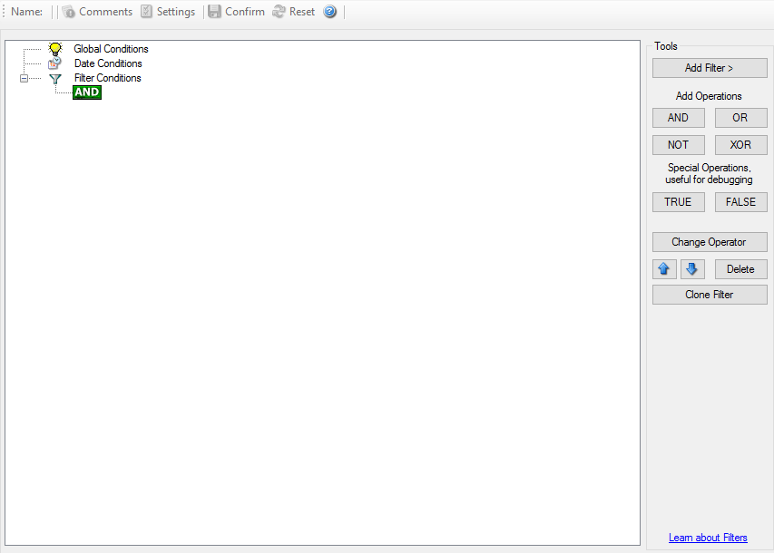

.. index:: Filter Conditions

Filter Conditions
=================

Filter conditions specify **when** a rule should match. If the condition of a
rule evaluates to true, EventReporter executes the actions configured in that
rule.

Why filters matter
------------------

Filters let you reduce noise and react only to the events that matter. Typical
criteria include:

- event log name or channel
- event source
- event ID
- severity or type
- message content
- user or computer context

Important behavior
------------------

- An empty top-level ``AND`` condition evaluates as true.
- That means a rule with no additional filters matches every event that reaches
  it.
- String matching is case-sensitive unless the specific filter documents a
  different behavior.

Example
-------

Use broad filters first, then narrow them until the rule matches exactly what
you intend.

Detailed filter references
--------------------------

.. toctree::
   :maxdepth: 2

   ../mwagentspecific/f-globalconditions
   ../mwagentspecific/f-dateconditions
   ../mwagentspecific/f-operators
   ../mwagentspecific/f-filters

Basic filters
-------------

.. toctree::
   :maxdepth: 1

   ../mwagentspecific/f-general
   ../mwagentspecific/f-datetime
   ../mwagentspecific/f-informationunittype

Event log monitor filters
-------------------------

.. toctree::
   :maxdepth: 1

   ../mwagentspecific/f-eventlogmonitorv1
   ../mwagentspecific/f-eventlogmonitorv2

Custom properties
-----------------

.. toctree::
   :maxdepth: 1

   ../mwagentspecific/f-customproperty
   ../mwagentspecific/f-extendednumberproperty
   ../mwagentspecific/f-extendedipproperty
   ../mwagentspecific/f-fileexists
   ../mwagentspecific/f-storefilterresults
