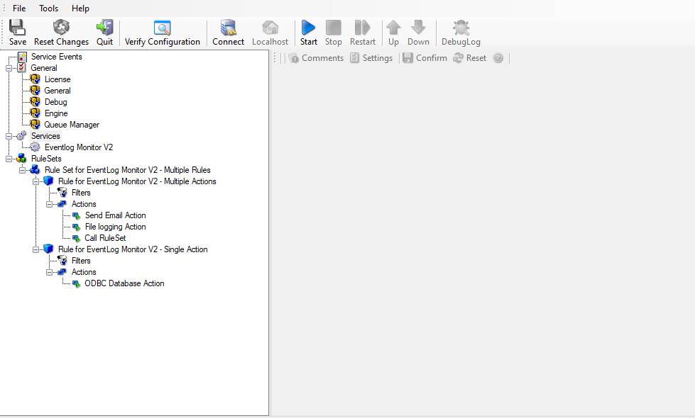

Multiple RuleSets - Rules - Actions
===================================

* Multiple RuleSets, Rules and Actions*

With EventReporter as many "RuleSets", "Rules" and "Actions" as necessary can
be defined.

You can create a separate "RuleSet" for each Service used, or just one "RuleSet"
for all services. RuleSets can also be created to use them with the
:doc:`"callruleset action" <../mwagentspecific/a-callruleset>`.

RuleSets contain one or multiple :doc:`rules <../glossaryofterms/rules>`. All actions and processing carried
out is defined by the rules.

A rule consists of :doc:`filter conditions <../glossaryofterms/mwconcepts-filterconditions>` and 1 to
multiple :doc:`actions <../glossaryofterms/mwconcepts-actions>`.
All actions that have to meet the same filter conditions can be combined in the same rule.
