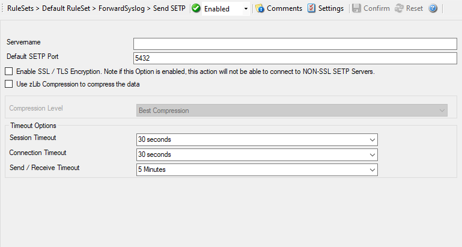

Forward via SETP
================

SETP is Adiscon's protocol for reliably transferring event messages in native
format. It is primarily of use for those that want to build a larger,
centralized event repository. SETP can optionally be SSL-encrypted.

SETP was originally developed for MonitorWare but now it is a key feature added
first in EventReporter 6.2. NT Event Messages can be forwarded using SETP
protocol. Windows Event Log are monitored successfully as well.

Further details can be found here:
:doc:`send setp <../mwagentspecific/a-forwardsetpoptions>`.
