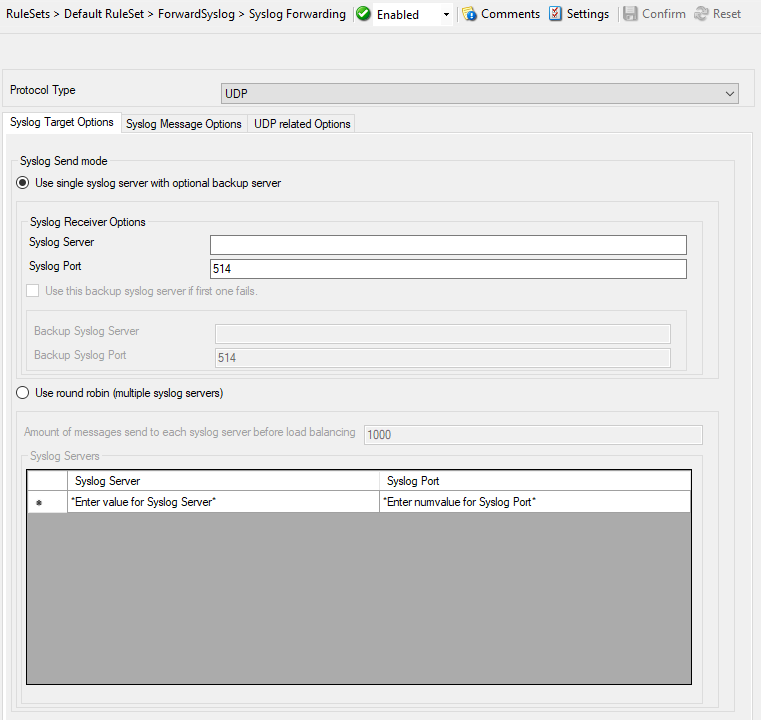
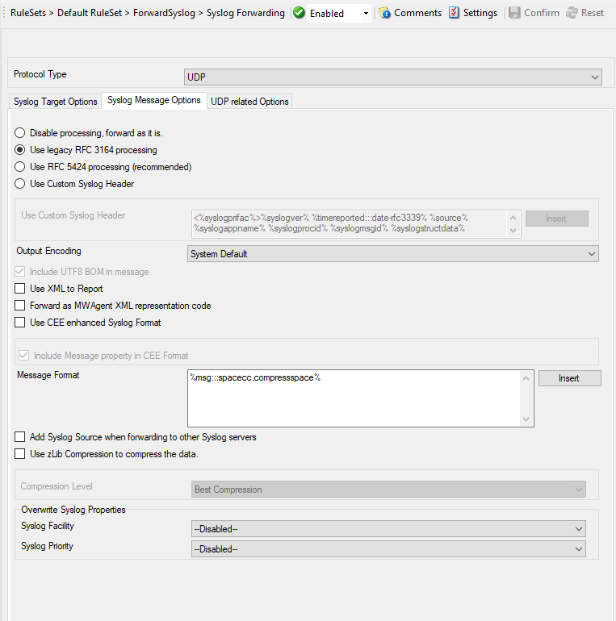
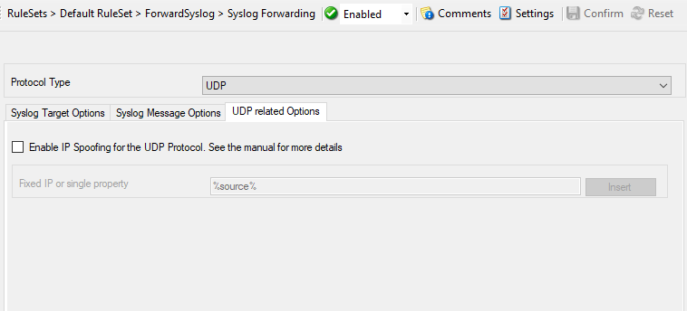

Syslog Forwarding
=================

EventReporter can locally filter events based on the any event log property
(like event id, severity or even partial message content). Flexible boolean
operations and nested conditions are supported. That way, you can discard
messages you are not interested in and alert high-priority message e.g. via
email.

* Syslog Target Options*

* Syslog Message Options*

* UDP related Options*

Further details can be found here:
:doc:`syslog forwarding <../shared/actions/a-forwardsyslogoptions>`.
