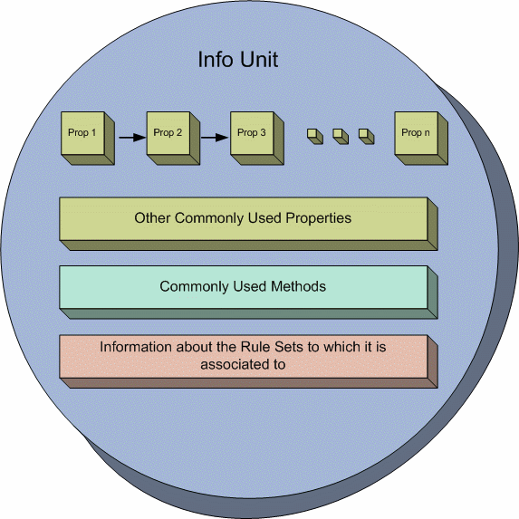
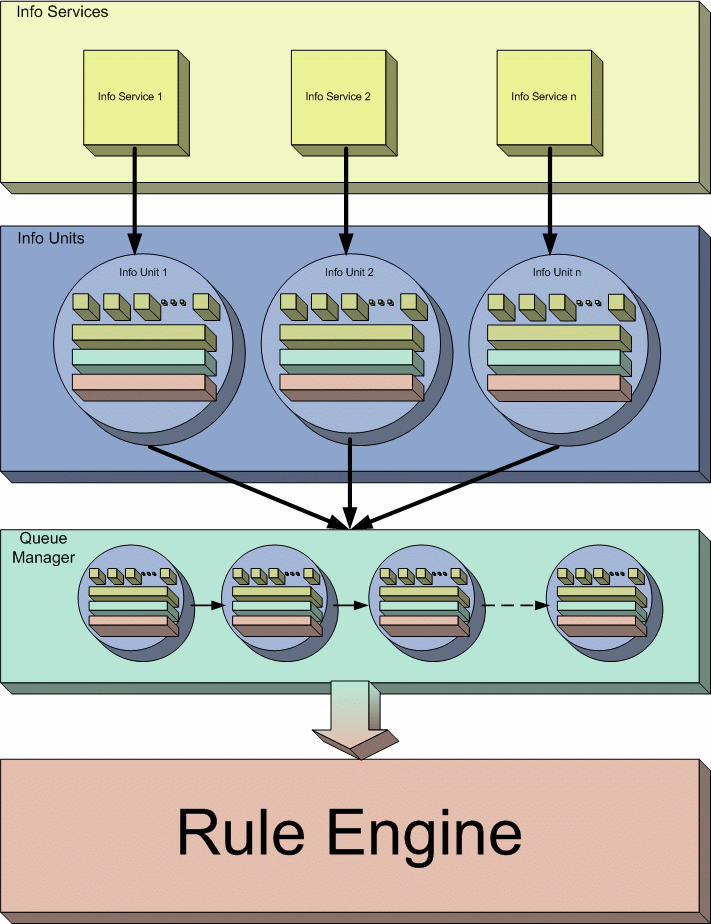
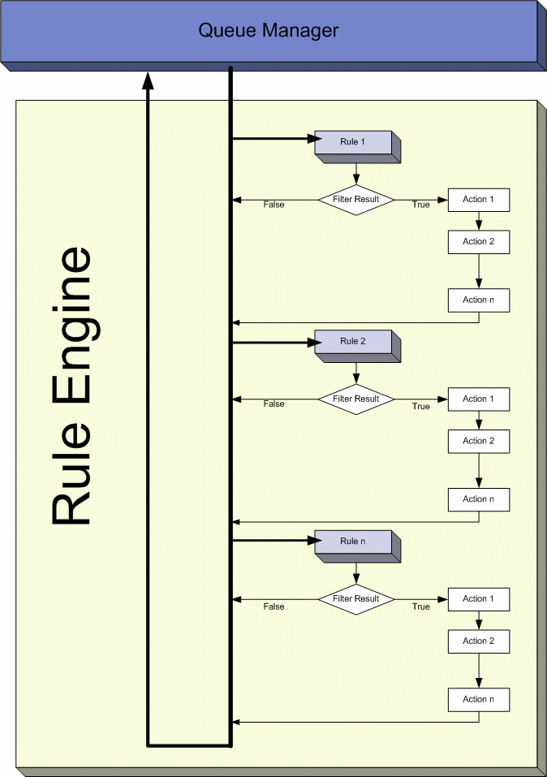

:orphan:

.. index:: Rule Engine

The Rule Engine
===============

Overview
--------

This paper explains you the Rule Engine that is employed in some of the
MonitorWare Line of Products namely MonitorWare Agent, WinSyslog, and
EventReporter 6.0 (and higher)

What is the Rule Engine
-----------------------

Rule Engine is actually an engine present in the above mentioned MonitorWare
Line of Products using which you can define certain filters and the actions
that are to be carried out if the defined filter condition matches with the
real time condition.

Rule Engine revolves around four basic concepts:

* Information Unit
* Information Services
* RuleSets
* Queue Manager

In order to understand the complete Rule Engine, you need to understand the
above mentioned four concepts. The details of these are written below

1. Information Unit (Info Unit)
-------------------------------

"Information Unit" or "Info Unit", as we call it, is the basic building
block of Rule Engine. Info Unit is basically an object that contains all the
information about a specific event which includes:

* Message
* Which application generated this event
* When this event was generated
* Syslog Facility
* Syslog Priority
* Info Unit Type (it tells which Info Service has generated this Info Unit)
* etc

The following figure will give you an idea about an Info Unit:

Figure 1: Conceptual Diagram of an Info Unit

As the figure illustrates, an Info Unit contains most of the properties
(mentioned above in bullets) in the form of a list. In addition to this list,
it also has some commonly used properties separately stored in it (for
efficiency reasons). Apart from the properties, an Info Unit also has some
methods which allow it to write it or to construct itself etc. Information
about the RuleSets (will be explained in the coming sections) is also
contained within each Info Unit so that it exactly knows which rules will be
applied on it.

2. Information Services (Info Service)
--------------------------------------

"Information Services" or "Info Services", as we call them, generate Info
Units. Each Information Service will generate its own Info Units. The important
thing to note over here is that each Info Unit has the same format but can have
different properties and rulesets associated with it. For example, if an
architect makes a building plan then it becomes a template. Now he can use this
template to construct as many buildings as he likes but each one can have
different properties (they can differ in color scheme, window styles etc).
Exactly in the similar way, an Info Unit is actually a template from which each
Info Service makes a specific object of Info Unit that might differ in
properties from another Info Unit object.

Examples of Info Services
-------------------------

There can be a number of different examples on Info Services. Following are
some of the examples:

**1. Syslog server**

It receives the messages that are forwarded to it and for each message (or
event) it generates an Info Unit out of it.

**2. Event Log Monitor**

It picks up the events from the Window's Event Log and for each event it
constructs an Info Unit.

**3. Ping Probe**

It pings a specified device and if doesn't find a response from the other
side, it generates an Info Unit with desired information.

Important Note
--------------

One thing to note about Info Services is that there can a number of different
Services running on the same machine. You can even run the different instances
of the same Info Service (but with different properties naturally). In either
case, each Info Service will generate its own Info Unit.

3. RuleSets
-----------

As the name suggests, a RuleSet is a set of Rules. A "Rule" consists of
the following two things

* Filter Condition
* Actions

You might have noticed that the point 1 written above is singular and point 2
is plural which clearly means that you can define only one Filter condition for
one rule but can define as many actions as you like. The filter condition can
however contain as many Boolean operators as you like.

Filter Condition
----------------

Filter Condition is a combination of different Boolean operators which will
evaluate to a Boolean answer. In simple words, the result of a filter condition
can either be True or False.

Actions
-------

Actions are all those events which are fired when a filter condition evaluates
to a True value. As mentioned above, a Rule can have more than one actions
associated with it which means that if a filter condition evaluates to a true
value then all of the actions associated with that rule will execute. If the
filter condition, on the other hand, evaluates to a false value then all of the
defined actions will be skipped.

Note that other than normal actions, there are three special kinds of Actions
that are worth mentioning here:

* Discard Action (Explained Later)
* Include Action (Explained Later)
* Actions that can alter the contents of Info Units permanently

4. Queue Manager
----------------

Queue Manager simply maintains a queue of all of the Info Units that have been
forwarded to it by different Info Services.

Overall Picture
---------------

This section will explain you that how the different components are related to
each other and how does the whole process work. The picture shown below gives
an idea about how things are working. As you can see that we have four
different stages through which the events are processed.

Info Services picks up the events and convert them into Info Unit. Note that
each Info Service has its own Info Unit. These Info Units are passed to the
Queue Manager. The job of the Queue Manager, as mentioned above and as clear
from the diagram, is to simply make a queue of these Info Units that it has
received from various Info Services. The Rule Engine picks up the Info Units
from this Queue Manager, applies the rules on these Info Units (as mentioned
above, each Info Unit has the information about which rules should be applied
on it) and if necessary carries on the actions. The rule engine keeps on
repeating this process while there are some Info Units present in the Queue.

Manager's Queue

Figure 2: Overall Process

How Does the Rule Engine Work
-----------------------------

Having explained the overall picture of the whole process, let's specifically
talk about Rule Engine. The following figure explains it in detail:

Figure 3: Working of Rule Engine

As you can see in the figure, the Rule Engine picks up Info Units one by one
from the Queue Manager. Since each Info Unit has the information about its Rule
sets, it will apply the rules on it in the same order in which they were
defined. As you can see above, it will pick up the first Rule and evaluates its
Filter Condition. If that Filter Condition is evaluated to false, all the
actions associated with that rule will be skipped and it will pick up the
second Rule. If the Filter Condition, on the other hand, evaluates to True, it
will execute all the actions that are associated with this Rule in the order in
which they were defined. After the execution of all these actions, it will pick
up the next rule in the current ruleset. Once all the rules have been
executed, the current Info Unit (that was handed over to Rule Engine by the
Queue Manager) will be destroyed and the Rule Engine will go to the Queue
Manager to pick up the next Info Unit if there exists one.

The above picture has been drawn for normal flow of executions. There can be 2
conditions when the flow will not follow the diagram shown above. These
conditions arise in response to 2 special kinds of actions that are called
Discard Action and Include Action.

Discard Action
--------------

A Discard Action immediately destroys the current Info Unit and any action of
any Rule that has been defined after the Discard Action will not be executed at
all. Let's take a simple example to clarify it further.

Let's say that Action 2 of Rule 1 in the picture above is a Discard Action.
If the Filter Result of Rule 1 is evaluated to true, then Action 1 will be
executed. As Action 2 is a Discard Action, immediately the current Info Unit
will be destroyed (which means that now the Rule Engine will skip all the Rules
and all the actions associated with them) and the Rule Engine will go back to
the Queue Manager to pick up the next Info Unit in the Queue.

Include Action
--------------

An Include Action simply includes another RuleSet in some existing RuleSet.
When this Action is encountered, the Rule Engine leaves the normal flow and go
to the included ruleset (which may contain many rules as well). It executes
all the rules that have been defined in that included RuleSet. After the
execution of all of them, it will return to its point from where it left the
original flow. Let's take an example to clarify it a little further.

Let's say that the Action 1 or Rule 1 is an include action. If the Filter
Condition result of Rule 1 evaluates to true, it will execute the Action 1.
Since Action 1 is the include action in this example, it will go to the
included ruleset and will execute its Filter Condition. If that filter
condition evaluates to true, it will execute all of its actions and will return
to Action 2 of Rule 1 (of normal flow) and if on the other hand, the filter
condition of the included ruleset evaluates to false, it will skip all of its
actions and will come back to the Action 2 of Rule 1 (of normal flow).

Note that there is no limit on including the rules which means that a rule that
has been included in another rule may contain another rule in it which might
contain another rule in it and so on.

Suggestions for Defining Complex RuleSets
-----------------------------------------

While defining a complex RuleSet, it might be a good idea to follow the stages
defined below.

Edit
Stage # - Actions
Stage 0    - Discard unwanted events
Stage 1    - Post Process
Stage 2    - Discard unwanted events
Stage 3    - All Actions
Stage 4    - Individual Actions

As mentioned above, the rules and actions will be executed in the order in
which you will define them. So it's very important that you define the
actions in a way such that you achieve the desired results as well as achieve
them with efficiency. For example, if you haven't defined any filter which we
call as No Filter (it always evaluates to true) and if the first action that
you have defined is the Discard Action, then there is no meaning of defining
any action after this first action because the first action will always be
executed and it will always discard the complete Info Unit.

Here is the explanation of the above mentioned stages.

Stage 0
-------

In this stage, you can discard those events that you are not interested in. You
can use the Discard Action explained above to discard the events.

Stage 1
-------

In this stage, we recommend to Post Process the incoming Info Units. Once the
Info Unit has been handed over to the Rule Engine from the Queue Manager, you
can actually change the contents of the Info Units to make them more meaningful.

Stage 2
-------

In this stage, you might want to again discard those events that you are not
interested in. Simply use the Discard Action.

Stage 3
-------

In this stage, you will apply the actions that will apply to all of the Info
Units coming (to be more specific, you will apply those rules over here for
which you have selected "No Filter" as the filter condition.

Stage 4
-------

In this stage, you will create the rules for which you have specific filter
conditions.

To sum it up, we recommend doing most generic things first and least generic
things later or in other words, do the generic things first and the specific
things later. Note that this section suggests only the typical scenario but it
can vary from depending upon the needs. For example, you might want to perform
some actions on some specific events after stage 1 and before stage 2.
