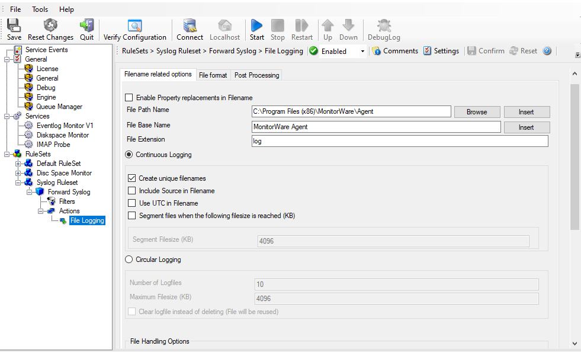
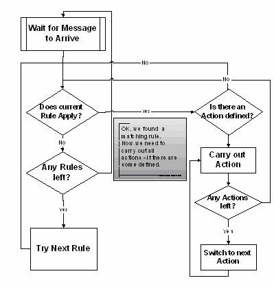

:orphan:

.. _glossary-rules:
.. supporting-labels-marker

.. index:: Rules

Rules
=====

Rules are the workhorse of the MonitorWare Agent. All actions and processing
carried out is configured by the rules defined. Rules are configured by the
client and processed by the so-called "rule engine" inside the MonitorWare
Agent service.

You might already know something similar to the MonitorWare Agent rule engine.
Rule engines and rule bases are an extremely powerful tool and in widespread
use in the industry. Examples of rule bases can be found at Checkpoint's
Firewall One Firewall Rule Base or Cisco Routing filter - just to name a few.

The rule base consists of the rules as configured in the client. The rule
engine is the process carrying out the rules. A rule base can contain no, one
or an unlimited number or rules. However, if there is no rule at all defined,
no action will ever be carried out by the agent. Consequently, the client will
issue a warning message in this case.

A rule has a description, associated match conditions, and actions. The match
conditions are called "filter conditions". These specify when a rule is to be
carried out. Again, there can be no, one, or many filter conditions for a single
rule. If there are no filter conditions, the rule will always match. This is
useful in many cases. If there is more than one filter condition, all filter
conditions need to match in order for the rule to match (logical AND).

Actions associated with a rule specify what to do when the associated rule
matches (and only the associated rule). Actions carry out the actual processing
of messages. For example, actions include logging a message to a flat file or
database, sending it via email or forwarding it to syslog daemon or another
MonitorWare Agent. There can be no, one, or an unlimited number of actions
associated with a rule. However, if no action is associated, the rule will not
have any effect. Consequently, the client will issue a warning when writing the
rule base. Rules without actions can be useful to temporarily disable a rule
with complex filter condition. If there are multiple actions, they are not
guaranteed to be carried out in any specific order. If you definitely need an
action to be carried out before another one, you currently need to define two
rules.

Actions can be modified with action modifiers. These are the strings attached
to a specific action. Action modifiers allow customizing a specific behavior of
this action. It modifies only this action and only this one, other actions of
the same type are not affected - regardless if the appear in the same rule or a
very different one. The use of the action modifier depends on the type of
action. For example, with syslog forwarding it is the host the syslog message
is to be forwarded to. With ODBC database logging it is the DSN and so on. If
there is no action modifier, the values configured in the client's
configuration tabs will be used. They are also used for all values that cannot
be modified via the action modifier (e.g. the SMTP server address for email
forwarding).

Below find a screenshot of a rule base with a number of rules, filter
conditions and action modifiers:

Sample Rule Base

Now that we know the elements, how are rules being processed. It is easy. Rules
are strictly processed from top to bottom, or from number one to the last one.
For each rule the filter conditions are checked to see if they match. If they
do, all associated actions are carried out. Then, the rule engine advances to
the next configured rule. Once again, it checks if it matches and - if it does
- carries out the actions associated with that rule. Then the next rule is

processed and so on. The rule engine stops when there are no more rules to be
evaluated. It also stops if a rule contains a "discard" action.

The "discard action" is a very special and powerful action. It does not
actually carry out any processing. In fact, it disables all further processing
for a message as soon as it is found by the rule engine. So what is the discard
action good for? It is used to handle common situations where a number of well
know messages - unimportant messages - should be filtered out so that the other
rules do not need to take care of these messages. In many other products using
rules bases, this is called the "block rule". Please note that with Adiscon's
rule engine, there can be multiple block rules at multiple layers of the rule
base giving you additional flexibility.

One last thing to mention: the rule base is applied to every message arriving
at the MonitorWare Agent. By design, there is no way to modify the behavior of
the rule base for the next message to be arrived. This ensures an always
consistent processing of incoming messages. However, there can be multiple rule
bases. Each rule base is associated with a service. Only the rule base
associated with the service generating the message will be processed.

While building and testing your rule base, please keep in mind that the
MonitorWare Agent service needs to be restarted to load a modified rule base.
The reason is that the service does not re-read the rule base to save system
resources.

There is an online seminar available on the rule engine and its processing. If
you are interested in a more in-depth view, you might want to visit it at
:doc:`rule engine <../glossaryofterms/ruleengine>`.

Rule Engine Flowchart

For those interested in more in-depth information on how the rule engine works,
this flowchart might be helpful:

There is an online seminar available on the rule engine and its processing. If
you are interested in a more in-depth view, you might want to visit it at
:doc:`rule engine <../glossaryofterms/ruleengine>`.
