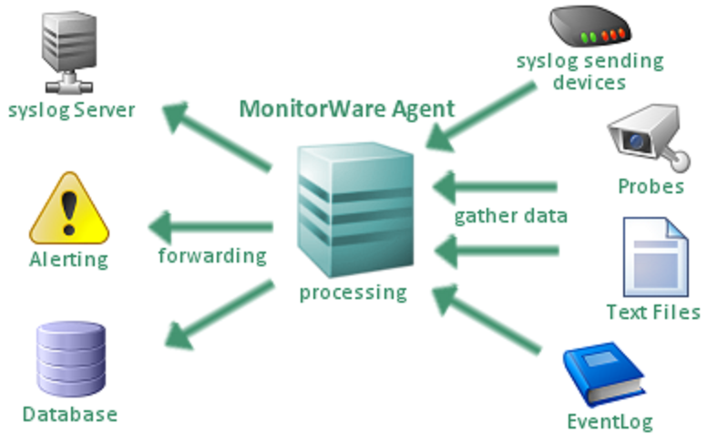

.. Configuration Program documentation master file, created by
   sphinx-quickstart on Fri Jul 26 10:43:58 2019.
   You can adapt this file completely to your liking, but it should at least
   contain the root `toctree` directive.

About MonitorWare Agent
=======================

MonitorWare is an Adiscon product line for **network monitoring**,
**management**, and **analysis**. We designed MonitorWare to meet the needs of small to mid-sized enterprises. These businesses often have critical

network security requirements but limited resources for security solutions.

MonitorWare Agent is the ideal solution if you want to centralize your
monitoring needs. It offers all the capabilities of
`WinSyslog <https://www.WinSyslog.com/>`_ and
`EventReporter <https://www.EventReporter.com/>`_ , plus many of its own
proven features. MonitorWare Agent uses the reliable
`SETP protocol <https://www.mwagent.com/files/manual/current/glossaryofterms/setp.html>`_
for event transmission and supports remote device monitoring. The **Secure
Event Transfer Protocol (SETP)** was developed by Adiscon specifically for
the reliable and secure transmission of event data. It ensures your valuable
log data arrives safely and completely, even under challenging network
conditions. SETP is designed to handle network interruptions and ensure
data integrity, making it a robust choice for critical logging environments.

MonitorWare Agent simplifies the work of various professionals:

* **Network Administrators/Planners:**
   Receive real-time notifications for network issues or unusual traffic to
   proactively prevent bottlenecks and outages.
* **Desktop Support Staff:**
   Quickly identify and resolve end-device errors through centralized event
   logs, accelerating troubleshooting.
* **System Analysts:**
   Analyze detailed log data to review system performance, security incidents,
   and compliance requirements.
* **System Administrators:**
   Automate server and application monitoring and receive alerts for critical
   events to ensure system stability.
* **Internet Managers:**
   Monitor web server access and security events to quickly detect potential
   attacks or misconfigurations.
* **Technical Support Staff:**
   Access comprehensive logs to efficiently diagnose user problems and provide
   solutions.

MonitorWare Agent runs on the systems you want to monitor and provides core
functionality. It can gather data from various sources, such as Windows
event logs, routers, switches, and firewalls. The tool enables highly
flexible and powerful local filtering and processing of these collected
events. Based on a robust :doc:`rule engine <../glossaryofterms/ruleengine>`, the system administrator
can forward, process, or discard events. Even a standalone MonitorWare Agent
plays a crucial role in network management. Here are some examples of
standalone use cases:

* **Single File Server:**
   Monitor access to critical files and folders to immediately detect and
   report unauthorized access or deletions.
* **Important Web Server:**
   Generate automated email or SMS notifications if specific HTTP error codes
   (e.g., 404, 500) exceed a predefined frequency, allowing for immediate
   problem response.
* **Sensitive Workstation:**
   Capture and filter events related to the installation of new software or
   hardware, sending reports to administrators for review.
* **Test Environment:**
   Collect detailed logs for debugging and performance analysis without
   requiring a central infrastructure.

In larger environments, you consolidate MonitorWare Agent data in a central
:doc:`repository <../glossaryofterms/repository>`, such as the MonitorWare event :doc:`database <../glossaryofterms/database>` or
combined log files. The :doc:`database <../glossaryofterms/database>` is the information source for all
reporting and analysis modules of the MonitorWare system. By default, you
can create the :doc:`database <../glossaryofterms/database>` with MySQL, Microsoft Access, or Microsoft
SQL Server (also available as the cost-free MSDE). Since we use standard SQL
and support both OLEDB and ODBC drivers, you can easily adapt MonitorWare to any :doc:`database <../glossaryofterms/database>` system
that provides compatible drivers. This includes Oracle, PostgreSQL, and many other database systems.

Data Flow in the MonitorWare Agent System
-----------------------------------------

The data flow within the MonitorWare Agent System is designed to efficiently
manage events from the source to central storage and analysis. The following
diagram illustrates this process:

1.  **Data Collection (Sources):**
    MonitorWare Agent begins by collecting data from various sources on the
    monitored system. This includes Windows event logs (Application, System,
    Security, etc.), Syslog messages from network devices (routers, switches,
    firewalls), and custom log files or text files.
2.  **Local Processing and Filtering:**
    After collection, events pass through a powerful local processing engine.
    Here, you apply flexible rules to filter, correlate, normalize, or enrich
    events. Unwanted data can be discarded, while relevant information is
    prioritized. This reduces data volume and optimizes transmission.
3.  **Event Forwarding:**
    Processed events can either be stored locally (in standalone mode) or
    forwarded to a central :doc:`repository <../glossaryofterms/repository>`. For
    transmission to a central MonitorWare Server, the robust
    `SETP protocol <https://www.mwagent.com/files/manual/current/glossaryofterms/setp.html>`_
    is often used, ensuring reliable and secure delivery.
4.  **Central Repository (database/Log Files):**
    In the central system, the received events are stored in a :doc:`database <../glossaryofterms/database>`
    (e.g., MySQL, MS SQL Server, Oracle) or in combined log files. This :doc:`repository <../glossaryofterms/repository>` serves
    as a consolidated information source for all subsequent steps.
5.  **Analysis and Reporting:**
    The centrally stored data is utilized by the analysis and reporting modules
    of the MonitorWare system. Here, administrators can generate comprehensive
    reports, identify trends, conduct audits, and perform forensic analyses to
    make informed decisions and enhance network security.

MonitorWare Agent vs. WinSyslog and EventReporter
-------------------------------------------------

MonitorWare Agent integrates the core functionalities of `WinSyslog <https://www.WinSyslog.com/>`_ (one of the first Syslog servers
for Windows) and `EventReporter <https://www.EventReporter.com/>`_ (the
first tool for Windows Event Forwarding) into a comprehensive solution. While
WinSyslog and EventReporter are proven specialists for Syslog collection and
Windows event logging, respectively, MonitorWare Agent significantly expands
this range of functions.

**Key Enhancements of MonitorWare Agent:**

* **Centralized Monitoring:**
    Unlike the individual products, which focus on specific logging tasks,
    MonitorWare Agent enables the consolidation of diverse data sources and
    comprehensive management.
* **Extended Rule Set:**
    Benefit from an even more powerful and flexible :doc:`rule engine <../glossaryofterms/ruleengine>`
    for local event processing and forwarding.
* **SETP Protocol:**
    Utilize the robust Secure Event Transfer Protocol (SETP) for reliable and
    secure data transmission, which is particularly advantageous in complex or
    insecure network environments.
* **Seamless Upgrade:**
    Since MonitorWare Agent uses common terms and methods wherever possible,
    transitioning from WinSyslog or EventReporter to the full MonitorWare
    system is easy and smooth. You can often reuse your existing configurations
    and expand your monitoring infrastructure without starting from scratch.

For a complete overview of the MonitorWare product line, please visit
`Adiscon MonitorWare Products <https://www.adiscon.com/products/>`_.

Manual
======

.. toctree::
   :maxdepth: 1

   introduction/index
   producttour/index
   shared/gettingstarted/index
   commonuses
   stepbystepguides
   interactivesyslogviewer/index
   mwagentspecific/index
   gettinghelp
   monitorwareconcepts
   purchasingmwagent
   articles/index-mwagent
   mwagentspecific/faq
   shared/references/index
   glossaryofterms/index
   copyrights

* :ref:`genindex`
