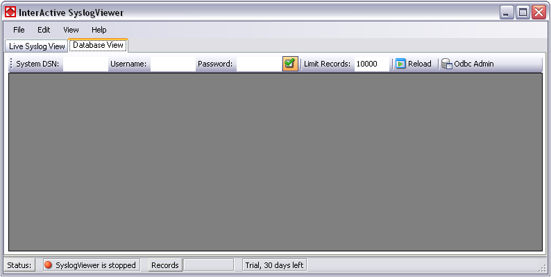
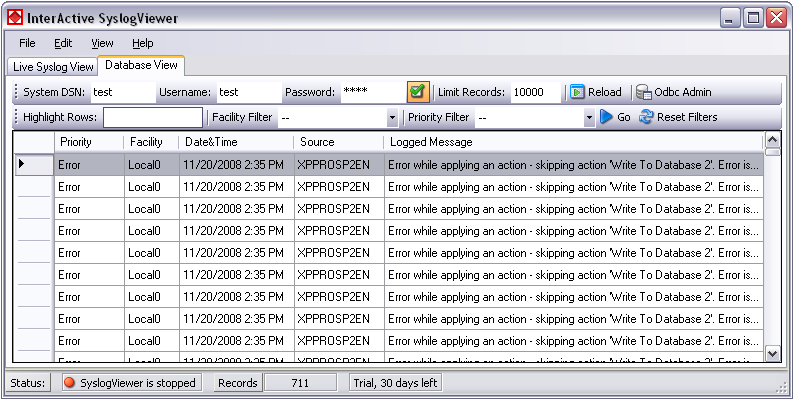

Database View
=============

Another feature is the possibility to review log messages which are stored in a
database.

The status bar at the bottom of the screen shows you, if the SyslogViewer is
running or stopped, how many records are currently shown and how much time you
have left for the trial or your licensing status.

* InterActive SyslogViewer Syslog - Database View*

The toolbar in this case is for entering the login information for the database.

**System DSN**
  Specify the System DSN of your database here.

**Username**
  The username for the database.

**Password**
  The appropriate password for the database.

**Store Username and Password**
  With the checkbox you can tell the InterActive SyslogViewer to keep the
  username and password or not. This is to make usage easier for you.

**Limit Records**
  This limits the maximum of the shown records. The default value is 10000. If
  changed, this can have a enormous impact on your machine.

**Reload**
  This button is to reload the database. This is needed to view if there are new
  log messages in the database.

**Odbc Admin**
  This button opens the Administration Panel for ODBC Data Source connections

Once a database connection is successfully established, you can see another
toolbar with the filter options:

* InterActive SyslogViewer Syslog - Active Database View*

**Highlight Rows**
  You can enter a keyword into the field, the rows containing this keyword will
  be highlighted. You can then find the messages much easier,

**Facility Filter**
  Allows you to only show messages with a certain facility. You can use the
  drop-down menu to specify the facility.

**Priority Filter**
  Allows you to only show messages with a certain priority. You can use the
  drop-down menu to specify the priority.

**Go**
  With this button, you apply the filter settings to the current view. Depending
  on the filter settings you chose you will see either colored lines and/or only
  the lines from the category you wish to see.

**Reset Filters**
  Resets the filter settings and returns you to the default view of your database.
