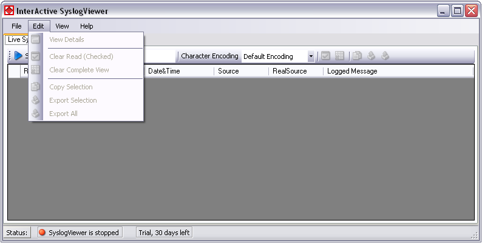
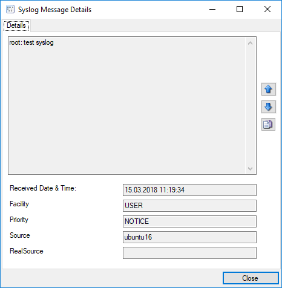

Edit Menu
=========

* InterActive SyslogViewer - Edit Menu*

**View Details**
  When using this option, another window will open up, which shows the details of
  this event in a more readable view. This could look like this:

* InterActive SyslogViewer Syslog - Message Details*

**Clear Read (Checked)**
  By activating this, you can clear the checkboxes of the items your marked as
  read.

**Clear Complete View**
  This option will clear the screen and remove all received data from the view.

**Copy Selection**
  Having selected one or multiple entries, you can copy them using this function.

**Export Selection**
  Instead of copying you can extract the selected data into a text file.

**Export All**
  Or you directly export all the data that is currently in the list.
