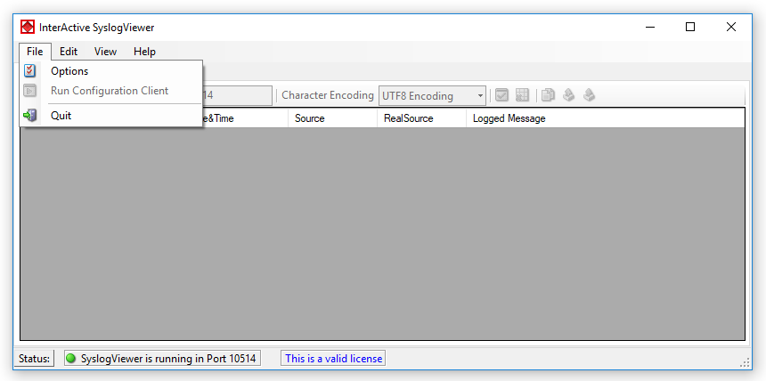

File Menu
=========

* InterActive SyslogViewer - File Menu*

Options
_______

This will open the Options dialog. Please see the sub-chapters for more details
on this.

.. toctree::
   :maxdepth: 1

   syslogviewergeneraloptions
   syslogviewernotificationsandquestions
   syslogviewerlicense

**run configuration client**
  this option will open the configuration client of MonitorWare Agent/WinSyslog.
  here you can do detail configuration of the service.

**minimize to tray**
  this will minimize the interactive syslogviewer window and remove it from the
  taskbar. you can open it again by double-clicking on the icon in the system tray.

**quit**
  by clicking here, interactive syslogviewer stops receiving data and it will
  close the application.
