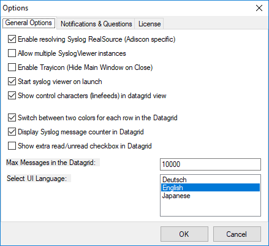

General Options
===============

* InterActive SyslogViewer - General Options Tab*

**Enable Resolving Syslog RealSource (Adiscon specific)**
  With this option enabled, you can see the real source in multiply forwarded
  messages. That means, you can see the system that forwarded the message and the
  system where the message originates from.

**Allow multiple SyslogViewer instances**
  You can have multiple instances of the InterActive SyslogViewer by activating
  this option. This allows you to have multiple forwarding servers sending on
  different ports and receive their messages separately.

**Enable Trayicon (Hide Main Windows on Close)**
  Enable this to have a tray icon. This enables a soft-close. InterActive
  SyslogViewer will stay active, but the window will be completely hidden except
  the tray icon. By double-clicking on the icon, the window will show again.

**Start SyslogViewer on launch**
  Enable this to start the Syslog server directly when starting InterActive
  SyslogViewer.

**Show control characters (line feeds) in data grid view**
  When enabled, you will see control characters like line feeds in the data grid as
  well.

**Switch between two colors for each row in the data grid**
  To have a better overview over the syslog data, activate this option.

**Display Syslog message counter in the data grid**
  You can enable a counter by checking the box here. It will count further, even
  if the maximum of messages is already exceeded.

**Show extra read/unread checkbox in the data grid**
  If enabled, an additional checkbox is added for each record in the data grid
  that can be marked as checked.

**Max Messages in the data grid**
  Here you can adjust the maximum messages that will be available in the
  data grid. By increasing this value, you can store more messages for direct
  review. Please note, that increasing the maximum number of messages will have a
  severe impact on your memory.

**Select UI Language**
  Here you can choose your favorite language for the InterActive SyslogViewer. By
  default it is English. You can choose German or Japanese as well.
