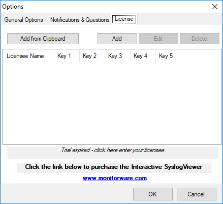

License Tab
===========

* InterActive SyslogViewer - License Tab*

Here you can insert the license. You have several options:

**Add from Clipboard**
  This will insert the license you have currently on your clipboard.

**Add**
  This button is to manually add a license manually. A new window will open,
  which shows you the form for entering the license information. This consists of
  a license name and five blocks of numbers.

**Edit**
  Once a license is entered, it can be changed afterwards. This is done with this
  button. Mark the license you want to edit and click the button. A window will
  open which looks just like when adding a license, but the marked license
  details are inserted already. You can edit every field separately.

**Delete**
  If a license is not needed anymore, you can delete it from the license screen.
  Mark the license and hit the button. The license will be deleted directly.

**Please note**, that the screen will give you additional information. You have

an overview of the licenses used and if not entered correctly it will show how
long your trial period still is.
