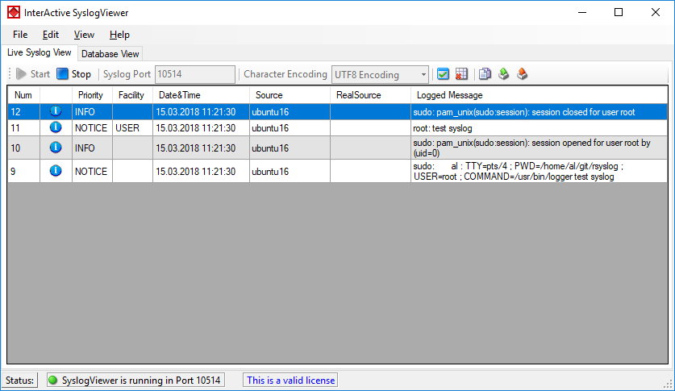

Live Syslog View
================

Primarily, the InterActive SyslogViewer is used for viewing current syslog
traffic. All messages are shown in a list with the most important information.
These are the Priority, Facility, Date&Time, Source, RealSource and the
Message. At the beginning of each line you can see the number of the logged
event and a checkbox, for you to track if a message has been read.

The status bar at the bottom of the screen shows you, if the SyslogViewer is
running or stopped and how much time you have left for the trial or your
licensing status.

* InterActive SyslogViewer Syslog - Live Syslog View*

The toolbar provides you with direct access to the most important functions.
These are described here:

**Start**
  With the start button, you start the receiving service. Now the InterActive
  SyslogViewer will receive and display all incoming messages. If messages were
  sent before starting the service, they will be dropped.

**Stop**
  Here you can stop the receiving server.

**Syslog Port**
  Here you can define the syslog port where the Viewer should receive the
  syslog messages.

**Character Encoding**
  Here you can define how characters will be decoded. You can choose from Default
  Encoding (depending on OS), ASCII, Unicode, UTF8, or UTF32.

**Clear checked**
  With this button, you can clear all the checkboxes in front of the messages.

**Clear View**
  By clicking on this button, all data will be deleted from your data grid.

**Copy Selection**
  This helps you copying the selected messages.

**Export Selection**
  You can export the selected data directly by using this button.

**Export All**
  Export the complete data that is in the data grid.
