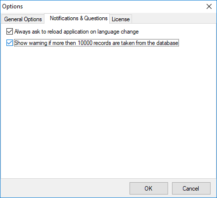

Notifications & Questions Tab
=============================

* InterActive SyslogViewer - Notifications & Questions Tab*

**Always ask to reload application on language change**
  While the box is checked, InterActive SyslogViewer will ask to reload the
  application on a language change. This is, because the language file can
  only be loaded while starting the application and not while it is running.

**Show warning if more than 10000 records are taken from the database**
  By activating this option, you will be warned, if the records in the database
  are just too much. This is to prevent the machine from receiving too much load.
  Polling lots of messages from a database can have a severe impact on the
  performance of the machine.
