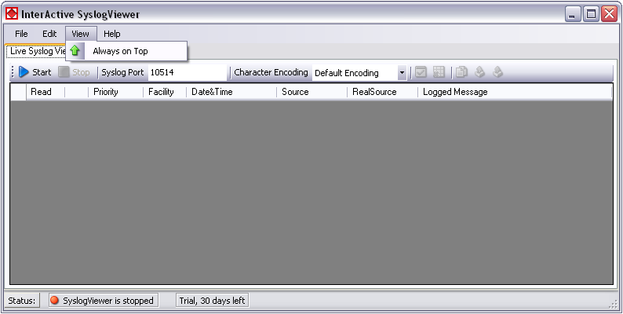

View Menu
=========

* InterActive SyslogViewer Syslog - View Menu*

**Always on Top**
  This option is very self-explanatory. While activated, the InterActive
  SyslogViewer window will stay on top of all other applications, so you will
  have all incoming log data directly in your point of view.
