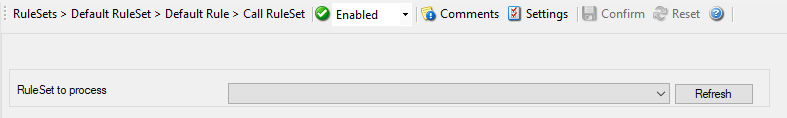

:orphan:

.. _action-callruleset:
.. supporting-labels-marker

Call RuleSet
============

A Call RuleSet action simply calls another ruleset in some existing ruleset.
When this action is encountered, the rule engine leaves the normal flow and
goes to the called ruleset (which may contain many rules as well). It executes
all the rules that have been defined in the called RuleSet. After the
execution of all of them, it will return to its point from where it left the
original flow. Let's take an example to clarify it a little further.

Let's say that Rule 1 has two actions - Action 1 and Action 2. The Action 1 of
Rule 1 is an include (Call Ruleset) action. If the filter condition result of
Rule 1 evaluates to true, it will execute the Action 1. Since Action 1 is the
include action in this example, it will go to the included ruleset and will
execute its filter condition. If that filter condition evaluates to true, it
will execute all of its actions and will return to Action 2 of Rule 1 (of
normal flow). If on the other hand, the filter condition of the included rule
set evaluates to false, it will skip all of its actions and will come back to
the Action 2 of Rule 1 (of normal flow).

**Note:** there is no limit on including the rules which means that a rule

that has been included in another rule may contain another rule in it which
might contain another rule in it and so on.

* Action - Call RuleSet*

Ruleset to Call
^^^^^^^^^^^^^^^

**File Configuration field:**
  szRuleSet

**Description:**
  Select the Ruleset to be called.

  **Note:** Call RuleSet stays disabled until you have more then "One" RuleSet!
