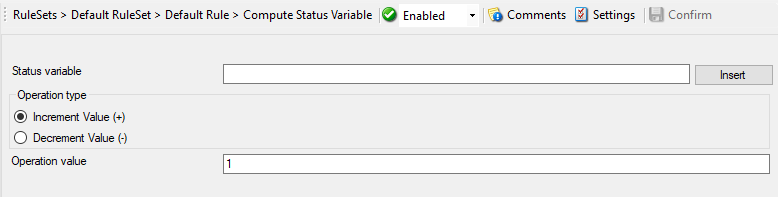

Compute Status Variable
=======================

An internal action used to compute a status variable. This is needed for
RuleSets which operate on a counter basis. This dialog controls the compute
status variable options.

* Action - Compute Status Variable*

Status variable
^^^^^^^^^^^^^^^

**File Configuration field:**
  szStatusVar

**Description:**
  Name of the unique status variable.

**Operation Type**

Increment Value
^^^^^^^^^^^^^^^

**File Configuration field:**
  nCalcType = 1

**Description:**
  It increments the value by the operation value.

Decrement Value
^^^^^^^^^^^^^^^

**File Configuration field:**
  nCalcType = 2

**Description:**
  It decrements the value by the operation value.

Operation value
^^^^^^^^^^^^^^^

**File Configuration field:**
  nChangeVal

**Description:**
  The operation value that is to be used.
