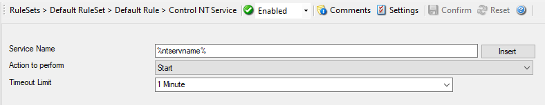

Control NT Service
==================

This dialog controls the control NT Service.

* Action - Control NT Service*

Service Name
^^^^^^^^^^^^

**File Configuration field:**
  szServiceName

**Description:**
  Specify the service name which you want to control. Please note that it is
  the internal name, not the display name. You can see the service internal
  name when you view the properties in the services control panel.

Action to perform
^^^^^^^^^^^^^^^^^

**File Configuration field:**
  nAction

**Description:**
  Few Actions are available in the drop down namely Start, Stop, Restart, Pause,
  and Unpause. The selected action is performed on the configured service.

Timeout limit
^^^^^^^^^^^^^

**File Configuration field:**
  nTimeOutLimit

**Description:**
  The amount of time (in milliseconds) the service is expected to wait for the
  configured action to take place.
