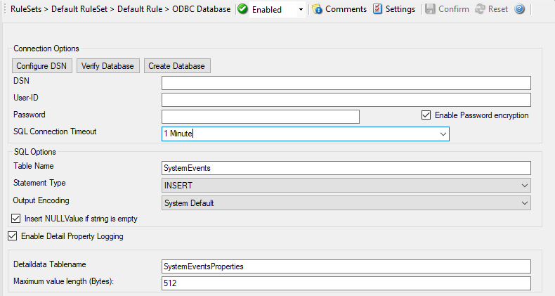
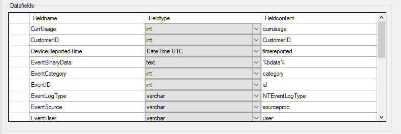

ODBC Database Options
=====================

Use database logging to store messages into a database.

Database logging allows writing incoming events directly to any ODBC -
compliant database (virtually any database system currently available for the
Windows operating system supports ODBC). We support any database system
that provides OLEDB or ODBC drivers. This includes Microsoft
JET databases (as used by Microsoft Access), Microsoft SQL Server, MySQL,
Oracle, PostgreSQL, Sybase, and many other database systems.

Once stored inside the database, different message viewers as well as custom
applications can easily browse them. The defaults for the write database action
are suitable Adiscon Loganalyzer (web interface).

The database format can be fine-tuned. This is most useful if you intend to run
some additional analysis on the database. Also, in high volume environments,
tuning the database action to exactly those fields need helps getting best
performance out of the database.

The main feature of the "Write To Database" property sheet is the field list.
The default reflects the typical assignment of event properties to database
columns. However, you can modify this assignment in any way you like. You only
need to keep in mind that Adiscon analysis products need the database contents
as specified. As such, malfunctions may occur if you modify the database
assignments and then use these tools.

Connection Options
------------------

* Action - ODBC Database Connection*

**Configure DSN**
  If you click on this button, it starts the ODBC administrator of the operating
  system where you can add, edit, or remove a data source(s).

  **Note:** The DSN must be a System DSN. **Verify Database**
  The configuration client will attempt to establish a database connection to
  your configured ODBC System DSN.

**Create Database**
  If you click on this button, it will create the default tables for SystemEvents
  and SystemEventsProperties into the database specified in the DSN.

DNS
^^^

**File Configuration field:**
  szODBCDsn

**Description:**
  This is the name of the system data source (DSN - data source name) to be
  used when connecting to the database. Create this in ODBC manager (can be
  found in control panel under Windows). Press the "Data Sources (ODBC)"
  button to start the operating system ODBC administrator where data sources
  can be added, edited, and removed.

  **Note:** The DSN must be a system DSN, not a user or file DSN. The DSN must be configured to have the correct connection parameters (for example database
  type and name, server name, authentication mode etc.).

User-ID
^^^^^^^

**File Configuration field:**
  szODBCUid

**Description:**
  The User-ID used to connect to the database. It is dependent on the database
  system used if it is to be specified (e.g. Microsoft Access does not need
  one, while Microsoft SQL Server can force you to use one). If in doubt,
  please see your database administrator

Password
^^^^^^^^

**File Configuration field:**
  szODBCPwd

**Description:**
  The password used to connect to the database. It must match the "User-ID".
  Like the User ID, it is dependent on the database system if a password is
  needed. Passwords can be stored either encrypted or unencrypted. We highly
  recommend storing them encrypted.

Enable Encryption
^^^^^^^^^^^^^^^^^

**File Configuration field:**
  nODBCEnCryption

**Description:**
  Check to store the ODBC password encrypted. If left unchecked, the password
  is stored unencrypted. We strongly recommend checking this box.

  If you store the password unencrypted for some reason, please be aware of the
  security implications. In this case, we recommend using an account with
  limited access privileges. Even when stored encrypted, we recommend using
  limited privileges accounts. We are not applying strong cryptography here.

SQL Connection Timeout
^^^^^^^^^^^^^^^^^^^^^^

**File Configuration field:**
  nSQLConnectionTimeOut

**Description:**
  Defines the Timeout for the connection.

SQL Options
^^^^^^^^^^^

Table Name
^^^^^^^^^^

**File Configuration field:**
  szTableName

**Description:**
  The name of the table to log to. This name is used to create the SQL insert
  statement and must match the database definition. Default is "SystemEvents".

SQL Statement Type
^^^^^^^^^^^^^^^^^^

**File Configuration field:**
  nSQLStatementType

**Description:**
  You can select between a INSERT and Call Statement, which is Microsoft
  specific for Stored Procedures. This means also this type of SQL Statement
  will only work if MSSQL is used as database. If you select MSSQL Call
  Statement, the tablename field will automatically be used as stored procedure
  name.

Output Encoding
^^^^^^^^^^^^^^^

**File Configuration field:**
  nOutputEncoding

**Description:**
  This setting is most important for Asian languages. A good rule is to leave
  it at "System Default" unless you definitely know you need a separate
  encoding. "System Default" works perfect in the far majority of cases, even
  on Asian (e.g. Japanese) Windows versions.

Insert NULL Value if string is empty
^^^^^^^^^^^^^^^^^^^^^^^^^^^^^^^^^^^^

**File Configuration field:**
  nSQLConnectionTimeOut

**Description:**
  This option inserts a NULL value, if a property is empty.

Enable Detail Property Logging
^^^^^^^^^^^^^^^^^^^^^^^^^^^^^^

**File Configuration field:**
  nPropertiesTable

**Description:**
  This option logs event properties other than the standard properties to the
  SystemEventProperties table. A single event can potentially have multiple
  properties, so selecting this option can result in multiple writes. With
  Syslog data, however, there are seldom any additional properties. They most
  often occur when you use the "Post Process" action to define your own
  properties. Additional properties are typically found in SETP received data
  originating from an Event Log Monitor, file monitor, or database monitor (plus
  other monitors, but these are the most prominent ones).

  For example, with Event Log data received via SETP, these properties contain
  the actually Windows event properties and the event data. Please note that
  this does not apply to event log messages received via Syslog, because they
  are no native events but rather Syslog data.

  Please make sure you actually need this before activating it. As a side note:
  some of the MonitorWare Console reports may need detail logging.

Detaildata Tablename
^^^^^^^^^^^^^^^^^^^^

**File Configuration field:**
  szPropertiesTableName

**Description:**
  Tablename for Detail Property Logging

Maximum value length (Bytes)
^^^^^^^^^^^^^^^^^^^^^^^^^^^^

**File Configuration field:**
  nMaxValueLength

**Description:**
  Maximum length in bytes for values stored in Detaildata table.

Datafields
----------

The provided fieldnames are those that Adiscon's schema uses - you can add your
own if you have a need for this.

You can edit the field list by selecting a row and then modifying the text
fields above the table. You can insert and delete rows by selecting the
respective button. If you press delete, the currently selected row is deleted.

For string data types, you can use the property replacer. This can be helpful
if you would like to store a substring. For example, if you intend to store
only the first 200 characters of each message, you can use ``%msg:1:200%``.

* Action - ODBC Database Datafields*

Fieldname
^^^^^^^^^

**File Configuration field:**
  szFieldName_[n]

**Description:**
  The Fieldname is the database column name. It can be any field inside the
  table.

Fieldtype
^^^^^^^^^

**File Configuration field:**
  nFieldType_[n]

  * 1 = varchar
  * 2 = int
  * 3 = text
  * 4 = DateTime

**Description:**
  Fieldtype is the data type of the database column. It must reflect the column
  type selected in the database. It must also be consistent in type with the
  actual property that must be stored. For example, an integer type property
  like the syslogpriority can be stored in a varchar column. A string data type
  like the syslogtag can - for obvious reasons - not be stored in an integer
  column.

Fieldcontent
^^^^^^^^^^^^

**File Configuration field:**
  szFieldContent_[n]

**Description:**
  Finally, the Fieldcontent is the event property. For a complete list of
  supported properties, see :doc:`event properties <../shared/references/eventspecificproperties>`

Action Queue Options
--------------------

.. image:: ../images/a-odbcdatabase-actionqueue.png
   :width: 100%

* Action - Send RELP Action Queue*

Use Diskqueue if connection to Syslog server fails
^^^^^^^^^^^^^^^^^^^^^^^^^^^^^^^^^^^^^^^^^^^^^^^^^^

**File Configuration field:**
  nUseDiscQueue

**Description:**
  Enable diskqueuing syslog messages after unexpected connection loss.

Split files if this size is reached
^^^^^^^^^^^^^^^^^^^^^^^^^^^^^^^^^^^

**File Configuration field:**
  nDiskQueueMaxFileSize

**Description:**
  Files will be split until they reach the configured size in bytes. The
  maximum support file size is 10485760 bytes.

Diskqueue Directory
^^^^^^^^^^^^^^^^^^^

**File Configuration field:**
  szDiskQueueDirectory

**Description:**
  The directory where the queue files will be generated in. The queuefiles will
  be generated with a dynamic UUID bound to the action configuration.

Waittime between connection tries
^^^^^^^^^^^^^^^^^^^^^^^^^^^^^^^^^

**File Configuration fields:**
  nDiskCacheWait

**Description:**
  The minimum waittime until the Syslog Action retries to establish a
  connection to the Syslog server after failure.

Overrun Prevention Delay (ms)
^^^^^^^^^^^^^^^^^^^^^^^^^^^^^

**File Configuration field:**
  nPreventOverrunDelay

**Description:**
  When the Action is processing syslog cache files, an overrun prevention delay
  can be added to avoid flooding the target Syslog server.

Double wait time after each retry
^^^^^^^^^^^^^^^^^^^^^^^^^^^^^^^^^

**File Configuration field:**
  bCacheWaittimeDoubling

**Description:**
  If enabled, the configured waittime is doubled after each try.

Limit wait time doubling to
^^^^^^^^^^^^^^^^^^^^^^^^^^^

**File Configuration field:**
  nCacheWaittimeDoublingTimes

**Description:**
  How often the waittime is doubled after a failed connection try.

Enable random wait time delay
^^^^^^^^^^^^^^^^^^^^^^^^^^^^^

**File Configuration field:**
  bCacheRandomDelay

**Description:**
  If enabled, a some random time will be added into the waittime delay. When
  using many syslog senders, this can avoid that all senders start sending
  cached syslog data to the Syslog server at the same time.

Maximum random delay
^^^^^^^^^^^^^^^^^^^^

**File Configuration field:**
  nCacheRandomDelayTime

**Description:**
  Maximum random delay time that will be added to the configured waittime if
  Enable random wait time delay is enabled.
