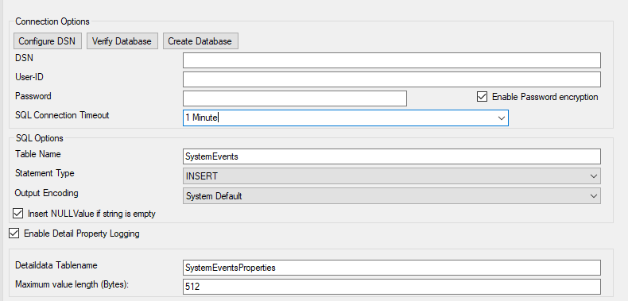
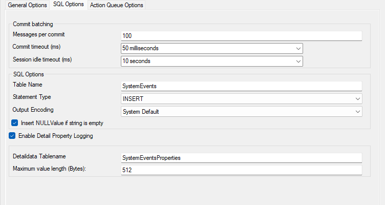
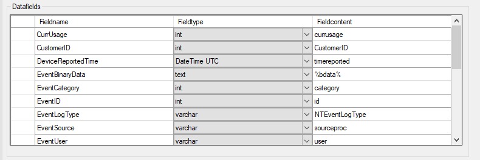
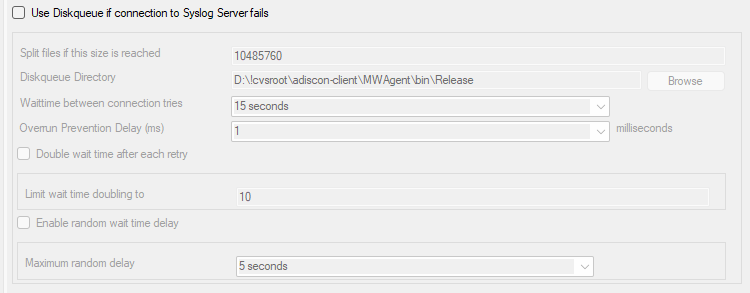

.. _odbc-database-options:

ODBC Database Options
=====================

Use this action to write matched events or messages to a database through ODBC.

The ODBC database action is an integration feature. It can write to the
built-in Adiscon default schema or to a user-defined schema in any supported
ODBC database. Use the default schema when you want the fastest supported setup
or compatibility with Adiscon tools. Use custom mapping when the product needs
to write into an existing database design.

Common usage patterns
---------------------

- **Default schema:** Use the built-in ``SystemEvents`` and
  ``SystemEventProperties`` tables when you want the shortest supported setup or
  when downstream Adiscon tools expect the standard schema.
- **Custom schema integration:** Map event properties to an existing table with
  your own column names and data types.
- **Microsoft SQL Server stored procedures:** Use the call-statement option only
  when your SQL Server design requires a stored procedure instead of a standard
  ``INSERT`` statement.

Out of scope
------------

This action does not design your database for you. It does not decide table
layout, indexes, retention policy, reporting logic, or broader analytics
architecture. For custom integration, you own the destination schema and the
mapping decisions.

Before you start
----------------

- Install a supported ODBC driver on the Windows host that runs the service.
- Create an **ODBC System DSN** for the target database. User DSNs and file DSNs
  are not suitable for the service path.
- Verify that the database server is reachable and that the configured
  credentials have the required permissions.
- Decide whether the action should:

  - create and use the default Adiscon tables, or
  - write into an existing user-defined table

Minimal action path
-------------------

#. Create and test an ODBC **System DSN** outside the product.
#. Add a **Write to Database** action to the relevant ruleset.
#. Configure the DSN, credentials, and connection settings.
#. Choose one of these paths:

   - keep the default schema and use **Create Database**, or
   - set the table name and field list for a custom schema

#. Save and apply the configuration.
#. Send a matching test event or message and verify that rows are inserted.

Default schema versus custom schema
-----------------------------------

Default schema
^^^^^^^^^^^^^^

Use the default schema when you want a predictable starting point or when you
need compatibility with other Adiscon components that expect the standard table
layout. In this path, the action can create the default tables for you.

Custom schema integration
^^^^^^^^^^^^^^^^^^^^^^^^^

Use a custom schema when your organization already has a database design that
WinSyslog, EventReporter, or MonitorWare Agent must write into. In this path,
the action does not infer the schema. You must set the target table name and
map each field deliberately.

If you diverge from the default schema, do not assume that Adiscon tools that
expect the standard layout will continue to work unchanged.

Connection options
------------------

*Action - ODBC Database Connection*

Buttons
^^^^^^^

**Configure DSN**
  Opens the Windows ODBC administrator so you can add, edit, or remove data
  sources.

**Verify Database**
  Attempts to connect to the configured ODBC System DSN with the current
  settings. Use this before you save the action into production.

**Create Database**
  Creates the default Adiscon tables in the target database. Use this only when
  you intentionally want the default schema.

DSN
^^^

**File Configuration field:**
  szODBCDsn

**Description:**
  Name of the ODBC **System DSN** used for the database connection. The DSN
  must already contain the correct driver and target-database connection
  details.

User-ID
^^^^^^^

**File Configuration field:**
  szODBCUid

**Description:**
  User name for database authentication, if the DSN and driver require it.

Password
^^^^^^^^

**File Configuration field:**
  szODBCPwd

**Description:**
  Password for the configured user ID. Use an account with only the permissions
  needed for this action.

Enable Encryption
^^^^^^^^^^^^^^^^^

**File Configuration field:**
  nODBCEnCryption

**Description:**
  Stores the configured ODBC password encrypted instead of plaintext. Enable
  this unless you have a documented reason not to.

SQL Connection Timeout
^^^^^^^^^^^^^^^^^^^^^^

**File Configuration field:**
  nSQLConnectionTimeOut

**Description:**
  Maximum time to wait while opening the database connection.

SQL options
-----------

The client organizes ODBC database settings across **General Options**, **SQL
Options**, and **Action Queue Options** tabs.

*Action - ODBC Database SQL Options*

Commit batching (SQL Options tab)
^^^^^^^^^^^^^^^^^^^^^^^^^^^^^^^^^

**File Configuration field:**
  nCommitBatchSize

**Description:**
  Number of messages to batch before committing (Messages per commit). Increase
  for higher throughput when the database can sustain larger batches; decrease
  for more frequent commits.

**File Configuration field:**
  nCommitTimeoutMs

**Description:**
  Maximum time in milliseconds to wait before flushing a partial batch.

**File Configuration field:**
  nSessionTimeoutMs

**Description:**
  Idle timeout in milliseconds for the database session.

Table Name
^^^^^^^^^^

**File Configuration field:**
  szTableName

**Description:**
  Target table name for database writes. Keep the default ``SystemEvents`` when
  you use the built-in schema. Set it to your existing table name when
  integrating with a custom schema.

SQL Statement Type
^^^^^^^^^^^^^^^^^^

**File Configuration field:**
  nSQLStatementType

**Description:**
  Selects whether the action uses a normal ``INSERT`` statement or a Microsoft
  SQL Server call statement for stored procedures. The call-statement path is
  Microsoft SQL Server specific.

Output Encoding
^^^^^^^^^^^^^^^

**File Configuration field:**
  nOutputEncoding

**Description:**
  Controls how string data is encoded when written. In most environments,
  **System Default** is the correct setting unless you have a confirmed
  character-set requirement.

Insert NULL Value if string is empty
^^^^^^^^^^^^^^^^^^^^^^^^^^^^^^^^^^^^

**Description:**
  Writes ``NULL`` instead of an empty string for empty string properties. Use
  this only if your schema and downstream queries intentionally distinguish
  between empty text and ``NULL``.

Datafields
----------

The field list controls how event properties are written into the destination
table. This is the most important part of custom integration work.

For the default schema, the built-in field list already reflects the standard
Adiscon table layout. For a custom schema, keep only the rows that correspond
to actual destination columns and adjust them deliberately.

For string data types, you can use the property replacer. For example, the
expression ``%msg:1:200%`` stores only the first 200 characters of the message.
For simple mappings, use the relevant event property directly.

*Action - ODBC Database Datafields*

Fieldname
^^^^^^^^^

**File Configuration field:**
  szFieldName_[n]

**Description:**
  Database column name in the destination table.

Fieldtype
^^^^^^^^^

**File Configuration field:**
  nFieldType_[n]

- 1 = varchar
- 2 = int
- 3 = text
- 4 = DateTime

**Description:**
  Data type of the destination column. It must match both the database schema
  and the kind of property you are storing.

Fieldcontent
^^^^^^^^^^^^

**File Configuration field:**
  szFieldContent_[n]

**Description:**
  Event property or property-replacer expression written into the destination
  column. See :doc:`event properties <../shared/references/eventspecificproperties>`
  and :doc:`property access and replacer syntax <../shared/references/accessingproperties>`.

Practical mapping guidance
^^^^^^^^^^^^^^^^^^^^^^^^^^

For a custom syslog-oriented table, a minimal mapping often includes:

- a timestamp column populated from ``timegenerated`` or ``timereported``
- a source column populated from ``source``
- a severity column populated from ``syslogpriority``
- a tag or application column populated from ``syslogtag`` or ``syslogappname``
- a message column populated from ``msg``

If a destination column is shorter than the source property, truncate or
transform the value explicitly instead of hoping the driver or database will do
the right thing.

Detail property logging
-----------------------

Enable Detail Property Logging
^^^^^^^^^^^^^^^^^^^^^^^^^^^^^^

**File Configuration field:**
  nPropertiesTable

**Description:**
  Writes non-standard properties into a separate detail table. This can be
  useful when additional event metadata must be retained, but it also increases
  write volume.

Detaildata Tablename
^^^^^^^^^^^^^^^^^^^^

**File Configuration field:**
  szPropertiesTableName

**Description:**
  Table name used for detail-property logging. In the default schema, this is
  typically ``SystemEventProperties``.

Maximum value length (Bytes)
^^^^^^^^^^^^^^^^^^^^^^^^^^^^

**File Configuration field:**
  nMaxValueLength

**Description:**
  Maximum size in bytes for values written into the detail-property table.

Action Queue Options
--------------------

*Action - ODBC Database Action Queue*

Use Diskqueue if connection to database fails
^^^^^^^^^^^^^^^^^^^^^^^^^^^^^^^^^^^^^^^^^^^^^

**File Configuration field:**
  nUseDiscQueue

**Description:**
  Stores pending writes on disk when the database path is temporarily
  unavailable.

Split files if this size is reached
^^^^^^^^^^^^^^^^^^^^^^^^^^^^^^^^^^^

**File Configuration field:**
  nDiskQueueMaxFileSize

**Description:**
  Maximum size of each queue file in bytes before a new file is created.

Diskqueue Directory
^^^^^^^^^^^^^^^^^^^

**File Configuration field:**
  szDiskQueueDirectory

**Description:**
  Directory used to store queue files for pending database writes.

Waittime between connection tries
^^^^^^^^^^^^^^^^^^^^^^^^^^^^^^^^^

**File Configuration fields:**
  nDiskCacheWait

**Description:**
  Minimum wait time before the action retries the database connection after a
  failure.

Overrun Prevention Delay (ms)
^^^^^^^^^^^^^^^^^^^^^^^^^^^^^

**File Configuration field:**
  nPreventOverrunDelay

**Description:**
  Optional delay between replayed queue writes to avoid overwhelming the target
  database after recovery.

Double wait time after each retry
^^^^^^^^^^^^^^^^^^^^^^^^^^^^^^^^^

**File Configuration field:**
  bCacheWaittimeDoubling

**Description:**
  Doubles the retry wait time after each failure.

Limit wait time doubling to
^^^^^^^^^^^^^^^^^^^^^^^^^^^

**File Configuration field:**
  nCacheWaittimeDoublingTimes

**Description:**
  Maximum number of retry wait-time increases after repeated failures.

Enable random wait time delay
^^^^^^^^^^^^^^^^^^^^^^^^^^^^^

**File Configuration field:**
  bCacheRandomDelay

**Description:**
  Adds a randomized delay to retry timing. This can reduce synchronized retry
  spikes when many senders reconnect at the same time.

Maximum random delay
^^^^^^^^^^^^^^^^^^^^

**File Configuration field:**
  nCacheRandomDelayTime

**Description:**
  Upper bound for the additional randomized retry delay.

Verification
------------

- Use **Verify Database** before enabling production traffic.
- Send a matching test event or message after saving the action.
- Query the destination table and confirm that:

  - rows are inserted
  - values appear in the expected columns
  - data types and lengths are compatible with the schema

Common pitfalls
---------------

- Using a user DSN instead of a **System DSN**
- Leaving the default field list unchanged while targeting a custom table
- Using **Create Database** when the goal is an existing custom schema
- Mapping text properties into integer or datetime columns
- Using the SQL Server call-statement mode on non-Microsoft SQL Server targets
- Forgetting that custom schemas may break compatibility with tools that expect
  the default Adiscon layout
