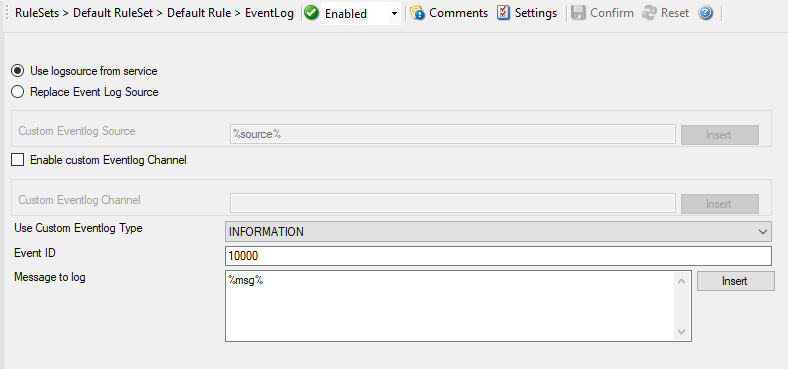

Event Log Options
=================

This tab is used to configure the logging to the Windows Event Log.
It is primarily included for legacy purposes.

* Action - EventLog*

Use logsource from service
^^^^^^^^^^^^^^^^^^^^^^^^^^

**File Configuration field:**
  bUseCustomEventLog = 0

**Description:**
  Takes the service name as logsource for the log entry. This option is enabled by default.

Replace Event Log Source
^^^^^^^^^^^^^^^^^^^^^^^^

**File Configuration field:**
  bUseCustomEventLog = 1

**Description:**
  If checked, a special mapping mechanism is activated. In this mode, the
  Windows event source is set to the IP address of the system sending the
  Syslog message. In addition, the ID is set to
  :doc:`syslog facility <../glossaryofterms/syslogfacility>`. This mode
  helps to quickly gather information about the system state in Windows event
  viewer.

  **However, this mode has its drawbacks.** Effectively, we are writing invalid event source information to the event log. This does not harm any
  application, but Windows event viewer will try to locate the matching message
  libraries. Of course, this is impossible. As such, event viewer will warn the
  user that the message library could not be found. Nevertheless, it will
  display the complete logged message. This happens only in detail view.

  Users should fully understand the implications of this mapping mechanism for
  their environment before turning this option on.

Custom Event Log Source
^^^^^^^^^^^^^^^^^^^^^^^

**File Configuration field:**
  szCustomSource

**Description:**
  EventSource is now fully configurable with all possibilities the property
  engine gives you.
  Please note that content of this field can be configured.
  :doc:`event properties <../shared/references/eventspecificproperties>` are described in the
  :doc:`property replacer section <../shared/references/eventproperties>`.

Enable custom Eventlog Channel
^^^^^^^^^^^^^^^^^^^^^^^^^^^^^^

**File Configuration field:**
  bUseCustomEventLog

**Description:**
  If enabled, a custom event log channel will be used instead of application.

Custom Eventlog Channel
^^^^^^^^^^^^^^^^^^^^^^^

**File Configuration field:**
  szCustomEventLog

**Description:**
  The custom Eventlog channel to be used instead of application. Will be
  automatically created if the channel does not exist.

Use Custom Eventlog Type
^^^^^^^^^^^^^^^^^^^^^^^^

**File Configuration field:**
  nEventType

  * 0 = EVENTLOG_SUCCESS (Information event)
  * 1 = EVENTLOG_ERROR_TYPE (Error event)
  * 2 = EVENTLOG_WARNING_TYPE (Warning event)
  * 4 = EVENTLOG_INFORMATION_TYPE (Information event)
  * 8 = EVENTLOG_AUDIT_SUCCESS (Success Audit event)
  * 16 = EVENTLOG_AUDIT_FAILURE (Failure Audit event)

**Description:**
  The type – or severity – this log entry is written with. Select from the
  available Windows system values.

EventID
^^^^^^^

**File Configuration field:**
  nEventID

**Description:**
  The ID to be used when writing to the event log. Different IDs can be used to
  provide other processes with a consistent interface to specific messages.
  WinSyslog does not restrict the IDs that can be used. However, if an ID is
  written that is not registered with the operating system, Windows event
  viewer places an error message pointing this out before the actual message
  text. To avoid this text, event IDs 10,000 to 10,100 have been registered
  with the OS. We highly recommend that these IDs should be used for all custom
  messages. IDs below 10,000 should not be used as they might potentially
  interfere with events generated by MonitorWare Agent 3.0 itself.

Message to Log
^^^^^^^^^^^^^^

**File Configuration field:**
  szMessagecontent

**Description:**
  It is the message which will be logged into the Windows Event Log. It is
  fully configurable what is logged into the Eventlog.

  **Insert Menu entry allows you to add replacement characters e.g. ``%msg%`` - you can write the actual message of an event into the Windows Event Log.**

  Please note that the message content of the message field can be configured.
  :doc:`event properties <../shared/references/eventspecificproperties>` are described in the
  :doc:`property replacer section <../shared/references/eventproperties>`.
