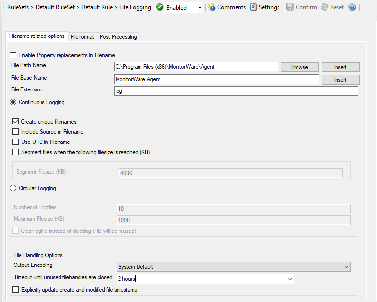

File Logging Options
====================

This configuration dialog is available both in the defaults section as well as
with file logging actions.

File logging is used to write text files of received messages. One file per
day is written. New entries are appended to the end of the file.

File locks are released when currently no data is written. Therefore, other
applications can access the files while the service is running. However,
please be sure that the other applications do not place a file-lock onto it.
Popular WordPad does so. In this case, the service will not be able to log any
further messages (an error event is written to the Windows Event Log in this
case). We recommend copying the file when accessing it at runtime - or use
notepad.exe, which does not place file-locks on the files it opens.

**The filename is build as follows:**

``<FilePathName><FileBaseName>-year-month-day.<FileExtension>``

Parameters in the brackets can be configured via dialog shown below:

* Action - File Logging Filename related*

Enable Property replacements in Filename
^^^^^^^^^^^^^^^^^^^^^^^^^^^^^^^^^^^^^^^^

**File Configuration field:**
  nEnablePropertyFileName

**Description:**
  By activating this option, you can use properties within the file or pathname
  like ``%source%`` and all the others. For example: File Path Name can be ``F:\syslogs\%source%``
  File Base Name can be ``IIS-%source%``

  If your source is ``10.0.0.1``, that writes the following file: ``F:\syslogs\10.0.0.1\IIS-10.0.0.1.log``

  The path ``f:\syslogs\10.0.0.1`` was generated because the source property was
  used inside the path.

  Please Note that you can use ANY property inside the path and base name.
  :doc:`event properties <../shared/references/eventspecificproperties>` are described
  in the :doc:`property replacer section <../shared/references/eventproperties>`.

File Path Name
^^^^^^^^^^^^^^

**File Configuration field:**
  szFilePath

**Description:**
  The base path (directory) of the file. Please see above for exact placement.
  Default is ``c:\temp``. The Insert Menu entry allows you to create "Dynamic Directories". For example:

  File Path Name can be **``F:\syslogs\%source%``**

  :doc:`event properties <../shared/references/eventspecificproperties>` are described
  in the :doc:`property replacer section <../shared/references/eventproperties>`.

  **On network paths:**
  The File Logging action can also work on network storages. There are two ways
  of storing log files in a network path.

  1. Direct the action to a full UNC path. In this case, make sure the system
     account with which the service is running is able to access the network
     path or the service will fail to access with a permission error.
     Sample path: ``\\Hostname\folder1\folder2\``
  2. Map the UNC path to a local drive letter in Windows. In this case, the
     path will look like a regular local path, but actually points to a network
     location. This requires a workaround, which is to run a scheduled task at
     system startup under Local System and perform a net use specifying the
     user and password of the share. Else, the service will not be able to
     access the mapped UNC path, because the mapping usually happens for
     interactive sessions only.

File Base Name
^^^^^^^^^^^^^^

**File Configuration field:**
  szFileBaseName

**Description:**
  The base name of the file. Please see above for exact placement. Default is
  "MonitorWare". The Insert Menu entry allows you to recreate
  "Dynamic Base Filenames". For example:

  File Base Name can be ``IIS-%source%``

File Extension
^^^^^^^^^^^^^^

**File Configuration fields:**
  szFileExtension

**Description:**
  The extension to be used when writing the file. Please see above for exact
  placement. Default is ``.log``.

Continuous Logging
^^^^^^^^^^^^^^^^^^

**Description**
  When enabled log files will not be overwritten, there is a single file with
  consistent file name. See below checkboxes to choose in which cases a new
  file should be created.

Create unique Filenames
^^^^^^^^^^^^^^^^^^^^^^^

**File Configuration field:**
  nUniqueFileName

**Description:**
  If checked, a unique file name is created for each day. This is done by
  adding the current date to the base name.

  If left unchecked, the date is not added and as such, there is a single file
  with consistent file name. Some customers that have custom scripts to look
  at the file name use this.

Include Source in Filename
^^^^^^^^^^^^^^^^^^^^^^^^^^

**File Configuration field:**
  nIncludeSourceInFilename

**Description:**
  This works together with the "Create unique Filenames" setting. If checked,
  the file name generation explained above is modified. The source of the Syslog
  message is automatically added to the file name.

  This feature has been introduced because many customers would like to have
  separate log files for each device. While this can be achieved with multiple
  rules, it is much more straight forward with this single checkbox. If it is
  checked, the messages are automatically written to separate files and the
  file name includes the originating device information.

Use UTC in Filename
^^^^^^^^^^^^^^^^^^^

**File Configuration field:**
  nUseUTCInFileName

**Description:**
  This works together with the "Create unique Filenames" setting. If unique
  names are to be created then select the "Use UTC in Filename" option, in this
  case the file name is generated on the basis of universal coordinated time
  (UTC) or on local time. UTC was formerly referred to as "GMT" and is the
  basis of the time zone system. For example, New York, USA is 5 hours behind
  UTC. Therefore, if it is 12 noon in New York, the UTC time is 5pm.

  When it comes to log file creation, it means that the date is computed on UTC.
  Taking the same example, if the "Use UTC in Filename" is checked, the log
  file name would roll over to the next date at 7 pm New York time. If it were
  unchecked, the rollover would occur exactly at midnight New York time (5 am UTC).

  Using UTC for file name creation can be helpful if log files are written among
  different time zones and later consolidated. Using UTC ensures a consistent
  time notation across all log files.

  **Please note that this setting does affect the file name creation only. A different setting controls the dates recorded inside the file.**

Segment files when the following file size is reached (KB)
^^^^^^^^^^^^^^^^^^^^^^^^^^^^^^^^^^^^^^^^^^^^^^^^^^^^^^^^^^

**File Configuration field:**
  nSegmentFileEnable

**Description:**
  Files are segmented if the defined file size: Segment Filesize (KB) is
  reached. A sequence number is appended to the file name: _1 to _n.

Circular Logging
^^^^^^^^^^^^^^^^

**File Configuration field:**
  nCircularLogging

**Description:**
  If enabled, log files are created and overwritten in a cycle.

Number of Log Files
^^^^^^^^^^^^^^^^^^^

**File Configuration field:**
  nNumberOfLogfiles

**Description:**
  Once the last log file is reached, circular logging begins and overwrites the
  first log file again. If set to 0, log files will not be rotated but can still
  be processed by Rotate Post Processing (for example compression or backup)
  along with the Rotate Conditions.

Maximum Filesize (KB)
^^^^^^^^^^^^^^^^^^^^^

**File Configuration field:**
  nMaxFileSize

**Description:**
  Max filesize of a log file, once this size is reached a new logfile is
  created.

Clear logfile instead of deleting (File will be reused)
^^^^^^^^^^^^^^^^^^^^^^^^^^^^^^^^^^^^^^^^^^^^^^^^^^^^^^^

**File Configuration field:**
  nReUseFile

**Description:**
  This option causes the File Action to truncate the log file instead of
  deleting and recreating it.

File Handling Options
^^^^^^^^^^^^^^^^^^^^^

Output Encoding
^^^^^^^^^^^^^^^

**File Configuration field:**
  nOutputEncoding

**Description:**
  This setting is most important for Asian languages. A good rule is to leave
  it at "System Default" unless you definitely know you need a separate
  encoding. "System Default" works perfectly in the far majority of cases, even
  on Asian (e.g. Japanese) Windows versions.

Timeout until unused filehandles are closed
^^^^^^^^^^^^^^^^^^^^^^^^^^^^^^^^^^^^^^^^^^^

**File Configuration field:**
  nCleanFileHandlesTimeout

**Description:**
  When dynamic filenames are used, filehandles are cached internally to avoid
  massive amount of File open/close operations. This timeout specifies after
  which time handles should be finally closed if not used anymore. Each write
  to a file will reset the timeout counter for the current filehandle.

Explicitly update create and modified file Timestamp
^^^^^^^^^^^^^^^^^^^^^^^^^^^^^^^^^^^^^^^^^^^^^^^^^^^^

**File Configuration field:**
   nEnableUpdateFileTime

**Description:**
   If the checkbox is not selected the operating system updates the timestamps
   for creating and modifying files. In cases where the filesystem does not do
   this reliably, the checkbox can be selected. Now the service itself updates
   the timestamps for creating and modifying files.

File Format
-----------

The format in which the log file is written can be selected here. The default
is "Adiscon", which offers most options. Other formats are available to
increase log file compatibility to third party applications.

* Action - File Logging File Format*

Adiscon
^^^^^^^

.. note::
   Any other format besides "Adiscon Default" are fixed formats. As such, if it
   is selected, all other formatting options do not apply and consequently are
   turned off.

**The following options are possible:**

Use XML to Report
^^^^^^^^^^^^^^^^^

**File Configuration field:**
  nUseXMLtoReport

**Description:**
  If checked, the message part includes a complete XML-formatted information
  record. It includes additional information like timestamps,
  :doc:`syslog facility <../glossaryofterms/syslogfacility>`
  and priority, and others in an easy to parse format. If XML output format is
  selected, you might consider turning all other information fields off, as
  they are already included in the XML stream. However, this is not a
  requirement.

Use UTC for Timestamps
^^^^^^^^^^^^^^^^^^^^^^

**File Configuration field:**
  nUseUTCForTimestamps

**Description:**
  Please see the definition of :doc:`utc <../glossaryofterms/utc>` above at "Use UTC in Filename".
  This setting is very similar. If checked, all time stamps are written in UTC.
  If unchecked, local time is used instead. Again, UTC is useful if logs
  written in multiple time zones are to be consolidated.

Include <Fieldname>
^^^^^^^^^^^^^^^^^^^

**File Configuration field:**
  * nFileDateTime
  * nFileFacility
  * nFilePriority
  * nFileDateTimeReported
  * nFileSource
  * nIncludeMessage
  * nIncludeRAWMessage

**Description:**
  The various "include" settings controls are used to specify the fields which
  are to be written to the log file. All fields except the message part itself
  are optional. If a field is checked, it is written to the log file. If
  unchecked, it will not be written. All fields are comma-delimited.

  Please note the difference between the "Date and Time" and "Date and Time
  reported by Device". Both are timestamps. Either both are written in local
  time or :doc:`utc <../glossaryofterms/utc>` based on the "Use UTC for Timestamps" check box.
  However, "Date and Time" is the time when MonitorWare Agent received the
  message. Therefore, it is always a consistent value.

  In contrast, the "Date and Time Reported by Device" is a timestamp taken from
  the actual message. As such, it is dependent on the reporting device clock,
  which might be off. In addition, in the case of Syslog messages, there is no
  time zone information within the device reported timestamp. As such, if
  devices from multiple time zones are reporting, the timestamp information is
  not consistent. This is due to Syslog design as of :doc:`rfc 3164 <../glossaryofterms/rfc3164>`. The Syslog
  server can be configured to ignore the RFC in this case and provide a
  consistent time stamp. However, from the view of the log file writer, the
  "Date and Time Reported by Device" might not be as trustworthy as the
  "Date and Time" field. Nevertheless, it might also be more useful than the
  former one. This is the reason both timestamps are present and can
  individually be selected.

  The "Include Message" and "Include RAW Message" fields allow customizing the
  message part that is being written. The raw message is the message as –
  totally unmodified, was received. This might be useful if a third party
  application is expecting raw Syslog entries. The message itself is just that
  part of the Syslog message that is being parsed as message. That is without
  e.g. host information or a tag value. Please note that we recommend selecting
  only one of these options, as otherwise two message fields are written.
  Similarly, if none is selected no message is written at all. Please note that
  we support these configurations, too – there might be a legitimate need for
  them.

Raw Syslog message
^^^^^^^^^^^^^^^^^^

The "Raw Syslog message" format writes raw Syslog format to the log file. That
is, each line contains the Syslog message as of RFC 3164. No specific field
processing or information adding is done. Some third party applications require
that format.

Webtrends syslog compatible
^^^^^^^^^^^^^^^^^^^^^^^^^^^

The "WebTrends Syslog compatible" mimics the format that WebTrends applications
expect. Please note that we only mimic the log file format. It is still the job
of the reporting device (most notable firewall) to generate the correct
WebTrends WELF format. The "WebTrends" format is supported because many
customers would like to use MonitorWare Agent 3.0 enhanced features while still
having the ability to work with WebTrends.

Custom format
^^^^^^^^^^^^^

The "Custom format" allows you to customize formats to increase log file
compatibility for third party applications. When you choose this option then
Custom line format is enabled.

Custom Line Format
^^^^^^^^^^^^^^^^^^

**File Configuration field:**
  szLineFormat

**Description:**
  Custom Line Format enables you to fully customize the output for the log
  file. The Insert Menu entry provides further options and they only work in
  custom line format. Default value is ``%msg%%$CRLF%``.

Post Processing
---------------

* Action - File Logging Post Processing*

Enable Log Rotation
^^^^^^^^^^^^^^^^^^^

**File Configuration field:**
  nCircularLogging

**Description:**
  When enabled log files are created and over written in a cycle.

Maximum wait time for log rotation
^^^^^^^^^^^^^^^^^^^^^^^^^^^^^^^^^^

**File Configuration field:**
  nLogRotateMaxWait

**Description:**
  Maximum Wait time when log rotation is processed within the Queue Engine.

Maximum number of rotated log files to keep
^^^^^^^^^^^^^^^^^^^^^^^^^^^^^^^^^^^^^^^^^^^

**File Configuration field:**
  nNumberOfLogfiles

**Description:**
  Once the last log file is reached, circular logging begins and overwrites the
  first log file again. If set to 0, log files will not be rotated but can still
  be processed by Rotate Post Processing (for example compression or backup)
  along with the Rotate Conditions.

Rotate Conditions
^^^^^^^^^^^^^^^^^

Rotate each time a file is closed
^^^^^^^^^^^^^^^^^^^^^^^^^^^^^^^^^

**File Configuration field:**
  nLogRotateOnClose

**Description:**
  When a file is closed (Timeout for example), log rotation will be done.

Do not rotate files on Shutdown
^^^^^^^^^^^^^^^^^^^^^^^^^^^^^^^

**File Configuration field:**
  nLogDoNotRotateOnShutdown

**Description:**
  Do not rotate log files if service is stopped even with "Rotate each time a
  file is closed" enabled.

Rotate if this filesize limit is being reached
^^^^^^^^^^^^^^^^^^^^^^^^^^^^^^^^^^^^^^^^^^^^^^

**File Configuration field:**
  nLogRotateOnSizeLimit

**Description:**
  Enable log rotation if a configured file size is reached.

Filesize limit (KB)
^^^^^^^^^^^^^^^^^^^

**File Configuration field:**
  nLogRotateSizeLimit

**Description:**
  The actual file size in KB for "Rotate if this filesize limit is being reached".

Enable time based rotation
^^^^^^^^^^^^^^^^^^^^^^^^^^

**File Configuration field:**
  nLogEnableRotateTimeout

**Description:**
  Enable time based log rotation.

Rotate log files older than
^^^^^^^^^^^^^^^^^^^^^^^^^^^

**File Configuration field:**
  nLogRotateTimeout

**Description:**
  Sets the maximum file age before a logfile is being rotated when "Enable time
  based rotation" is enabled.

Enable rotation by time of the day
^^^^^^^^^^^^^^^^^^^^^^^^^^^^^^^^^^

**File Configuration field:**
  nLogEnableRotateTimeOfTheDay

**Description:**
  Rotate this file at this time (hour:minute) and the checked day/days.

Rotate PostProcessing
^^^^^^^^^^^^^^^^^^^^^

Compress File After log rotation
^^^^^^^^^^^^^^^^^^^^^^^^^^^^^^^^

**File Configuration field:**
  nLogZipAfterRotate

**Description:**
  Enable file compression after log rotation.

Compression Format
^^^^^^^^^^^^^^^^^^

**File Configuration field:**
  nLogZipAfterRotateFormat

**Description:**
  It is possible to compress to ZIP or GZIP format.

Compression Level
^^^^^^^^^^^^^^^^^

**File Configuration field:**
  nLogZipCompressionLevel

**Description:**
  There are different levels that can be selected:

  - Best Speed
  - Low Compression
  - Normal Compression
  - Best Compression

Move file after log rotation
^^^^^^^^^^^^^^^^^^^^^^^^^^^^

**File Configuration field:**
  nLogMoveAfterRotate

**Description:**
  Move logfile after rotation & compression.

Target directory
^^^^^^^^^^^^^^^^

**File Configuration field:**
  szLogMoveAfterRotatePath

**Description:**
  Location where to move the logfile after rotation & compression.
