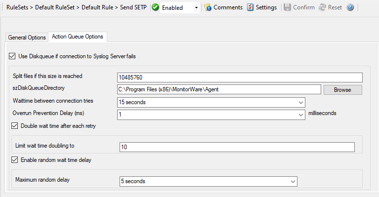

Send SETP
=========

With the "Send SETP" action, messages can be sent to a SETP server.

* Action - Send SETP General*

Servername
^^^^^^^^^^

**File Configuration field:**
  szServer

**Description:**
  The MonitorWare Agent sends :doc:`setp <../glossaryofterms/setp>` to the server/listener under this name.
  You can either use an IPv4, an IPv6 Address, or a Hostname that resolves to
  an IPv4 or IPv6 Address.

Default SETP Port
^^^^^^^^^^^^^^^^^

**File Configuration field:**
  nMIAPSendPort

**Description:**
  The Send :doc:`setp <../glossaryofterms/setp>` sends outgoing requests on this port.
  The default value is 5432. Set the port to 0 to use the system-supplied
  default value (which defaults to 5432 if not modified by a system
  administrator).

  Instead of the port number, a service name can be used. If so, that name is
  looked up via the socket service database functions. The lookup is for
  protocol TCP.

  **Please Note: The SETP port configured here must match the port configured at the listener side (i.e. MonitorWare Agent or WinSyslog Enterprise edition).
  If they do not match, a Send SETP session cannot be initiated. The rule
  engine will log this to the Windows Event Log.**

Enable SSL / TLS Encryption
^^^^^^^^^^^^^^^^^^^^^^^^^^^

**File Configuration field:**
  nUseSSL

**Description:**
  If this option is enabled then this action will be able to connect to SSL/TLS
  :doc:`setp <../glossaryofterms/setp>` servers. Please make sure that you want this option to be enabled.

Use zLib Compression to compress the data
^^^^^^^^^^^^^^^^^^^^^^^^^^^^^^^^^^^^^^^^^

**File Configuration field:**
  nZlibComp

**Description:**
  It enables zLib compression support. Note that the SETP receiver must have
  zLib Compression support and enabled, otherwise it does not work.

Compression Level
^^^^^^^^^^^^^^^^^

**File Configuration field:**
  nCompLevel

  * 1 = Best Speed
  * 3 = Low Compression
  * 6 = Normal Compression
  * 9 = Best Compression

**Description:**
  Higher level results in better compression but slower performance.

Session Timeout
^^^^^^^^^^^^^^^

**File Configuration field:**
  nTimeOutSession

**Description:**
  The maximum time a session to a SETP server is to be kept open.

Connection Timeout
^^^^^^^^^^^^^^^^^^

**File Configuration field:**
  nConnectTimeOut

**Description:**
  Maximum time a connection can take to connect or disconnect.

Send / Receive Timeout
^^^^^^^^^^^^^^^^^^^^^^

**File Configuration field:**
  nSendRecvTimeOut

**Description:**
  When sending or receiving data, this timeout applies.

  **Please note:** If this option is enabled, this action is not be able to
  connect to NON-SSL SETP servers.

Action Queue Options
--------------------

* Action - Send SETP Action Queue*

Use Diskqueue if connection to Syslog server fails
^^^^^^^^^^^^^^^^^^^^^^^^^^^^^^^^^^^^^^^^^^^^^^^^^^

**File Configuration field:**
  nUseDiscQueue

**Description:**
  Enable diskqueuing syslog messages after unexpected connection loss.

Split files if this size is reached
^^^^^^^^^^^^^^^^^^^^^^^^^^^^^^^^^^^

**File Configuration field:**
  nDiskQueueMaxFileSize

**Description:**
  Files will be split until they reach the configured size in bytes. The
  maximum support file size is 10485760 bytes.

Diskqueue Directory
^^^^^^^^^^^^^^^^^^^

**File Configuration field:**
  szDiskQueueDirectory

**Description:**
  The directory where the queue files will be generated in. The queuefiles will
  be generated with a dynamic UUID bound to the action configuration.

Waittime between connection tries
^^^^^^^^^^^^^^^^^^^^^^^^^^^^^^^^^

**File Configuration fields:**
  nDiskCacheWait

**Description:**
  The minimum waittime until the Syslog Action retries to establish a
  connection to the Syslog server after failure.

Overrun Prevention Delay (ms)
^^^^^^^^^^^^^^^^^^^^^^^^^^^^^

**File Configuration field:**
  nPreventOverrunDelay

**Description:**
  When the Action is processing syslog cache files, an overrun prevention delay
  can be added to avoid flooding the target Syslog server.

Double wait time after each retry
^^^^^^^^^^^^^^^^^^^^^^^^^^^^^^^^^

**File Configuration field:**
  bCacheWaittimeDoubling

**Description:**
  If enabled, the configured waittime is doubled after each try.

Limit wait time doubling to
^^^^^^^^^^^^^^^^^^^^^^^^^^^

**File Configuration field:**
  nCacheWaittimeDoublingTimes

**Description:**
  How often the waittime is doubled after a failed connection try.

Enable random wait time delay
^^^^^^^^^^^^^^^^^^^^^^^^^^^^^

**File Configuration field:**
  bCacheRandomDelay

**Description:**
  If enabled, a some random time will be added into the waittime delay. When
  using many syslog senders, this can avoid that all senders start sending
  cached syslog data to the Syslog server at the same time.

Maximum random delay
^^^^^^^^^^^^^^^^^^^^

**File Configuration field:**
  nCacheRandomDelayTime

**Description:**
  Maximum random delay time that will be added to the configured waittime if
  Enable random wait time delay is enabled.
