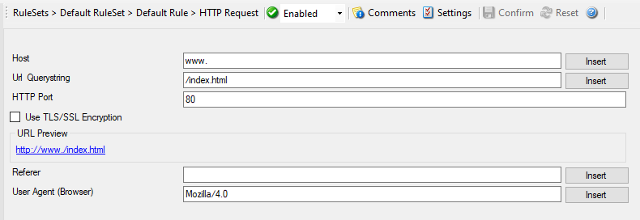

HTTP Request
============

With the "Net Send" action, short alert messages can be sent via the Windows
"net send" facility. These messages are delivered on a best-effort basis. If
the recipient can be reached, they will pop up in a message box on the
recipient's machine. If the recipient cannot be reached, they will simply be
discarded. No buffering takes place. Consequently, the rule engine does not
check if the message can be delivered. It will never flag an action to be in
error due to a reported delivery problem with "net send".

* Action - HTTP Request*

Host
^^^^

**File Configuration field:**
  szHost

**Description:**
  Specify the targeted host here.

URL & Querystring
^^^^^^^^^^^^^^^^^

**File Configuration field:**
  szUrl

**Description:**
  By default this is ``/index.html``. This value is used to construct an URL which
  is previewed in a rectangular field under Use secure https Protocol option.

Port
^^^^

**File Configuration field:**
  nPort

**Description:**
  This port is to be probed. Please see your server's reference for the actual
  value to use. For example, mail servers typically listen to port 25 and web
  servers to 80.

Referrer
^^^^^^^^

**File Configuration field:**
  szReferer

**Description:**
  An optional configuration option where you can specify a Referrer that is
  send in the HTTP header.

UserAgent (Browser)
^^^^^^^^^^^^^^^^^^^

**File Configuration field:**
  szUserAgent

**Description:**
  It is also an optional value which can be used to specify a UserAgent that is
  send in the HTTP header.
