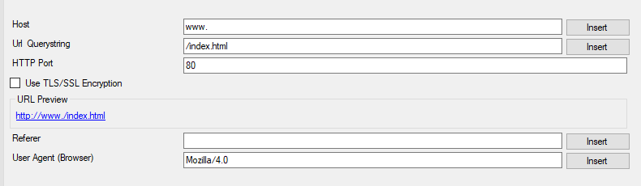

HTTP Request
============

The **HTTP Request** action sends an HTTP or HTTPS request to a remote host.
It is listed under **Forwarding** in the configuration client. Use it for
simple HTTP callbacks where the **HTTP REST Output** action is not required.

*Action - HTTP Request*

Host
^^^^

**File Configuration field:**
  szHost

**Description:**
  Specify the targeted host here.

URL & Querystring
^^^^^^^^^^^^^^^^^

**File Configuration field:**
  szUrl

**Description:**
  By default this is ``/index.html``. This value is used to construct an URL which
  is previewed in a rectangular field under Use secure https Protocol option.

Port
^^^^

**File Configuration field:**
  nPort

**Description:**
  This port is to be probed. Please see your server's reference for the actual
  value to use. For example, mail servers typically listen to port 25 and web
  servers to 80.

Referrer
^^^^^^^^

**File Configuration field:**
  szReferer

**Description:**
  An optional configuration option where you can specify a Referrer that is
  send in the HTTP header.

UserAgent (Browser)
^^^^^^^^^^^^^^^^^^^

**File Configuration field:**
  szUserAgent

**Description:**
  It is also an optional value which can be used to specify a UserAgent that is
  send in the HTTP header.
