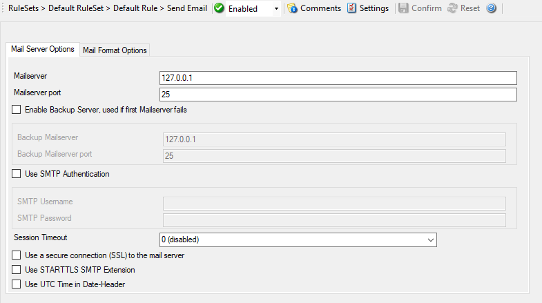

Send Email
==========

This tab is used to configure mail (SMTP) parameters. These are the basic
parameters for email forwarding. They need to be configured correctly, if mail
message should be sent by the service.

Mail Server Options
-------------------

* Action - Send Email - Mail Server Options*

Mailserver
^^^^^^^^^^

**File Configuration field:**
  szSMTPServer

**Description:**
  This is the Name or IP address of the mail server to be used for forwarding
  messages. You can either use an IPv4, an IPv6 Address, or a Hostname that
  resolves to an IPv4 or IPv6 Address. Please note that this server must be
  able to relay messages if the recipient is not hosted at this server. Be sure
  to contact your mail server's administrator if in doubt on this issue.

  The service expects to talk to a standard SMTP mail server. Message relaying
  to the final destination must be permitted.

Mailserver port
^^^^^^^^^^^^^^^

**File Configuration field:**
  nSMTPPort

**Description:**
  Port the mail server is to be contacted at. Usually, this is 25. It might,
  however, be changed in your system. Then, specify the port your mail server
  uses. If in doubt, try the default of 25 - or contact your mail server
  administrator.

Enable Backup Server, used if first Mailserver fails
^^^^^^^^^^^^^^^^^^^^^^^^^^^^^^^^^^^^^^^^^^^^^^^^^^^^

**File Configuration field:**
  nEnableBackupServer

**Description:**
  When enabled, you can configure a second Mailserver that will be used if the
  regular Mailserver is not available/accessible.

Backup Mailserver
^^^^^^^^^^^^^^^^^

**File Configuration field:**
  szSMTPServerBackup

**Description:**
  In case that the connection to the main configured mail server cannot be
  established, the backup mail server is tried. Note that an error is only
  generated, if the connection to the backup server fails as well.

Backup Mailserver port
^^^^^^^^^^^^^^^^^^^^^^

**File Configuration field:**
  nSMTPPortBackup

**Description:**
  Port the mail server is to be contacted at. Usually, this is 25. It might,
  however, be changed in your system. Then, specify the port your mail server
  uses. If in doubt, try the default of 25 - or contact your mail server
  administrator.

Use SMTP Authentication
^^^^^^^^^^^^^^^^^^^^^^^

**File Configuration field:**
  nUseSMTPAuth

**Description:**
  Check this box if your server requires SMTP authentication. To fight SPAM,
  more and more server operators allow relaying only for authenticated users.
  It might even happen that an existing account does no longer work because the
  server has been reconfigured to disallow anonymous posting.

  If your server requires (or supports) SMTP authentication, check this box and
  enter your User ID and password in the boxes below. The exact values will be
  provided by your server operator – if in doubt, please ask the mail server
  support.

  If the mail server does not support authentication, leave this box unchecked.

  We recommend using authentication if it is available. Even when the current
  server configuration allows unauthenticated relay, this potentially will
  change in the future (as the SPAM problem grows). If you already use
  authentication, such a server configuration change will not affect you.
  Otherwise, it will disrupt mail service.

Session Timeout
^^^^^^^^^^^^^^^

**File Configuration field:**
  nTimeoutValue

**Description:**
  This option controls if multiple rapidly incoming messages should be combined
  to a single email message. The SMTP session with the server is held open for
  the specified timeout period. Please note that the period is specified in
  milliseconds, not seconds.

  If a new event arrives within the specified timeout period, that event will
  be included in the same email message as the previous one. Then, the timeout
  is re-started. As such, any events coming in within successive timeout
  periods will be combined in a single mail.

  This is most appropriate when large burst of messages are expected and these
  should be combined in few mail messages. Otherwise, multiple mail messages
  can easily overflow the administrator's mailbox.

  The session timeout is user configurable between 1 and 2147483647
  milliseconds (32bit integer) or different pre-set values. Larger values are
  not supported as they probably affect the SMTP server performance and can
  lead to unpredictable results.

  The session timeout of zero milliseconds has a special meaning: if it is
  selected, every event will be sent in a separate message, no matter how fast
  two messages occur after each other.

Use a secure connection (SSL) to the mail server
^^^^^^^^^^^^^^^^^^^^^^^^^^^^^^^^^^^^^^^^^^^^^^^^

**File Configuration field:**
  nUseSSL

**Description:**
  This option enables SSL-secured traffic to the mail server. Please note, that
  this only works, if the receiving mail server supports SSL-secured
  transmission of emails.

Use STARTTLS SMTP Extension
^^^^^^^^^^^^^^^^^^^^^^^^^^^

**File Configuration field:**
  nUseUTCTimeStamp

**Description:**
  Some Email Readers do not support UTC time in date-headers. Therefore here is
  a switch to turn the UTC time on or off.

Use UTC Time in Date-Header
^^^^^^^^^^^^^^^^^^^^^^^^^^^

**File Configuration field:**
  nUseUTCTimeStamp

**Description:**
  Some Email Readers do not support UTC time in date-headers. Therefore here is
  a switch to turn the UTC time on or off.

Mail Format Options
-------------------

* Action - Send Email - Mail Format Options*

Sender email address
^^^^^^^^^^^^^^^^^^^^

**File Configuration field:**
  szSMTPSender

**Description:**
  Email address used as the sender address for outgoing messages. In order for
  your SMTP server to accept it, it probably must be a valid address.

Recipient email address
^^^^^^^^^^^^^^^^^^^^^^^

**File Configuration field:**
  szSMTPRecipient

**Description:**
  The recipient emails are addressed to. To send a message to multiple
  recipients, enter all recipient's email addresses in this field. Separate
  addressed by spaces, semicolons, or commas ``(e.g. "receiver1@example.com, receiver2@example.com")``. Alternatively, you can use a single email address
  and define a distribution list in your mail software. The distribution list
  approach is best if the recipients frequently change or there is a large
  number of them. Multiple recipients are also supported. They can be delimited
  by space, comma, or semicolon.

Use legacy subject line processing
^^^^^^^^^^^^^^^^^^^^^^^^^^^^^^^^^^

**File Configuration field:**
  nUseLegacySubjectProcessing

**Description:**
  This checkbox specifies which type of subject line processing will be done.
  If it is checked, the old-style processing using single character replacement
  sequences is applied. If it is left unchecked, the far more powerful event
  property based method is used.

  In legacy mode, the following replacement characters are recognized inside
  the subject line:

  ``%s`` IP address or name (depending on the "resolve hostnames" setting) of the source system that sent the message.

``%f`` Numeric facility code of the received message

``%p`` Numeric priority code of the received message

``%m`` the message itself. Please note: this is the complete message text and can be rather lengthy. As such, it is most probably subject to truncation. If that occurs, all other information after the ``%m`` replacement character is also truncated. As such, we strongly recommend using the ``%m`` replacement at the end of the subject line only.

``%%`` It represents a single ``%`` sign. As an example, you may have the subject line set to ``Event from %s: "m"`` and enabled legacy processing. If a message ``This is a test`` were received from ``172.16.0.1``, the resulting email subject would read: ``Event from 172.16.0.1: This is a test``

  In non-legacy mode, the Property Replacer can be used. With it, you can
  include any property from the event message and also modify it. Please visit
  the Property Replacer documentation for details.

  As an example, in non-legacy mode, you can set the subject line to
  ``Mesg: '%msg:1:15%' From: %fromhost%``. If the message ``This is a lengthy test message`` were received from ``172.16.0.1``, the resulting email subject would read: ``Mesg: 'This is a lengt' From: 172.16.0.1``. Please note that the message is truncated because you only extracted the first 15 characters from the message
  text (position 1 to 15).

Subject
^^^^^^^

**File Configuration field:**
  szSMTPSubject

**Description:**
  Subject line to be used for outgoing emails and it is used for each message
  sent. It can contain replacement characters or "Event Properties" to
  customize it with event details. This is especially useful when sending email
  to cellular phones or pagers, which often display only the subject line and
  not the actual message body. The subject line – after expansion of the any
  replacement sequences – can hold a maximum of 255 characters. Characters
  beyond this will be truncated. Please note that many email systems impose a
  more strict limit and truncation may occur before the 255-character limit.
  It is advisable to limit the subject line length to 80 characters or less.

  The mail body will also include full event information, including the source
  system, facility, priority, and actual message text as well as any other
  information that came with this event. As there is no size limitation for
  message bodies, the body always contains the full message received (except
  otherwise configured – see below).

  Please note that Insert Menu entry allows you to add replacement characters
  e.g. ``%msg%`` - you can send out the actual message of an event in the subject line.

  There will be one email for each received message. Email delivery is meant
  for urgent notifications and actions (e. g. calling pagers and such). It is
  not meant to provide an email report.

  Please note that The message content of the Message field can be configured.
  Event properties are described in the property replacer section.

Mail Priority
^^^^^^^^^^^^^

**File Configuration field:**
  nMailPriority

  * 0 = low
  * 1 = Default
  * 2 = High

**Description:**
  Here you can adjust the priority with which the mail will be sent. You can
  choose between "low", "normal", and "high" priority. With this you can give
  your setup some complexity, being able to send some events as "important" and
  others with less importance.

Mail Message Format
^^^^^^^^^^^^^^^^^^^

**File Configuration field:**
  szSMTPBody

**Description:**
  This is the format of the message body. Properties from the event can be
  included by using the Property Replacer. Please note that the message body is
  only sent if "Include Message/Event in Email Body" is checked.

Output Encoding
^^^^^^^^^^^^^^^

**File Configuration field:**
  nOutputEncoding

**Description:**
  Determines the character encoding mode.

Use XML to Report
^^^^^^^^^^^^^^^^^

**File Configuration field:**
  nUseXMLtoReport

**Description:**
  If checked, the received event will be included in XML format in the mail.
  If so, the event will include all information, like the original timestamp,
  the facility, priority etc. XML format is especially useful if the mail is
  sent to an automated system, which will then parse the message.

  If unchecked, just the plain text message will be included in the mail.
  This format is more readable for a human reader.
