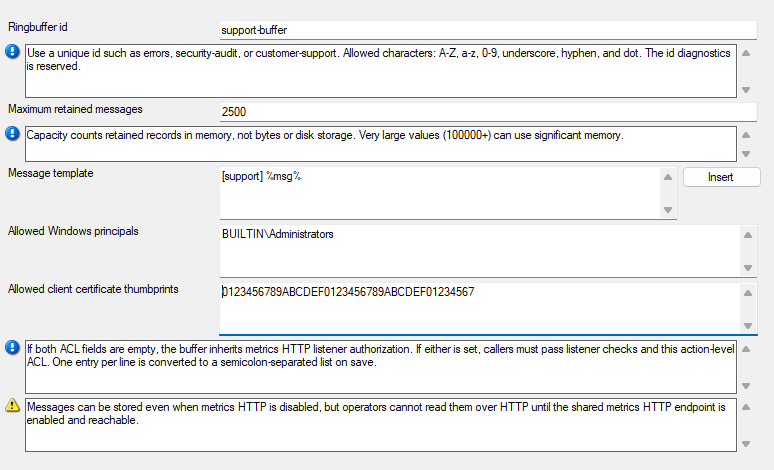

Message Ringbuffer Action
=========================

The **Message Ringbuffer** action keeps recent copies of processed messages in
a named, in-memory buffer. Use it for bounded troubleshooting or an approved
integration that needs recent messages. It does not replace archival logging,
audit retention, or a disk-backed queue.

The action is available starting with **26.08** in MonitorWare Agent,
WinSyslog, EventReporter, and rsyslog Windows Agent builds when the installed
edition includes it.

Messages are retained only while the service and this action configuration
remain active. When the buffer is full, the oldest retained messages are
overwritten. Its contents are lost when the service restarts, when a
configuration reload recreates the action, or when the action is removed.

Remote reads use the secure metrics HTTP listener. Enable that listener
through the file-based ``general(name="Metrics")`` settings; see
:ref:`metrics-http-listener`. Current configuration clients preserve the
Metrics block but do not provide a Metrics editor.

*Message Ringbuffer action properties.*

Ringbuffer ID
^^^^^^^^^^^^^

**File Configuration field:**
  szRingBufferId

**Description:**
  Enter a unique ID for this buffer. Use one to 64 letters, digits, periods,
  underscores, or hyphens. The ID identifies the configured buffer, so do not
  reuse it for another Message Ringbuffer action. The ID ``diagnostics`` is
  reserved and cannot be used.

Maximum retained messages
^^^^^^^^^^^^^^^^^^^^^^^^^

**File Configuration field:**
  nRingBufferMaxMessages

**Description:**
  Set the number of messages to retain, from 2 through 1,000,000. This is a
  record count, not a storage size. Choose a bounded value after considering
  the average message size and the available memory. Larger buffers keep more
  history but use more memory.

Message template
^^^^^^^^^^^^^^^^

**File Configuration field:**
  szMessageTemplate

**Description:**
  Define the text stored for each message. The default is ``%msg%``. Use the
  property insertion control to include the event properties needed by the
  intended troubleshooting or integration workflow.

Allowed Windows principals
^^^^^^^^^^^^^^^^^^^^^^^^^^

**File Configuration field:**
  szRingBufferAllowedWindowsPrincipals

**Description:**
  Optionally list the Windows users, groups, aliases, or SID strings that may
  read this buffer. Separate entries with commas, semicolons, or line breaks.
  Listener authorization is inherited only when both action ACL fields are
  empty. If either this field or **Allowed client certificate thumbprints** is
  populated, the caller must still pass the metrics HTTP listener checks and
  must also match at least one populated action ACL list.

Allowed client certificate thumbprints
^^^^^^^^^^^^^^^^^^^^^^^^^^^^^^^^^^^^^^

**File Configuration field:**
  szRingBufferAllowedClientCertificateThumbprints

**Description:**
  Optionally list SHA-1 client certificate thumbprints that may read this
  buffer. Do not enter SHA-256 fingerprints; this field matches SHA-1 only.
  Use this only when the deployment requires client-certificate authentication
  on the configured secure metrics listener. Listener authorization is
  inherited only when both action ACL fields are empty. If either this field
  or **Allowed Windows users, groups, aliases, or SID strings** is populated,
  the caller must still pass the metrics HTTP listener checks and must also
  match at least one populated action ACL list.
