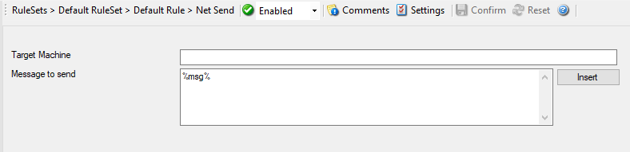

Net Send
========

With the "Net Send" action, short alert messages can be sent via the Windows
"net send" facility. These messages are delivered on a best-effort basis. If
the recipient can be reached, they will pop up in a message box on the
recipient's machine. If the recipient cannot be reached, they will simply be
discarded. No buffering takes place. Consequently, the rule engine does not
check if the message can be delivered. It will never flag an action to be in
error due to a reported delivery problem with "net send".

* Action - Net Send*

Target Machine
^^^^^^^^^^^^^^

**File Configuration field:**
  szTarget

**Description:**
  This is the Windows user name of the intended recipient, a NETBIOS machine
  name, or even an IP address (in the form of ``10.1.1.1``). You can either use an
  IPv4, an IPv6 Address or a Hostname that resolves to an IPv4 or IPv6 Address.

Message to send
^^^^^^^^^^^^^^^

**File Configuration field:**
  szMessage

**Description:**
  This is the message that is sent to the intended target.

  Please note that the message content of the Message to send field can now be
  configured.
  :doc:`event properties <../shared/references/eventspecificproperties>` are described in the
  :doc:`property replacer section <../shared/references/eventproperties>`.
