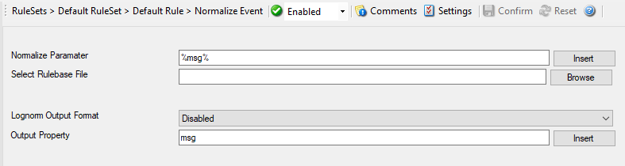

Normalize Event
===============

Parameters can be normalized and converted into XML, CSV, and JSON formats. The
normalization result is stored into an internal property which can be used
for filtering decisions as well as for output actions.

The action uses liblognorm (http://www.liblognorm.com/files/manual/index.html)
which is also used by Rsyslog. Rulebases created for liblognorm can easily be
used and adapted.

* Action - Normalize Event*

Normalize Parameter
^^^^^^^^^^^^^^^^^^^

**File Configuration field:**
  szMessage

**Description:**
  Specifies the property that you want to normalize, by default this is the
  ``%msg%`` property.

Select Rulebase File
^^^^^^^^^^^^^^^^^^^^

**File Configuration field:**
  szRulebase

**Description:**
  The text file that contains the rulebase definitions (see liblognorm
  documentation for more).

Lognorm Output Format
^^^^^^^^^^^^^^^^^^^^^

**File Configuration field:**
  nOutputFormat

  * 0 = DISABLED
  * 1 = JSON
  * 2 = XML
  * 3 = CSV

**Description:**
  * Disabled: No additional output format.
  * JSON Format: Creates a string formatted in JSON which is stored in the
    output property.
  * XLM Format: Creates an XML formatted string which is stored in the output
    property.
  * CSV Format: Creates a CSV (Comma separated values) string which is stored
    in the output property.

Output Property
^^^^^^^^^^^^^^^

**File Configuration field:**
  szOutputProperty

**Description:**
  The property where the normalized format is saved to.
