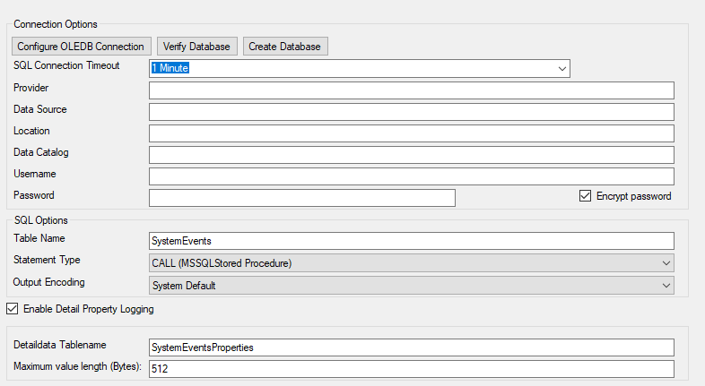
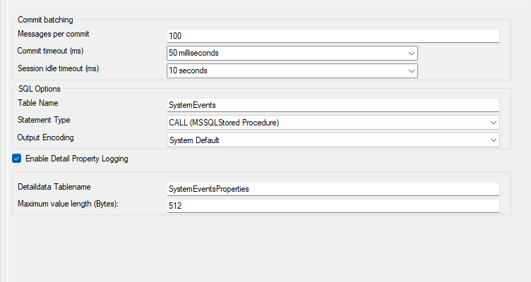

.. _oledb-database-action:

OLEDB Database Action
=====================

Use this action to write matched events or messages to a database through an
OLEDB provider.

This action serves the same main use cases as
:doc:`ODBC Database Options <a-databaseoptions>`, but it connects through OLEDB
instead of an ODBC System DSN. It can write to the built-in Adiscon default
schema or to a user-defined schema. Provider availability depends on your
Windows environment and the database vendor's current OLEDB support.

When to choose OLEDB
--------------------

- You already have a supported OLEDB provider for the target database.
- Your environment standardizes on OLEDB rather than ODBC.
- You need the same database-writing and field-mapping behavior but through an
  OLEDB connection path.

Use the ODBC action instead when your preferred or only supported driver path is
ODBC.

Before you start
----------------

- Verify that the required OLEDB provider is installed on the Windows host.
- Confirm the server, database, and authentication details that the provider
  expects.
- Decide whether you want the default Adiscon schema or an existing custom
  schema.
- Ensure the target account has the required database permissions.

Minimal action path
-------------------

#. Configure the OLEDB connection.
#. Use **Verify Database** to test the connection.
#. Choose one of these paths:

   - use **Create Database** for the default schema, or
   - set the table name and field list for a custom schema

#. Save and apply the configuration.
#. Send a matching test event or message and verify that rows are inserted.

Connection options
------------------

*Action - OLEDB Database Connection*

Buttons
^^^^^^^

**Configure OLEDB Connection**
  Starts the OLEDB configuration wizard for the provider and connection string.

**Verify Database**
  Tests the current OLEDB connection settings.

**Create Database**
  Creates the default Adiscon tables in the target database. Use this only when
  you intentionally want the default schema.

SQL Connection Timeout
^^^^^^^^^^^^^^^^^^^^^^

**File Configuration field:**
  nSQLConnectionTimeOut

**Description:**
  Maximum time to wait while opening the database connection.

Provider
^^^^^^^^

**File Configuration field:**
  szProvider

**Description:**
  OLEDB provider name. Use a provider that is actually installed and supported
  in your environment.

Data Source
^^^^^^^^^^^

**File Configuration field:**
  szDataSource

**Description:**
  Server, instance, or provider-specific data source identifier.

Location
^^^^^^^^

**File Configuration field:**
  szLocation

**Description:**
  Optional OLEDB location setting if your provider requires it.

Data Catalog
^^^^^^^^^^^^

**File Configuration field:**
  szDataCatalog

**Description:**
  Database name or catalog, depending on the provider.

Username
^^^^^^^^

**File Configuration field:**
  szUsername

**Description:**
  User name for database authentication, if required by the provider.

Password
^^^^^^^^

**File Configuration field:**
  szPassword

**Description:**
  Password for the configured user.

Encrypt password
^^^^^^^^^^^^^^^^

**Description:**
  Enable password encryption if your build exposes this option. As with ODBC,
  prefer encrypted storage unless you have a documented reason not to.

*Action - OLEDB Database SQL Options*

Commit batching (SQL Options tab)
^^^^^^^^^^^^^^^^^^^^^^^^^^^^^^^^^

**File Configuration field:**
  nCommitBatchSize

**Description:**
  Number of messages to batch before committing (Messages per commit). Tune for
  throughput versus commit frequency under load.

**File Configuration field:**
  nCommitTimeoutMs

**Description:**
  Maximum time in milliseconds to wait before flushing a partial batch (Commit
  timeout).

**File Configuration field:**
  nSessionTimeoutMs

**Description:**
  Idle timeout in milliseconds for the database session (Session idle timeout).

Table Name
^^^^^^^^^^

**File Configuration field:**
  szTableName

**Description:**
  Target table name for database writes. Keep the default ``SystemEvents`` when
  you use the built-in schema. Set it to your existing table when integrating
  with a custom schema.

Statement Type
^^^^^^^^^^^^^^

**File Configuration field:**
  nSQLStatementType

**Description:**
  Selects whether the action uses a standard ``INSERT`` statement or a Microsoft
  SQL Server call statement for stored procedures. The call-statement path is
  Microsoft SQL Server specific.

Output Encoding
^^^^^^^^^^^^^^^

**File Configuration field:**
  nOutputEncoding

**Description:**
  Controls how string data is encoded when written. In most environments,
  **System Default** is the correct setting unless you have a confirmed
  character-set requirement.

Data mapping and custom schemas
-------------------------------

The field list works the same way as in
:doc:`ODBC Database Options <a-databaseoptions>`. It controls which event
properties are written to which destination columns.

For custom integration:

- set the table name to your existing table
- keep only the fields that exist in that table
- make each field name, field type, and field content match the destination
  schema deliberately

For string fields, you can use property-replacer expressions such as
``%msg:1:200%`` when you need truncation or transformation.

If you use the default schema, keep the default field list unchanged unless you
understand the compatibility impact on tools that expect the standard Adiscon
layout.

Detail property logging
^^^^^^^^^^^^^^^^^^^^^^^

**File Configuration field:**
  nPropertiesTable

**Description:**
  Writes non-standard properties into a separate detail table. This increases
  write volume and is usually needed only when you intentionally want those
  additional properties retained.

Detaildata Tablename
^^^^^^^^^^^^^^^^^^^^

**File Configuration field:**
  szPropertiesTableName

**Description:**
  Table name used for detail-property logging. In the default schema, this is
  typically ``SystemEventProperties``.

Maximum value length (Bytes)
^^^^^^^^^^^^^^^^^^^^^^^^^^^^

**File Configuration field:**
  nMaxValueLength

**Description:**
  Maximum size in bytes for values written into the detail-property table.

Action Queue Options
--------------------

.. only:: mwagent

   .. image:: ../images/a-odbcdatabase-actionqueue-mwagent.png
      :width: 100%
      :alt: MonitorWare Agent OLEDB database Action Queue Options

   *MonitorWare Agent - OLEDB database Action Queue Options*

.. only:: winsyslog or winsyslog_j

   .. image:: ../images/a-odbcdatabase-actionqueue-winsyslog.png
      :width: 100%
      :alt: WinSyslog OLEDB database Action Queue Options

   *WinSyslog - OLEDB database Action Queue Options*

.. only:: eventreporter

   .. image:: ../images/a-odbcdatabase-actionqueue-eventreporter.png
      :width: 100%
      :alt: EventReporter OLEDB database Action Queue Options

   *EventReporter - OLEDB database Action Queue Options*

Use Diskqueue if connection to database fails
^^^^^^^^^^^^^^^^^^^^^^^^^^^^^^^^^^^^^^^^^^^^^

**File Configuration field:**
  nUseDiscQueue

**Description:**
  Stores pending writes on disk when the database path is temporarily
  unavailable.

Split files if this size is reached
^^^^^^^^^^^^^^^^^^^^^^^^^^^^^^^^^^^

**File Configuration field:**
  nDiskQueueMaxFileSize

**Description:**
  Maximum size of each queue file in bytes before a new file is created.

Diskqueue Directory
^^^^^^^^^^^^^^^^^^^

**File Configuration field:**
  szDiskQueueDirectory

**Description:**
  Directory used to store queue files for pending database writes.

Waittime between connection tries
^^^^^^^^^^^^^^^^^^^^^^^^^^^^^^^^^

**File Configuration fields:**
  nDiskCacheWait

**Description:**
  Minimum wait time before the action retries the database connection after a
  failure.

Overrun Prevention Delay (ms)
^^^^^^^^^^^^^^^^^^^^^^^^^^^^^

**File Configuration field:**
  nPreventOverrunDelay

**Description:**
  Optional delay between replayed queue writes to avoid overwhelming the target
  database after recovery.

Double wait time after each retry
^^^^^^^^^^^^^^^^^^^^^^^^^^^^^^^^^

**File Configuration field:**
  bCacheWaittimeDoubling

**Description:**
  Doubles the retry wait time after each failure.

Limit wait time doubling to
^^^^^^^^^^^^^^^^^^^^^^^^^^^

**File Configuration field:**
  nCacheWaittimeDoublingTimes

**Description:**
  Maximum number of retry wait-time increases after repeated failures.

Enable random wait time delay
^^^^^^^^^^^^^^^^^^^^^^^^^^^^^

**File Configuration field:**
  bCacheRandomDelay

**Description:**
  Adds a randomized delay to retry timing. This can reduce synchronized retry
  spikes when many senders reconnect at the same time.

Maximum random delay
^^^^^^^^^^^^^^^^^^^^

**File Configuration field:**
  nCacheRandomDelayTime

**Description:**
  Upper bound for the additional randomized retry delay.

Common pitfalls
---------------

- Assuming OLEDB is required when a supported ODBC path is simpler
- Relying on provider names or examples from older Windows environments without
  verifying that the provider is still installed and supported
- Using the default field list unchanged while targeting a custom table
- Expecting the action to design a custom schema automatically
