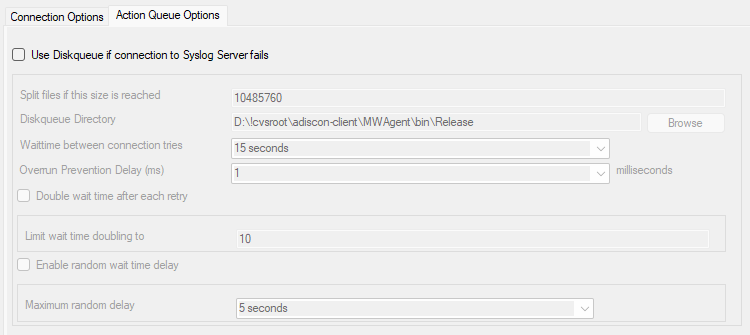

OLEDB Database Action
=====================

Due the changes to x64, it became more important to also support the newer
database layer from Microsoft called OLEDB. The OLEDB Action works similar to
the ODBC Action from configuration point of few. The MS SQL OLEDB Provider and
JET4.0 OLEDB Provider have been successfully tested in the Win32 environment.
Unfortunately, the JET4.0 Provider has not been ported to the x64 platform yet.
In our internal performance tests, there was an enhancement of up to 30%
compared to ODBC. So this action may also be interesting for people with a huge
amount of incoming data.

This Action allows writing incoming events directly to any OLEDB - compliant
database.

Once stored inside the database, different message viewers as well as custom
applications can easily browse them. The defaults for the write database action
are suitable for Adiscon Loganalyzer (web interface).

The database format can be fine-tuned. This is most useful if you intend to run
some additional analysis on the database. Also, in high volume environments,
tuning the database action to exactly those fields need helps getting best
performance out of the database.

The main feature of the "OLEDB Database Action" property sheet is the field
list. The default reflects the typical assignment of event properties to
database columns. However, you can modify this assignment in any way you like.

Connection Options
------------------

* Action - OLEDB Database Connection*

**Configure OLEDB Connection**

If you click on this button, it starts an OLEDB configuration wizard that will
  help you configuring your OLEDB data source.

**Verify Database**

The configuration client will attempt to establish a database connection to
your configured OLEDB Connection.

**Create Database**

If you click on this button, the configuration client will create the default
tables for SystemEvents and SystemEventsProperties into your configured OLEDB
database.

SQL Connection Timeout
^^^^^^^^^^^^^^^^^^^^^^

**File Configuration field:**
  nSQLConnectionTimeOut

**Description:**
  Defines the Timeout for the connection

Provider
^^^^^^^^

**File Configuration field:**
  szProvider

**Description:**
  OleDB Provider like SQL Server Client (SQLNCLI11.1). Should be filled
  automatically with Configure OLEDB Connection button.

Data Source
^^^^^^^^^^^

**File Configuration field:**
  szDataSource

**Description:**
  Data source is most often the server name or IP address like
  SERVERNAME\SQLEXPRESS for example. Should be filled automatically with
  Configure OLEDB Connection button.

Location
^^^^^^^^

**File Configuration field:**
  szLocation

**Description:**
  OLEDB Location. Should be filled automatically with Configure OLEDB
  Connection button.

Data Catalog
^^^^^^^^^^^^

**File Configuration field:**
  szDataCatalog

**Description:**
  Is the database name in most cases. Should be filled automatically with
  Configure OLEDB Connection button.

Username
^^^^^^^^

**File Configuration field:**
  szUsername

**Description:**
  Username used for authentication. Should be filled automatically with
  Configure OLEDB Connection button.

Password
^^^^^^^^

**File Configuration field:**
  szPassword

**Description:**
  Password used for authentication. Should be filled automatically with
  Configure OLEDB Connection button.

Encrypt password
^^^^^^^^^^^^^^^^

**File Configuration field:**
  szPassword

**Description:**
  Password used for authentication. Should be filled automatically with
  Configure OLEDB Connection button.

Table Name
^^^^^^^^^^

**File Configuration field:**
  szTableName

**Description:**
  The name of the table to log to. This name is used to create the SQL insert
  statement and must match the database definition. Default is "SystemEvents".

  **Please note that the default table name must be used when other members of the MonitorWare family (like the web interface or the MonitorWare Console)
  should work with the database. This customization option is meant for those
  customers that use third-party or custom software.**

Statement Type
^^^^^^^^^^^^^^

**File Configuration field:**
  nSQLStatementType

**Description:**
  You can select between a INSERT and Call Statement, which is Microsoft
  specific for Stored Procedures. This means also this type of SQL Statement
  will only work if MSSQL is used as database. If you select MSSQL Call
  Statement, the tablename field will automatically be used as stored procedure
  name.

Output Encoding
^^^^^^^^^^^^^^^

**File Configuration field:**
  nOutputEncoding

**Description:**
  This setting is most important for Asian languages. A good rule is to leave
  it at "System Default" unless you definitely know you need a separate
  encoding. "System Default" works perfect in the far majority of cases, even
  on Asian (e.g. Japanese) Windows versions.

Enable Detail Property Logging
^^^^^^^^^^^^^^^^^^^^^^^^^^^^^^

**File Configuration field:**
  nPropertiesTable

**Description:**
  This option logs event properties other than the standard properties to the
  SystemEventProperties table. A single event can potentially have multiple
  properties, so selecting this option can result in multiple writes. With
  Syslog data, however, there are seldom any additional properties. They most
  often occur when you use the "Post Process" action to define your own
  properties. Additional properties are typically found in SETP received data
  originating from an Event Log Monitor, file monitor, or database monitor (plus
  other monitors, but these are the most prominent ones).

  For example, with Event Log data received via SETP, these properties contain
  the actually Windows event properties and the event data. Please note that
  this does not apply to event log messages received via Syslog, because they
  are no native events but rather Syslog data.

  Please make sure you actually need this before activating it. As a side note,
  some of the MonitorWare Console reports may need detail logging.

Detaildata Tablename
^^^^^^^^^^^^^^^^^^^^

**File Configuration field:**
  szPropertiesTableName

**Description:**
  Tablename for Detail Property Logging

Maximum value length (Bytes)
^^^^^^^^^^^^^^^^^^^^^^^^^^^^

**File Configuration field:**
  nMaxValueLength

**Description:**
  Maximum length in bytes for values stored in Detaildata table.

Datafields
----------

The provided fieldnames are those that Adiscon's schema uses - you can add your
own if you have a need for this.

You can edit the field list by selecting a row and then modifying the text
fields above the table. You can insert and delete rows by selecting the
respective button. If you press delete, the currently selected row is deleted.

For string data types, you can use the property replacer. This can be helpful
if you would like to store a substring. For example, if you intend to store
only the first 200 characters of each message, you can use "%msg:1:200%".

* Action - OLEDB Database Datafields*

Fieldname
^^^^^^^^^

**File Configuration field:**
  szFieldName_[n]

**Description:**
  The Fieldname is the database column name. It can be any field inside the
  table.

Fieldtype
^^^^^^^^^

**File Configuration field:**
  nFieldType_[n]

  * 1 = varchar
  * 2 = int
  * 3 = text
  * 4 = DateTime

**Description:**
  Fieldtype is the data type of the database column. It must reflect the column
  type selected in the database. It must also be consistent in type with the
  actual property that must be stored. For example, an integer type property
  like the syslogpriority can be stored in a varchar column. A string data type
  like the syslogtag can - for obvious reasons - not be stored in an integer
  column.

Fieldcontent
^^^^^^^^^^^^

**File Configuration field:**
  szFieldContent_[n]

**Description:**
  Finally, the Fieldcontent is the event property. For a complete list of
  supported properties, see :doc:`event properties <../shared/references/eventspecificproperties>`

Action Queue Options
--------------------

* Action - Send RELP Action Queue*

Use Diskqueue if connection to Syslog server fails
^^^^^^^^^^^^^^^^^^^^^^^^^^^^^^^^^^^^^^^^^^^^^^^^^^

**File Configuration field:**
  nUseDiscQueue

**Description:**
  Enable diskqueuing syslog messages after unexpected connection loss.

Split files if this size is reached
^^^^^^^^^^^^^^^^^^^^^^^^^^^^^^^^^^^

**File Configuration field:**
  nDiskQueueMaxFileSize

**Description:**
  Files will be split until they reach the configured size in bytes. The
  maximum support file size is 10485760 bytes.

Diskqueue Directory
^^^^^^^^^^^^^^^^^^^

**File Configuration field:**
  szDiskQueueDirectory

**Description:**
  The directory where the queue files will be generated in. The queuefiles will
  be generated with a dynamic UUID bound to the action configuration.

Waittime between connection tries
^^^^^^^^^^^^^^^^^^^^^^^^^^^^^^^^^

**File Configuration fields:**
  nDiskCacheWait

**Description:**
  The minimum waittime until the Syslog Action retries to establish a
  connection to the Syslog server after failure.

Overrun Prevention Delay (ms)
^^^^^^^^^^^^^^^^^^^^^^^^^^^^^

**File Configuration field:**
  nPreventOverrunDelay

**Description:**
  When the Action is processing syslog cache files, an overrun prevention delay
  can be added to avoid flooding the target Syslog server.

Double wait time after each retry
^^^^^^^^^^^^^^^^^^^^^^^^^^^^^^^^^

**File Configuration field:**
  bCacheWaittimeDoubling

**Description:**
  If enabled, the configured waittime is doubled after each try.

Limit wait time doubling to
^^^^^^^^^^^^^^^^^^^^^^^^^^^

**File Configuration field:**
  nCacheWaittimeDoublingTimes

**Description:**
  How often the waittime is doubled after a failed connection try.

Enable random wait time delay
^^^^^^^^^^^^^^^^^^^^^^^^^^^^^

**File Configuration field:**
  bCacheRandomDelay

**Description:**
  If enabled, a some random time will be added into the waittime delay. When
  using many syslog senders, this can avoid that all senders start sending
  cached syslog data to the Syslog server at the same time.

Maximum random delay
^^^^^^^^^^^^^^^^^^^^

**File Configuration field:**
  nCacheRandomDelayTime

**Description:**
  Maximum random delay time that will be added to the configured waittime if
  Enable random wait time delay is enabled.
