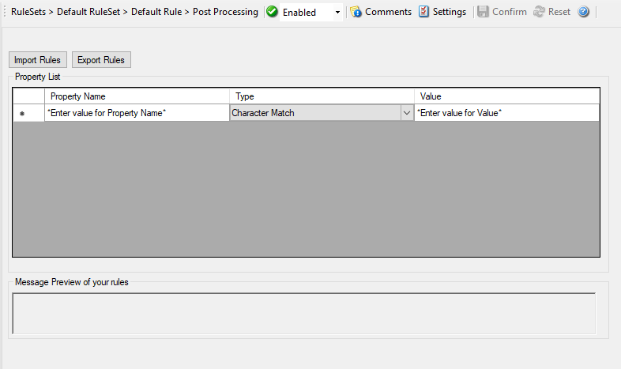

Post Processing
===============

The Post Processing action allows you to re-parse a message after it has been
processed e.g. Tab Delimited format.

Such re-parsing is useful if you either have a non-standard Syslog format or
if you would like to extract specific properties from the message.

The post process action takes the received message and parses it according to a
parse map. The parse map specifies which properties of which type are present
at which position in the message. If the message actually matches the parse
map, all properties are extracted and are set as part of the event. If the
parse map does not match the message, parsing stops at the first-non matching
entry.

* Action - Post Processing*

Templates
---------

Parse maps can be quite complex. In order to facilitate exchange for parse
maps, they can be persisted to XML files. Adiscon also plans to provide parse
maps for some common devices.

We know that creating a parse map is often not a trivial task. If you are in
doubt how to proceed, please contact us via the `Customer Service System <https://ticket.adiscon.com/>`_ - we
will happily assist you with your needs. In this case, you will probably
receive a parse map file that you can import here.

The Parse Map Editor
--------------------

In this dialog, you can edit only in the text boxes above the data grid. When
you select an entry in the grid, its values are updated in the textboxes. Any
edits made there will automatically be reflected to the grid. Pressing Insert
or Delete will create a new entry or delete the currently selected one.

Property Name
^^^^^^^^^^^^^

**File Configuration field:**
  szProperty_[n]

**Description:**
  The property name that is to be parsed. The list box is pre-populated with
  standard and event properties. However, you can add any property name you
  like. If you create your own properties, we highly recommend prefixing their
  name with "u-" so that there will be no duplicates with standard properties.
  Adiscon will never prefix any properties with "u-". For example, if you would
  like to create a custom property "MyProperty", we highly suggest that you use
  the property name "u-MyProperty" instead.

  The property name "Filler" is reserved. Any values assigned to the
  Filler-property will be discarded. This is the way to get rid of
  fill-characters that you do not really need.

Type
^^^^

**File Configuration field:**
  nSyntax_[n]

  * Integer = 101
  * IPV4Addr = 102
  * CharMatch = 201
  * RestOfMessage = 202
  * Word = 203
  * UpTo = 204
  * TimeStampISO = 301
  * TimeStampUNIX = 302

**Description**
  Some types need an additional value. If that is needed, you can provide it here.

Value
^^^^^

**File Configuration field:**
  szParsValue_[n]

**Description:**
  Some types need an additional value. If that is needed, you can provide it
  here.

Message Preview
---------------

This is a read-only box. It shows a hypothetical message that would match the
configured parsing rules.

Parsing log messages
====================

**This article describes how to parse log message via "Post-Process". It illustrates the logic behind Post-Process action.**

Get relevant information from logs
----------------------------------

Log files contain a lot of information. In most cases only a small part of the
log message is of actual interest. Extracting relevant information is often
difficulty. Due to a variety of different log formats a generic parser covering
all formats is not available.

Good examples are firewalls. Cisco PIX and FortiGate firewalls both use syslog
for logging. But the content of their respective log messages are very
different. Therefore a method is needed to parse the logs in a generic way.
Here Post-Process action of Adiscon's MonitorWare comes into play.

Tool kit for parsing
--------------------

Post-Process action provides an editor for creating a log format template. A
template consists of as many rules as necessary to parse out the relevant
information.

Determine necessary information
-------------------------------

In order to parse out information it is vital to know the exact structure of
the message. Identifying the position of each relevant item is essential.
Assuming for auditing purposes the following items are needed:

  * Timestamp
  * Source IP-Address
  * SyslogTag
  * MessageID
  * Username
  * Status
  * Additional Information

A sample message looks like:

``Mar 29 08:30:00 172.16.0.1 %Access-User: 12345: rule=monitor-user-login user=Bob status=denied msg=User does not exist``

In order to extract the information let us examine each item within the
message. Splitting the message makes it easier to explain. So here we go.

.. code-block:: text

   Pos = Position of the character
   *p  = Points to the position the parser stands after parsing the*
         rule
   Log = Message subdivided into its characters.
   Pro = Property. In the term of Adiscon a property is the name of
         the item which is parsed out.mk:
         @MSITStore:C:\PROGRA~2\MONITO~1\Agent\manual\MONITO~1.CHM::/

Note that at beginning of the parse process the parser's pointer points to the
first character. Each parse type starts parsing at the current position of the
pointer.

Parsing out a Timestamp
-----------------------

The first identified item is a so called Unix/Timestamp. It has always a length
of 15 characters. 'UNIX/LINUX-like Timestamp' parse type exactly covers the
requirement to parse this item. Therefore insert a rule and select
'UNIX/LINUX-like Timestamp' type. This rule parses out the timestamp and moves
the pointer to the next character after the timestamp. Name the property
'u-timestamp' [1].

**Note:** There is a second timestamp-type, the **ISO-like-timestamp**. It has the format**2006-07-24 13:37:00.**

* Post-Process Editor: Inserted a 'UNIX/LINUX like timestamp' rule*

Get the IP-Address
------------------

Next item is the IP address. Note that after the timestamp follows a space and
then the IP address. Therefore insert a 'Character Match' rule with a space as
value. Select the 'Filler' [2] property for this rule. 'Character Match'
requires a user defined value. This parse type compares the given value with
the character at the current position of the message. The character has to be
identical with the given value otherwise the parse process will fail. After
applying this parse type the parse pointer is moved to the position immediately
after the given value. In our sample this is the start position of the IP
Address (position 17).

After that the address can be obtained. Place in a 'IP V4 Address' type. This
type parses out a valid IP regardless of its length. No need to take care about
the characters. Select 'Source' property or name it to whatever you prefer. The
parser will automatically move the pointer to the position next to the address.

.. image:: ../images/post-process-editor-02.png
   :width: 100%

* Post-Process Editor: Note the value of 'Character Match' rule is a Space*

Obtain the syslogtag
--------------------

Behind the IP it is a blank followed by a percent sign. The percent indicates
that the syslogtag is following. To move the pointer to the syslogtag position
once again a 'Character Match' rule is necessary. It has to match the space
(actual position of the pointer) and the percent sign. This content is not
needed therefore assign it to the 'Filler' property.

A colon is immediately behind the syslogtag. So all characters between the
percent sign and the colon are needed. The 'UpTo' type can do this job.
Insert an 'UpTo' rule. As value enter ':' (without the quotes) and select
the syslogtag property. Note that after parsing the pointer stands on the
first character of the 'UpTo' value.

.. image:: ../images/post-process-editor-03.png
   :width: 100%

* Post-Process Editor*

* Important: It points to the colon not to the blank.*

Take the MessageID
------------------

The next interesting item is the MessageID. Move the pointer to start position
of the MessageID part. Again, do this by using a 'Character Match' rule. Keep
in mind that the pointer points to the colon. Behind the colon is a space and
then the MessageID starts. Thus, the value of the rule has to be ': '.

MessageID consist of numbers only. For numeric parsing the 'Integer' parse type
exist. This type captures all characters until a non-numeric character appears.
The pointer is moved behind the number. Note that numeric values with decimal
dots cannot be parsed with this type (because they are not integers). This
means trying to parse 1.1 results in 1, because the dot is a non-numeric value.

* Post-Process Editor*

Find the username and status
----------------------------

Looking at the remainder of the message indicates that the username is not
immediately after syslogtag. Thankfully though, the username always starts with
'user='. Consequently the 'UpTo' type can be used to identify the username. To
get the start position of the username we have to use 'UpTo' together with
'Character Match'. Remember that 'UpTo' points to the first character of the
given value. For this reason the 'Character Match' rule is necessary.

After locating the start position of the username 'Word' parse type can be used.
'Word' parses as long as a space sign is found. Enter 'u-username' as property.

* Post-Process Editor*

* Notice: After parsing a word the pointer stands on the space behind the parsed

word.*

The steps to get the status are very similar to the previous one

The last rule - Additional Information
--------------------------------------

One item of interest is left. The last part of the message contains additional
information. It starts after 'msg='. So the combination of 'UpTo' and
'Character Match' is used to go to the right position. All characters after
'msg=' until the end of the message are interesting. For this purpose the
'Rest of Message' parse type is available. It stores all characters from the
current position until the end of the message. This also means that this rule
can only be used once in a template and is always the last rule.

.. image:: ../images/post-process-editor-07.png
   :width: 100%

* Complete parse template.*

What happens if the parser fails?
---------------------------------

If a rule does not match processing stops at this point. This means all
properties of rules which were processed successfully until the non-matching
rule occurs are available.

Let's assume the fourth rule of the following sample does not match.

The first three rules were processed successfully. Therefore u-timestamp and
Source are available. But syslogtag and u-messageid are always empty due to the
parser never process this rules.

.. The Post-Process template which was created in this article is available for download. If you have further question on Post-Process, please contact our support.

[1] Using the "u-" prefix is recommended to differentiate between
MonitorWare-defined properties and user defined one. It is not required, but
often of great aid. A common trap is that newer versions of MonitorWare may
use property names that a user has also used. MonitorWare will never use any
name starting with "u-", so the prefix also guards against such a scenario.

[2] Filler is a predefined property which acts as a bin for unwanted
characters. Essentially, the data is simply discarded.

Please Note: There's also a StepByStep Guide available which describes how the
PostProcessAction works, you can find it `here <https://www.mwagent.com/faq/general-questions/how-to-store-custom-properties-of-a-log-message-in-a-database/>`_.
