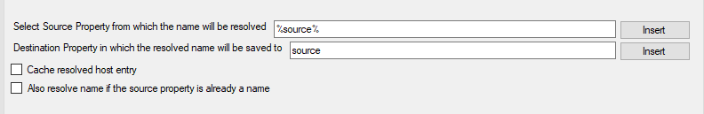

Resolve Hostname Action
=======================

The **Resolve Hostname** action resolves a host name or address from one event
property and stores the result in another property. Because it is an action,
you can place it in the ruleset where the resolved value is needed.

* Action - Resolve Hostname*

Select Source Property from which the name will be resolved
^^^^^^^^^^^^^^^^^^^^^^^^^^^^^^^^^^^^^^^^^^^^^^^^^^^^^^^^^^^

**File Configuration field:**
  szSourcePropertyName

**Description:**
  Click on the Insert menu link on the right side of the textfield to customize
  the source property from which the name will be resolved.

Destination Property in which the resolved name will be saved to
^^^^^^^^^^^^^^^^^^^^^^^^^^^^^^^^^^^^^^^^^^^^^^^^^^^^^^^^^^^^^^^^

**File Configuration field:**
  szDestinationPropertyName

**Description:**
  Same as above, please click on the Insert menu link on the right side of the
  textfield to customize the destination property in which the resolved name
  will be saved to.

Also resolve name if the source property is already a name
^^^^^^^^^^^^^^^^^^^^^^^^^^^^^^^^^^^^^^^^^^^^^^^^^^^^^^^^^^

**File Configuration field:**
  nResolveIfName

**Description:**
  Activates the feature that the name will also be resolved if there is
  already a source property with that name.

Cache resolved host entry
^^^^^^^^^^^^^^^^^^^^^^^^^

**File Configuration field:**
  nCacheNameEntry

**Description:**
  If activated this will, as it says, cache the resolved host entry.
