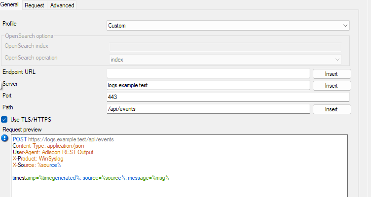
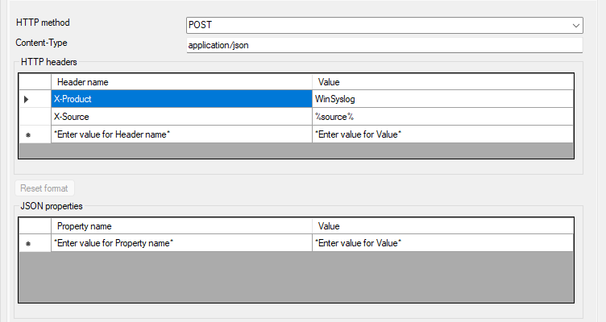
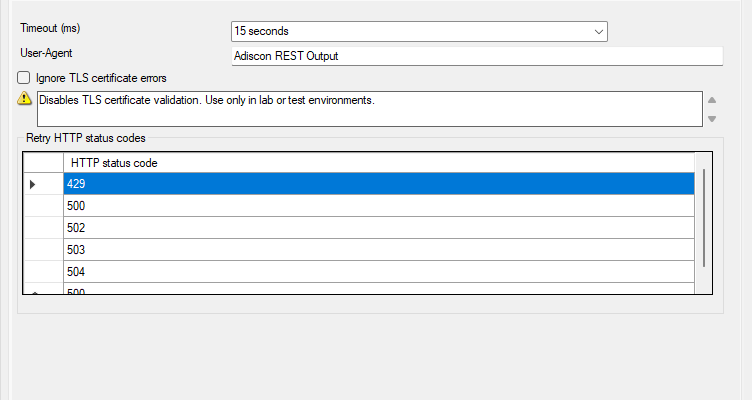

.. _http-rest-output:

HTTP REST Output
================

The **HTTP REST Output** action forwards matched events or messages to an HTTP
or HTTPS endpoint. It is available on WinSyslog, EventReporter, and
MonitorWare Agent from the **26.07** release line onward (action type **1032**,
``RestOutput``).

Use this action for webhooks, REST APIs, and OpenSearch bulk indexing. It is
distinct from the older **HTTP Request** action, which performs a simpler HTTP
call.

*Action - HTTP REST Output - General*

General tab
-----------

Profile
^^^^^^^

**File Configuration field:**
  szProfile

**Description:**
  Selects the request profile:

  - **Custom** — full control over endpoint, method, headers, and body template.
  - **OpenSearch bulk** — preconfigured layout for OpenSearch bulk API uploads.

Endpoint
^^^^^^^^

**File Configuration field:**
  szEndpoint

**Description:**
  Optional full endpoint URL. When set, it can override separate server, path,
  and port fields depending on profile behavior. A preview shows the resolved
  URL in the client.

Server
^^^^^^

**File Configuration field:**
  szServer

**Description:**
  Host name or IP address of the REST endpoint.

Path
^^^^

**File Configuration field:**
  szPath

**Description:**
  URL path (default ``/``).

Port
^^^^

**File Configuration field:**
  nPort

**Description:**
  TCP port (``0`` uses the default for HTTP or HTTPS).

Use TLS
^^^^^^^

**File Configuration field:**
  bUseTLS

**Description:**
  Use HTTPS instead of HTTP.

Ignore TLS certificate errors
^^^^^^^^^^^^^^^^^^^^^^^^^^^^^

**File Configuration field:**
  bIgnoreTlsCertificateErrors

**Description:**
  Accept server certificates even when validation fails. Use only in controlled
  test environments.

Request tab
-----------

*Action - HTTP REST Output - Request*

Method
^^^^^^

**File Configuration field:**
  szMethod

**Description:**
  HTTP method: ``POST``, ``PUT``, ``PATCH``, ``GET``, or ``DELETE``.

Content-Type
^^^^^^^^^^^^

**File Configuration field:**
  szContentType

**Description:**
  Value for the ``Content-Type`` header (for example ``application/json``).

HTTP headers
^^^^^^^^^^^^

**File Configuration field:**
  szHttpHeaders

**Description:**
  Additional headers as configured in the client header list.

Request template
^^^^^^^^^^^^^^^^

**File Configuration field:**
  szRequestTemplate

**Description:**
  Body template for the HTTP request. Property replacers can embed event
  fields. The client supports mapping JSON properties to values for structured
  payloads.

OpenSearch bulk profile
^^^^^^^^^^^^^^^^^^^^^^^

When **OpenSearch bulk** is selected:

**File Configuration field:**
  szOpenSearchIndex

**Description:**
  Target index name.

**File Configuration field:**
  szOpenSearchOperation

**Description:**
  Bulk operation type: ``index`` or ``create``.

Advanced tab
------------

*Action - HTTP REST Output - Advanced*

Timeout
^^^^^^^

**File Configuration field:**
  nTimeoutMs

**Description:**
  Maximum time in milliseconds to wait for the HTTP response (default 15000).

User-Agent
^^^^^^^^^^

**File Configuration field:**
  szUserAgent

**Description:**
  ``User-Agent`` header sent with the request (default ``Adiscon REST Output``).

Retry HTTP status codes
^^^^^^^^^^^^^^^^^^^^^^^

**File Configuration field:**
  szRetryHttpStatusCodes

**Description:**
  Comma-separated list of HTTP status codes that trigger a retry (default
  ``429,500,502,503,504``). Individual codes can also be configured in the
  retry list in the client.

Related information
-------------------

- :doc:`a-httprequest`
- :doc:`../shared/references/accessingproperties`
