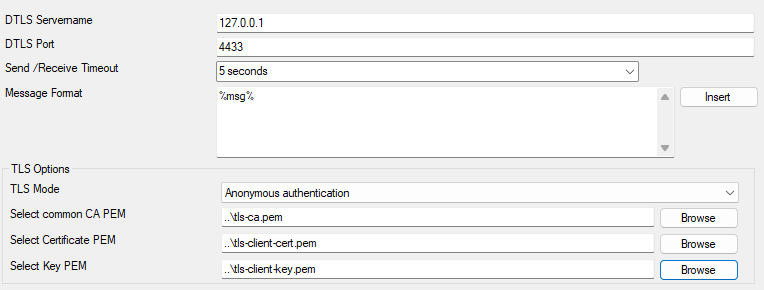

Send DTLS
=========

This action sends messages securely using the Datagram Transport Layer Security (DTLS) protocol. It ensures message confidentiality and integrity over an encrypted channel. The implementation uses OpenSSL to handle encryption and decryption, ensuring robust security and compatibility with industry standards. DTLS is suitable for applications requiring low latency and secure communication.

* Action - Send DTLS Configuration*

DTLS Servername
^^^^^^^^^^^^^^^

**File Configuration field:**
  szDTLSServer

**Description:**
  The hostname or IP address of the DTLS server to which messages should be sent. You can use an IPv4, IPv6 address, or a hostname resolving to one of these.

DTLS Port
^^^^^^^^^

**File Configuration field:**
  nDTLSSendPort

**Description:**
  The port number on the DTLS server where messages are sent. Typically, this port is 4433.

Send/Receive Timeout
^^^^^^^^^^^^^^^^^^^^

**File Configuration field:**
  nSendTimeOut

**Description:**
  Specifies the time in seconds to wait for a response from the DTLS server before timing out. For instance, set this value to "5 seconds" for a 5-second timeout.

Message Format
^^^^^^^^^^^^^^

**File Configuration field:**
  szMessage

**Description:**
  Defines the format of the message being sent. Use placeholders like "%msg%" to define the dynamic content of the message. Multi-line messages are supported.

TLS Options
^^^^^^^^^^^

TLS Mode
^^^^^^^^

**File Configuration field:**
  nTLSMode

**Description:**
  Specifies the authentication method used. Options include "Anonymous authentication" or other modes requiring certificates.

Select common CA PEM
^^^^^^^^^^^^^^^^^^^^

**File Configuration field:**
  szTLSCAFile

**Description:**
  Path to the CA certificate file (e.g., `tls-ca.pem`).

Select Certificate PEM
^^^^^^^^^^^^^^^^^^^^^^

**File Configuration field:**
  szTLSCertFile

**Description:**
  Path to the client certificate file (e.g., `tls-client-cert.pem`).

Select Key PEM
^^^^^^^^^^^^^^

**File Configuration field:**
  szTLSKeyFile

**Description:**
  Path to the private key file for the client (e.g., `tls-client-key.pem`).
