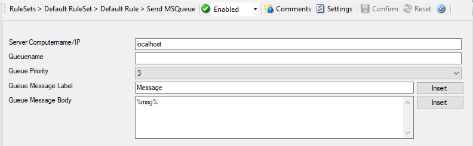

Send MSQueue
============

In order to use this Action, the "Microsoft Message Queue (MSMQ) Server" needs
to be installed. This Action can be used to send a message into the Microsoft
Message Queue.

* Action - Send MSQueue*

Server Computername/IP
^^^^^^^^^^^^^^^^^^^^^^

**File Configuration field:**
  szComputerName

**Description:**
  Sets the computername or IP which contains the MSQueue you want to query. You
  can either use an IPv4, an IPv6 Address, or a Hostname that resolves to an
  IPv4 or IPv6 Address.

Queuename
^^^^^^^^^

**File Configuration field:**
  szQueueName

**Description:**
  Specify the Queuename into which you want to write.

Queue Priority
^^^^^^^^^^^^^^

**File Configuration field:**
  nMessagePriority

**Description:**
  Configure or set the priority property here.

Queue Message Label
^^^^^^^^^^^^^^^^^^^

**File Configuration field:**
  szQueueLable

**Description:**
  Sets the Label text of a queue item.

Queue Message Body
^^^^^^^^^^^^^^^^^^

**File Configuration field:**
  szQueueBody

**Description:**
  The text here will be set to the body of a queue item.
