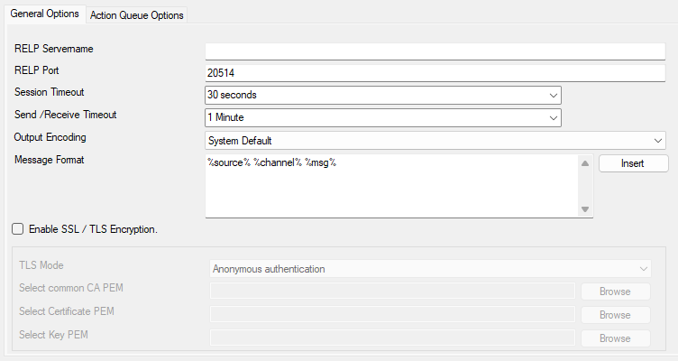
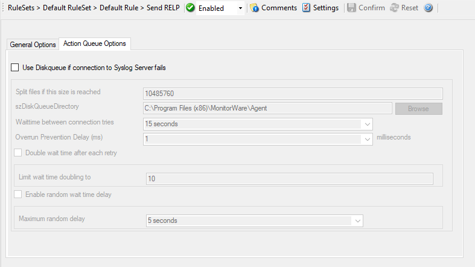

Send RELP
=========

This action is roughly equivalent to the "send syslog" action, except that it
utilizes the new reliable event logging protocol (RELP) for message
transmission. It can only be used together with a RELP-enabled receiver but
then provides enhance reliability in the communications process.

Note that for reliable operation where messages should be preserved over a
service shutdown, queue cache mode must be activated. This is because RELP
guards only the transmission channel, but not local processing.

* Action - Send RELP General*

RELP Servername
^^^^^^^^^^^^^^^

**File Configuration field:**
  szSelpSendServer

**Description:**
  This is the name or IP address of the system to which RELP messages should be
  sent to. You can either use an IPv4, an IPv6 Address, or a Hostname that
  resolves to an IPv4 or IPv6 Address.

RELP Port
^^^^^^^^^

**File Configuration field:**
  nSelpSendPort

**Description:**
  The remote port on the RELP server to report to. If in doubt, please leave it
  at the default value of 20514, which is typically the RELP port. Different
  values are only required for special setups, for example in security
  sensitive areas.

  Instead of the port number, a service name can be used. If so, that name is
  looked up via the socket service database functions.

Session Timeout
^^^^^^^^^^^^^^^

**File Configuration field:**
  nTimeOutSession

**Description:**
  The maximum time a session to a SETP server is to be kept open.

Send / Receive Timeout
^^^^^^^^^^^^^^^^^^^^^^

**File Configuration field:**
  nSendTimeOut

**Description:**
  The maximum time a server waits for a response of a remote server. When the
  timeout expires without receiving a response, the connection is broken and
  (based on rule settings) being reestablished. This can be a useful option if
  the remote system drops connections for whatever reason AND the sender system
  is not notified about this (which, for example, can happen due to some
  firewall configurations).

Output Encoding
^^^^^^^^^^^^^^^

**File Configuration field:**
  nOutputEncoding

**Description:**
  Allows you to specify the character encoding for messages sent to the RELP server.
  The default setting is "System Default", which uses the system's default character
  encoding. Other common options include UTF-8, ASCII, and other standard encodings.

Message format
^^^^^^^^^^^^^^

**File Configuration field:**
  szMessage

**Description:**
  You can change the message format. By default the original message is forwarded.

  Please note that the message content of the Message field can be configured.
  :doc:`event properties <../shared/references/eventspecificproperties>` are described in the
  :doc:`property replacer section <../shared/references/eventproperties>`.

Enable SSL / TLS Encryption
^^^^^^^^^^^^^^^^^^^^^^^^^^^

**File Configuration field:**
  nUseSSL

**Description:**
  If this option is enabled, the action will use SSL/TLS encryption for secure
  communication with the RELP server. When disabled, messages will be sent
  unencrypted. Note that if this option is enabled, the action will not be able
  to talk to a NON-SSL secured server.

TLS Mode
^^^^^^^^

**File Configuration field:**
  nTLSMode

**Description:**
  **Anonymous Authentication**
  Default option. This means that a default certificate will be used.

  **Use Certificate**
  If this option is enable, you can specify your own certificate. For further
  authentication solutions, you will need to create your own certificates using
  OpenSSL Tools for example.

Select common CA PEM
^^^^^^^^^^^^^^^^^^^^

**File Configuration field:**
  szTLSCAFile

**Description:**
  Select the certificate from the common Certificate Authority (CA). The RELP
  Receiver should use the same CA.

Select Certificate PEM
^^^^^^^^^^^^^^^^^^^^^^

**File Configuration field:**
  szTLSCertFile

**Description:**
  Select the client certificate (PEM Format).

Select Key PEM
^^^^^^^^^^^^^^

**File Configuration field:**
  szTLSKeyFile

**Description:**
  Select the keyfile for the client certificate (PEM Format).

Action Queue Options
--------------------

* Action - Send RELP Action Queue*

Use Diskqueue if connection to Syslog server fails
^^^^^^^^^^^^^^^^^^^^^^^^^^^^^^^^^^^^^^^^^^^^^^^^^^

**File Configuration field:**
  nUseDiscQueue

**Description:**
  Enable diskqueuing syslog messages after unexpected connection loss.

Split files if this size is reached
^^^^^^^^^^^^^^^^^^^^^^^^^^^^^^^^^^^

**File Configuration field:**
  nDiskQueueMaxFileSize

**Description:**
  Files will be split until they reach the configured size in bytes. The
  maximum support file size is 10485760 bytes.

Diskqueue Directory
^^^^^^^^^^^^^^^^^^^

**File Configuration field:**
  szDiskQueueDirectory

**Description:**
  The directory where the queue files will be generated in. The queuefiles will
  be generated with a dynamic UUID bound to the action configuration.

Waittime between connection tries
^^^^^^^^^^^^^^^^^^^^^^^^^^^^^^^^^

**File Configuration fields:**
  nDiskCacheWait

**Description:**
  The minimum waittime until the Syslog Action retries to establish a
  connection to the Syslog server after failure.

Overrun Prevention Delay (ms)
^^^^^^^^^^^^^^^^^^^^^^^^^^^^^

**File Configuration field:**
  nPreventOverrunDelay

**Description:**
  When the Action is processing syslog cache files, an overrun prevention delay
  can be added to avoid flooding the target Syslog server.

Double wait time after each retry
^^^^^^^^^^^^^^^^^^^^^^^^^^^^^^^^^

**File Configuration field:**
  bCacheWaittimeDoubling

**Description:**
  If enabled, the configured waittime is doubled after each try.

Limit wait time doubling to
^^^^^^^^^^^^^^^^^^^^^^^^^^^

**File Configuration field:**
  nCacheWaittimeDoublingTimes

**Description:**
  How often the waittime is doubled after a failed connection try.

Enable random wait time delay
^^^^^^^^^^^^^^^^^^^^^^^^^^^^^

**File Configuration field:**
  bCacheRandomDelay

**Description:**
  If enabled, a some random time will be added into the waittime delay. When
  using many syslog senders, this can avoid that all senders start sending
  cached syslog data to the Syslog server at the same time.

Maximum random delay
^^^^^^^^^^^^^^^^^^^^

**File Configuration field:**
  nCacheRandomDelayTime

**Description:**
  Maximum random delay time that will be added to the configured waittime if
  Enable random wait time delay is enabled.
