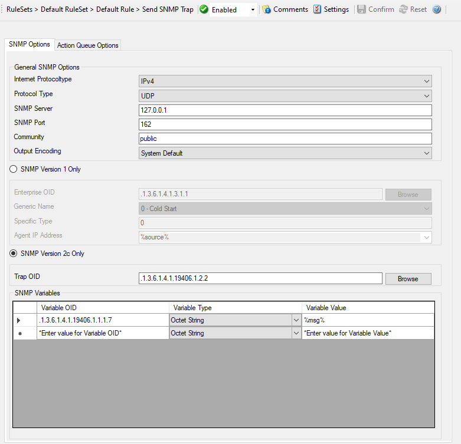
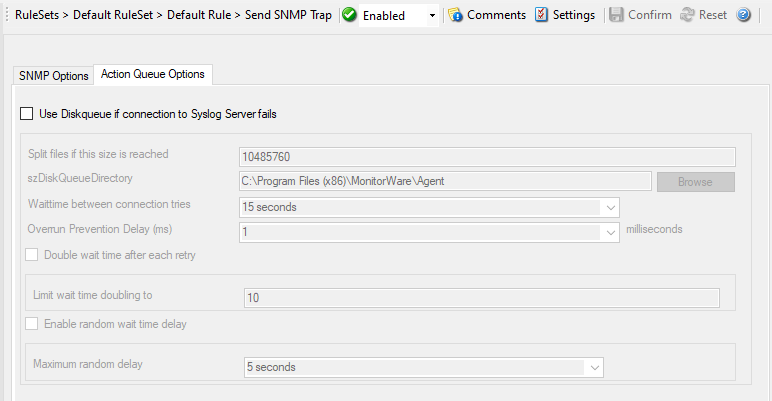

Send SNMP Trap
==============

General Options
---------------

* Action - Send SNMP Trap Options*

**SNMP Version**

You can choose between SNMP Version 1 Only and SNMP Version 2c Only.
Both options have different SNMP related configuration properties which need
to be configured.

Internet Protocoltype
^^^^^^^^^^^^^^^^^^^^^

**File Configuration field:**
  nInetType

**Description:**
  Select the desired protocol type. IPv4 and IPv6 are available. The IPv6
  protocol needs to be properly installed in order to be used. Note that one
  Service can only handle IPv4 or IPv6, so if you want to use both protocols,
  you will need to create two separate services.

Protocol Type
^^^^^^^^^^^^^

**File Configuration field:**
  nProtocolType

**Description:**
  You can select to listen on UDP or TCP protocol for SNMP Traps.

SNMP Server
^^^^^^^^^^^

**File Configuration field:**
  szAgent

**Description:**
  Specify the agent that has to receive the SNMP trap. Please note that
  specifying a host name can cause the SMTP probe to fail if DNS name
  resolution fails (for example due to a failing DNS server). To avoid this,
  specify an IP address. You can either use an IPv4, an IPv6 Address or a
  Hostname that resolves to an IPv4 or IPv6 Address.

SNMP Port
^^^^^^^^^

**File Configuration field:**
  nPort

**Description:**
  This port is to be probed. Please see your server's reference for the actual
  value to use. For example, mail servers typically listen to port 25 and web servers to 80.

Community
^^^^^^^^^

**File Configuration field:**
  szCommunity

**Description:**
  Specify the SNMP community to which the messages belong too.

SNMP V1 Specific Parameters
---------------------------

Under this group box you can see the parameters related to SNMP version 1.

Enterprise OID
^^^^^^^^^^^^^^

**File Configuration field:**
  nInetType

**Description:**
  It is also an optional value which can be used to specify a UserAgent that is
  send in the HTTP header.

  Specify the enterprise object ID here. You can use Browse option to select
  your OID. If you click the Browse link, the screen similar to shown below is
  appeared:

  .. image:: ../images/mib-browser-snmp-trap.png
   :width: 100%

  MIB Browser

  You can select your MIB here.

Generic Name
^^^^^^^^^^^^

**File Configuration field:**
  nGenericName

  * 0 - Cold Start
  * 1 - Warm Start
  * 2 - Link Down
  * 3 - Link Up
  * 4 - Authentication Failure
  * 5 - EGP Neighbor Loss
  * 6 - Enterprise Specific

**Description:**
  You can specify the generic name of the trap which can be one of these:
  coldStart(0), warmStart(1), linkDown(2), linkUp(3), authenticationFailure(4),
  egpNeighborLoss(5), or enterpriseSpecific(6).

Specific Type
^^^^^^^^^^^^^

**File Configuration field:**
  nSpecificType

**Description:**
  You can define an additional code for the trap. It is also an Integer value.

Agent IP Address
^^^^^^^^^^^^^^^^

**File Configuration field:**
  szAgentIP

**Description:**
  The SNMPv1 Agent Address field can be set to other IP Addresses here.
  Hostnames will automatically be resolved if possible. By default we are using
  the %source% property.

**SNMP Variables**

These are the variables to send in the SNMP Trap. If you know the trap codes,
you can enter them manually, otherwise use the built-in SNMP MIB Browser.

Variable OID
^^^^^^^^^^^^

**File Configuration field:**
  szVariableOID_[n]

**Description:**
  OID of the SNMP Trap. Use the built-in SNMP MIB Browser for a list of known
  and available OIDs.

Variable Type
^^^^^^^^^^^^^

**File Configuration field:**
  nVariableType_[n]

  * 1 = TYPE_OBJID
  * 2 = TYPE_OCTETSTR
  * 3 = TYPE_INTEGER
  * 5 = TYPE_IPADDR
  * 6 = TYPE_COUNTER
  * 7 = TYPE_GAUGE
  * 8 = TYPE_TIMETICKS
  * 12 = TYPE_BITSTRING
  * 14 = TYPE_UINTEGER
  * 15 = TYPE_UNSIGNED32
  * 16 = TYPE_INTEGER32

**Description:**
  The variable type of the variable, usually OCTETSTRING or INTEGER. Depending
  on this type, the Variable value needs to be formatted correctly (Like for
  the type IPADDR).

Variable Value
^^^^^^^^^^^^^^

**File Configuration field:**
  szVariableValue_[n]

**Description:**
  The value of the Variable. It needs to be formatted depending on the variable type.

**Please Note:**

**The "Send SNMP Trap"-Action is capable of sending all kinds of Traps. You can choose the whole variety of the MonitorWare Products' Properties as a value for the messages. With that, you can send SNMP Traps to the Windows internal SNMP
Agent or any other device that is able to receive SNMP Traps. Of course you
have full enterprise support, too. This gives you the possibility to involve
every machine on your network into your security plan or whatever purpose it
should serve.**

Action Queue Options
--------------------

* Action - Send SNMPT Trap Action Queue*

Use Diskqueue if connection to Syslog server fails
^^^^^^^^^^^^^^^^^^^^^^^^^^^^^^^^^^^^^^^^^^^^^^^^^^

**File Configuration field:**
  nUseDiscQueue

**Description:**
  Enable diskqueuing syslog messages after unexpected connection loss.

Split files if this size is reached
^^^^^^^^^^^^^^^^^^^^^^^^^^^^^^^^^^^

**File Configuration field:**
  nDiskQueueMaxFileSize

**Description:**
  Files will be split until they reach the configured size in bytes. The
  maximum support file size is 10485760 bytes.

Diskqueue Directory
^^^^^^^^^^^^^^^^^^^

**File Configuration field:**
  szDiskQueueDirectory

**Description:**
  The directory where the queue files will be generated in. The queuefiles will
  be generated with a dynamic UUID bound to the action configuration.

Waittime between connection tries
^^^^^^^^^^^^^^^^^^^^^^^^^^^^^^^^^

**File Configuration fields:**
  nDiskCacheWait

**Description:**
  The minimum waittime until the Syslog Action retries to establish a
  connection to the Syslog server after failure.

Overrun Prevention Delay (ms)
^^^^^^^^^^^^^^^^^^^^^^^^^^^^^

**File Configuration field:**
  nPreventOverrunDelay

**Description:**
  When the Action is processing syslog cache files, an overrun prevention delay
  can be added to avoid flooding the target Syslog server.

Double wait time after each retry
^^^^^^^^^^^^^^^^^^^^^^^^^^^^^^^^^

**File Configuration field:**
  bCacheWaittimeDoubling

**Description:**
  If enabled, the configured waittime is doubled after each try.

Limit wait time doubling to
^^^^^^^^^^^^^^^^^^^^^^^^^^^

**File Configuration field:**
  nCacheWaittimeDoublingTimes

**Description:**
  How often the waittime is doubled after a failed connection try.

Enable random wait time delay
^^^^^^^^^^^^^^^^^^^^^^^^^^^^^

**File Configuration field:**
  bCacheRandomDelay

**Description:**
  If enabled, a some random time will be added into the waittime delay. When
  using many syslog senders, this can avoid that all senders start sending
  cached syslog data to the Syslog server at the same time.

Maximum random delay
^^^^^^^^^^^^^^^^^^^^

**File Configuration field:**
  nCacheRandomDelayTime

**Description:**
  Maximum random delay time that will be added to the configured waittime if
  Enable random wait time delay is enabled.
