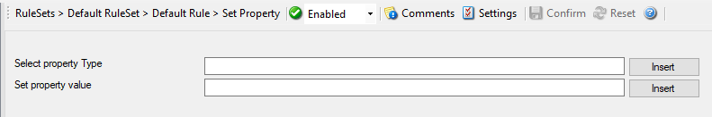

Set Property
============

You can set every property and custom properties using this action.

This dialog controls the set property options. With the "Set Property" action,
some properties of the incoming message can be modified. This is especially
useful if an administrator would like to e.g. rename two equally named devices.

**Please note: when you change or create a property, the value will be changed as soon as the set property action is carried out. It will not change before that happens and the old value is no longer available thereafter. That means all
actions and filter conditions will use the new value after it is set. So, if
you would like e.g. rename a system, make sure the set property actions are at
the top of the rule base!**

* Action - Set Property*

Select Property Type
^^^^^^^^^^^^^^^^^^^^

**File Configuration field:**
  szPropertyType

**Description:**
  Select the property type to be changed. The list box contains all properties
  that can be changed. By default it is set to nothing.

  Please note that the field content can be configured with
  :doc:`event properties <../shared/references/eventspecificproperties>` are described in the
  :doc:`property replacer section <../shared/references/eventproperties>`.

Set Property Value
^^^^^^^^^^^^^^^^^^

**File Configuration field:**
  szPropertyValue

**Description:**
  The value to be assigned to the property. Any valid property type value can be entered.

  Please note that the field content can be configured with
  :doc:`event properties <../shared/references/eventspecificproperties>` are described in the
  :doc:`property replacer section <../shared/references/eventproperties>`.
