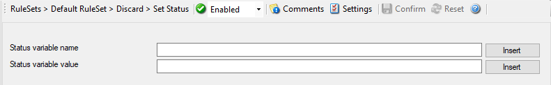

:orphan:

.. _action-setstatus:
.. supporting-labels-marker

Set Status
==========

Each information unit have specific properties e.g. EventID, Priority, Facility
etc. These properties have some values. Lets suppose that EventID has property
value 01. Now, If you want to add "a new property of your own choice" in the
existing set of properties then Set Status action allows you to accomplish this!

You can create a new property and assign any valid desired value to it e.g. we
create a new property as CustomerID and set its value to 01. After you have
created the property through this action, then you can define filters for them.
There is an internal status list within the product which you can use for more
complex filtering.

Please note: when you change a property, the value will be changed as soon as
the set status action is carried out. It will not change before that happens
and the old value is no longer available thereafter. That means all actions and
filter conditions will use the new value after it is set. So if you would like
e.g. rename a system, make sure the set status actions are at the top of the
rule base!

* Action - Set Status*

Status Variable Name
^^^^^^^^^^^^^^^^^^^^

**File Configuration field:**
  szPropertyName

**Description:**
  Enter the Property name. That name will from now on be used inside the rule
  base. More precisely, it will be used in the filter conditions and actions.

  Please note that the field content can be configured with
  :doc:`event properties <../shared/references/eventspecificproperties>` are described in the
  :doc:`property replacer section <../shared/references/eventproperties>`.

Status Variable Value
^^^^^^^^^^^^^^^^^^^^^

**File Configuration field:**
  szPropertyValue

**Description:**
  The value to be assigned to the property. Any valid property type value can be entered.

  Please note that the field content can be configured with
  :doc:`event properties <../shared/references/eventspecificproperties>` are described in the
  :doc:`property replacer section <../shared/references/eventproperties>`.
