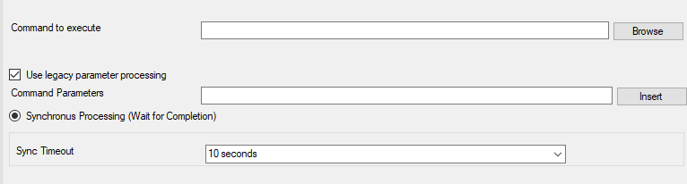

Start Program
=============

With the "Start Program" action, an external program can be run. Any valid
Windows executable can be run. This includes actual programs (EXE files), as
well as scripts like batch files (.BAT), or VB scripts (.vbs).

Start process can, for example, be combined with the service monitor to restart
failed services. Another example application is a script that deletes temporary
files if the disk space monitor detects a low space condition.

* Action - Start Program*

Command to execute
^^^^^^^^^^^^^^^^^^

**File Configuration field:**
  szCommand

**Description:**
  This is the path of actual program file to be executed. This can be the path
  of any valid executable file. A relative file name can be specified if it can
  be found via the operating system default search path.

Use legacy parameter processing
^^^^^^^^^^^^^^^^^^^^^^^^^^^^^^^

**File Configuration field:**
  nUseLegacyProcessing

**Description:**
  When enabled, old style parameter processing is used. Otherwise all
  properties can be used.

Parameters
^^^^^^^^^^

**File Configuration field:**
  szParameters

**Description:**
  These parameters are passed to the program executed. They are passed as
  command line parameters. There is no specific format – it is up to the script
  to interpret them.

  Parameters can contain replacement characters to customize it with event
  details. This allows passing event data to the script. The following
  replacement characters can be used:

  * %d Date and time in local time
  * %s IP address or name (depending on the "resolve hostnames" setting) of the
    source system that sent the message.
  * %f Numeric facility code of the received message
  * %p Numeric priority code of the received message
  * %m The message itself
  * %% Represents a single % sign.

  In the example above, replacement characters are being used. If a message
  "This is a test" were received from "172.16.0.1", the script would be started
  with 3 parameters:

  Parameter 1 would be the string "e1" – it is assumed that this has some
  meaning to the script. Parameter 2 would be the IP address, 172.16.0.1.
  Parameter 3 would be "This is a test". Please note that due to the two quotes
  ("), the message is interpreted as a single parameters. If they were missing,
  it would typically be split into several ones, with parameter 3 being "This",
  4 being "is", and so on. So these quotes are very important!

Sync Timeout
^^^^^^^^^^^^

**File Configuration field:**
  nSyncTimeOut

**Description:**
  Time Out option is under Sync. Processing. When a program is executed, the
  service waits for it to finish before it carries on further actions. This is
  needed in order to ensure that all actions are carried out in the correct
  sequence.

  The external program should only run for a limited amount of time. If it
  would block for some reason, the agent would be prevented from carrying out
  any further processing. As such, a timeout value must be specified. If the
  program still runs after the configured timeout, the rule engine cancels it,
  flags the action as unsuccessful, and then carries on with processing.

  Important: Even though the timeout value can be as high as 30 seconds, we
  strongly recommend limiting the run time of external program to below 5
  seconds. Otherwise, they could affect the overall performance too much. If
  the average run time is 5 seconds, the default timeout of 10 seconds ensures
  that the program can finish even when there is high system activity.

  For performance reasons, we also strongly recommend to use the
  "Start Program" action only for rules that apply relatively seldom.
