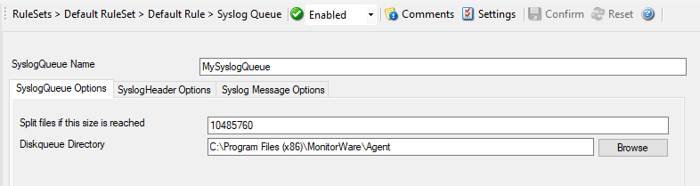
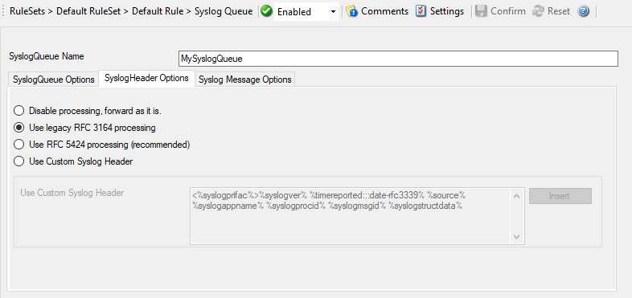
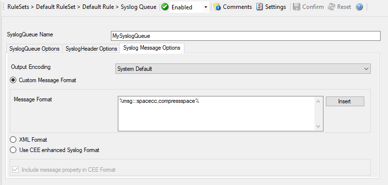

Syslog Queue Action
===================

The Syslog Queue Action was added as part of the
:doc:`passive syslog listener service <passivesysloglistener>`.
All messages send to this action are stored preformatted in disk based
queuefiles. Therefore you can configure the Syslog Header and message format in
this action as well.

* Action - SyslogQueue Options*

SyslogQueue Name
^^^^^^^^^^^^^^^^

**File Configuration field:**
  szSyslogQueue

**Description:**
  The internal Name of the SyslogQueue, must be unique. The Configuration
  Client will verify the Name is unique while you save the configuration.

Split files if the size is reached
^^^^^^^^^^^^^^^^^^^^^^^^^^^^^^^^^^

**File Configuration field:**
  nDiskQueueMaxFileSize

**Description:**
  The size in bytes when queue files are split, by default this is set to 10MB
  (10485760). However you may configured a larger size to have less files, but
  you should not go below 100KB. This could result in to many queuefiles.

Diskqueue Directory
^^^^^^^^^^^^^^^^^^^

**File Configuration field:**
  szDiskQueueDirectory

**Description:**
  The default directory where the queue files are saved into.

SyslogHeader Options
--------------------

* Action - SyslogQueue SyslogHeader*

Syslog processing
^^^^^^^^^^^^^^^^^

**File Configuration field:**
  szSyslogQueue

**Description:**
  With this settings you can assign how your syslog messages will be processed.
  For processing syslog you can choose out of four different options.
  You can use :doc:`rfc 3164 <../glossaryofterms/rfc3164>` or RFC 5424 (recommended)
  which is the current syslog standard, you are able to customize the syslog
  header or you do not process your syslog and forwards it as it is.

Use Custom Syslog Header
^^^^^^^^^^^^^^^^^^^^^^^^

**File Configuration field:**
  szSyslogQueue

**Description:**
  In this field you can specify the contents of your syslog header. This option
  is only available when you choose "Use Custom Syslog Header" in the Syslog
  Processing menu. The contents can be either a fixed message part which you
  can write into the field yourself or you use properties as dynamic content.
  By default the Header field is filled with the content of the RFC 5424
  header.

  Please note that the field content can be configured with
  :doc:`event properties <../shared/references/eventspecificproperties>` are described in the
  :doc:`property replacer section <../shared/references/eventproperties>`.

Syslog Message Options
----------------------

* Action - SyslogQueue Syslog Message*

Message Format
^^^^^^^^^^^^^^

You can use several different message formats for forwarding messages via syslog.

Output Encoding
^^^^^^^^^^^^^^^

**File Configuration field:**
  nOutputEncoding

**Description:**
  This setting is most important for Asian languages. A good rule is to leave
  it at "System Default" unless you definitely know you need a separate
  encoding. "System Default" works perfect in the far majority of cases, even
  on Asian (e.g. Japanese) Windows versions.

Custom Message Format
^^^^^^^^^^^^^^^^^^^^^

**File Configuration field:**
  nMessageFormatType = 0

**Description:**
  The custom format lets you decide how the content of a syslog message looks
  like. You can use properties to insert content dynamically or have fixed
  messages that appear in every message.

  Please note that the field content can be configured with
  :doc:`event properties <../shared/references/eventspecificproperties>` are described in the
  :doc:`property replacer section <../shared/references/eventproperties>`.

XML Format
^^^^^^^^^^

**File Configuration field:**
  nMessageFormatType = 1

**Description:**
  If this option is checked, the forwarded Syslog message is a complete
  XML-formatted information record. It includes additional information like
  timestamps or originating system in an easy to parse format.

  The XML formatted message is especially useful if the receiving system is
  capable of parsing XML data. However, it might also be useful to a human
  reader as it includes additional information that cannot be transferred
  otherwise.

Use CEE enhanced Syslog Format
^^^^^^^^^^^^^^^^^^^^^^^^^^^^^^

**File Configuration field:**
  nMessageFormatType = 2

**Description:**
  If enabled, the new CEE enhanced Syslog format will be used (work in
  progress). All useful properties will be included in a JSON Stream. The
  message itself can be included as well, see the "Include message property in
  CEE Format" option. Here is a sample how the format looks like for a security
  Eventlog message:

  @cee: {"source": "machine.local", "nteventlogtype": "Security", "sourceproc":
  "Microsoft-Windows-Security-Auditing", "id": "4648", "categoryid": "12544",
  "category": "12544", "keywordid": "0x8020000000000000", "user": "N\\A",
  "SubjectUserSid": "S-1-5-11-222222222-333333333-4444444444-5555",
  "SubjectUserName": "User", "SubjectDomainName": "DOMAIN", "SubjectLogonId":
  "0x5efdd", "LogonGuid": "{00000000-0000-0000-0000-000000000000}",
  "TargetUserName": "Administrator", "TargetDomainName": " DOMAIN ",
  "TargetLogonGuid": "{00000000-0000-0000-0000-000000000000}",
  "TargetServerName": "servername", "TargetInfo": " servername ", "ProcessId":
  "0x76c", "ProcessName": "C:\\Windows\\System32\\spoolsv.exe", "IpAddress":
  "-", "IpPort": "-", "catname": "Logon", "keyword": "Audit Success", "level":
  "Information", }

  Additionally to this format you can set Include message property in CEE Format

  If enabled, the message itself will be included in the JSON Stream as
  property. Disable this option if you do not want the message itself in the
  CEE Format.

  Please note that the field content can be configured with
  :doc:`event properties <../shared/references/eventspecificproperties>` are described in the
  :doc:`property replacer section <../shared/references/eventproperties>`.
