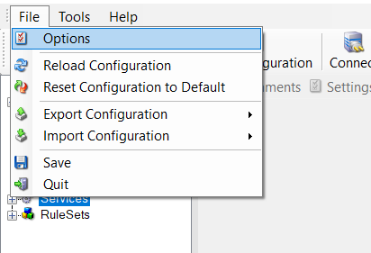
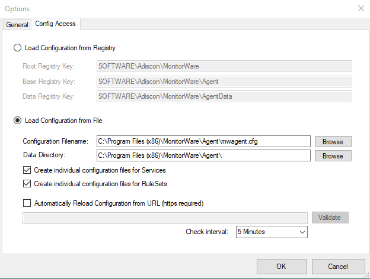

Client Options
==============

There are several options, that refer to the configuration client and not to
the service. These can be found under File -> Options

* Client Options*

.. image:: ../images/clientoptions_2.png
   :width: 80%

* General Tab*

**Choose your language**
  You can choose a language pack. "English" is the default and suggested language.

**Suppress warning when a service is deleted**
  If this option is checked you will not get a warning when you try to delete a
  service and there is no other service that uses the connected ruleset.

**Suppress autosave warning message**
  If you make changes in the configuration and switch to another component, a
  warning will occur if you haven't saved the changes. This warning will also
  allow you to directly enable auto-saving the configuration.

**Always ask to reload application after language change**
  When you change the language, a popup will ask you to reload the configuration
  client to properly apply the changes and load with the set language.

**Load SNMP Mibs Description (Slows OID Browser down first time)**
  If enabled, load SNMP Descriptions from MIB files (Client starts a little
  slower on startup).

**Automatically sort Datagrids**
  Datagrids are used in certain areas within the configuration objects. You can
  change the default sorting behavior from ascending to descending here.

* Config Access Tab*

**Load Configuration from Registry**
  The Configuration Client can be switched to a different registry path for
  configuration. The registry path change can be made permanent here. The changed
  registry path is the saved within the Parameters key of the Service.

**Load Configuration from File**
  Alternatively, you can configure the service to load the configuration from a
  file. You can set the paths with the two fields below.

  When enabled, the configuration will always be backed up before applying the
  new configuration. The backup consists of the last iteration and will be placed
  in the same directory.

**Create individual configuration files for Services**
  Can only be enabled when "Load Configuration from File" is enabled. When
  enabled, the Services section of the configuration will be put into a separate
  file.

**Create individual configuration files for RuleSets**
  Can only be enabled when "Load Configuration from File" is enabled. When
  enabled, the RuleSet section of the configuration will be put into a separate
  file.

**Automatically Reload Configuration from URL (https required)**
  Only possible if File Configuration Mode is used.

  If enabled, the configuration will be reloaded from a remote https location.
  Please note that a valid SSL certificate is required, or if custom
  certificates are used they have to be imported on the local machine properly.

  If the remote configuration file can be downloaded from the configured
  location and differs from the current configuration, it will be installed
  automatically and the service will reload itself.

**Check interval**
   Specifies how often the service will check for remote configuration files.
   Please keep in mind that the configuration needs to be downloaded each time
   from the remote https url for comparison with the local one. We do not
   recommend to use a value lower then 5 minutes.
