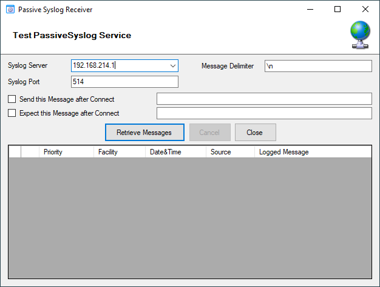
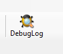

Client Tools
============

There are tools within the configuration client that you can use to test
certain services or debug the application in general. Some can be found in
the Tools menu.

Syslog Test Message
^^^^^^^^^^^^^^^^^^^

Opens a new windows which can send syslog test messages to Syslog Servers. This
can also be opened within the configuration window of a Syslog service.

* Syslog Test Message Connection properties - UDP*

**Syslog server**
  The hostname or ip address of the target Syslog server.

**Syslog Port**
  The port that should be used to connect to the target Syslog server.

**Repeat Message**
  How often you want to repeat the test message. Can be configured from 1 to 1000.

**Sleeptime between sending**
  When using TCP, you can use 0ms. For UDP we recommend 1-5ms as sleeptime
  between sending syslog messages. Otherwise package loss can happen.

**Append Number to Syslog Message**
  If sending multiple messages, enable this option in order to add a syslog
  number at the end of the message.

**Network Protocol**
  Which network protocol should be used, either UDP or TCP can be selected.

* Syslog Test Message Connection properties - TCP*

**Message Delimiter (TCP related Options)**
  When using TCP protocol, a message delimiter (separator) can be configured
  which is a simple linefeed by default.

**Enable SSL/TLS Encryption (TCP related Options)**
  Check this option to enable the TLS related Options.

**TLS related Options (TCP related Options)**
  Select common CA:
  Select the certificate from the common Certificate Authority (CA), the syslog receiver should use the same CA.

  Select Certificate:
  Select the client certificate (PEM Format).

  Select Key:
  Select the keyfile for the client certificate (PEM Format).

* Syslog Test Message Message properties*

**Load RAW Syslogdata from File**
  You can choose to load raw syslogdata from file using this option. When loading
  UTF8 data make sure to set the Output encoding format from ASCII to UTF8. And
  if your file contains multiple syslog messages make sure that - Send One Message
  per LineFeed - is checked.

**Configure Syslog message with these properties**
  Choose this if you want to configure all properties of the syslog message
  manually.

**Send one Message per LineFeed**
  Check if your syslogdata contains multiple syslog messages divided by line feeds

**Output encoding**
  Select the Output encoding you wish to use. When using UTF8, the UTF8 BOM is
  automatically prepended.

Passive Syslog Receiver
^^^^^^^^^^^^^^^^^^^^^^^

Opens a new windows to test Passive Syslog Servers. This can also be opened
within the configuration window of a Passive Syslog service.

* Test Passive Syslog Service*

**Syslog server**
  The hostname or ip address of the target passive Syslog server.

**Syslog Port**
  The port that should be used to connect to the target passive Syslog server.

**Message Delimiter**
  The message delimiter (separator) used to split syslog messages which is a
  simple linefeed by default.

**Send this Message after Connect**
  If required, configure a custom message that is send to the server after
  connect.

**Expect this Message after Connect**
  If required, configure a custom message that is expected by the sender when the
  server response to our custom message.

Network Discovery
^^^^^^^^^^^^^^^^^

Opens up a Wizard that will help you discover devices in your local network.
Once the wizard has scanned your network, it will show Windows compatible
devices it has found. Please note that this will require Windows Management
Instrumentation (WMI) access to the remote machines which may be disabled in
Windows Firewalls by default.

.. image:: ../images/networkdiscovery.png
   :width: 80%

* Network Discovery - Choose the discovery Method*

Kill Service
^^^^^^^^^^^^

When stopping a service, and it does not shutdown in the time period, you can
use this function to forcefully stop the service. The service process will be
killed if possible.

DebugLog
^^^^^^^^

The **DebugLog** Button will be available if Debug Logging is enabled in your
Debug Options

* DebugLog*

When clicked, a new Logviewer window will be opened. The Debug Logviewer can
load, parse, and analyze debug log-files from the service.

* Logviewer (Debug)*

**Debugfile**
  Will automatically be set to your configured debug file. You can also choose
  other saved debug-files for analysis.

**Load**
  When Load is clicked, the Logviewer will load lines as configured in the
  initial debug-lines field. When loading all log-lines on a large debug
  log-file, this may take a while. While the Load button is grayed out, the
  Logviewer will continue to read data from the debug log as it is being written.

**Stop**
  Stop continuous loading of the debug log.

**Reset**
  Will reset all loaded log-lines from memory and clear the debug data-grid.

**Init Debuglines**
  The amount of log-lines you want to read the first time.

**Show debug messages for**
  Once the debug-log is processed, the Logviewer will automatically add filters
  for objects like services, rulesets, rules, and actions. You can use this select
  box to filter by them.

**Filtering (bottom bar)**
  At the bottom of the Logviewer window, you can filter the debug-log for Thread
  (ID), Priority, internal Facility, and Functions. You can also filter for words
  or word sequences. The view will automatically be refreshed once you changed a
  filter.
