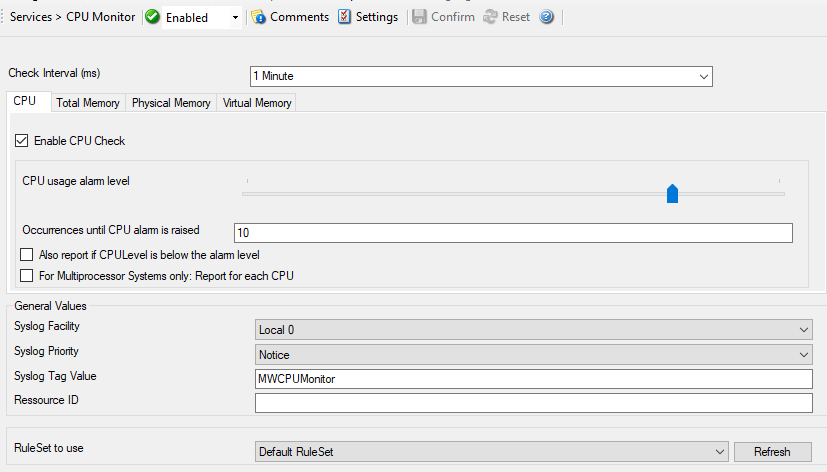
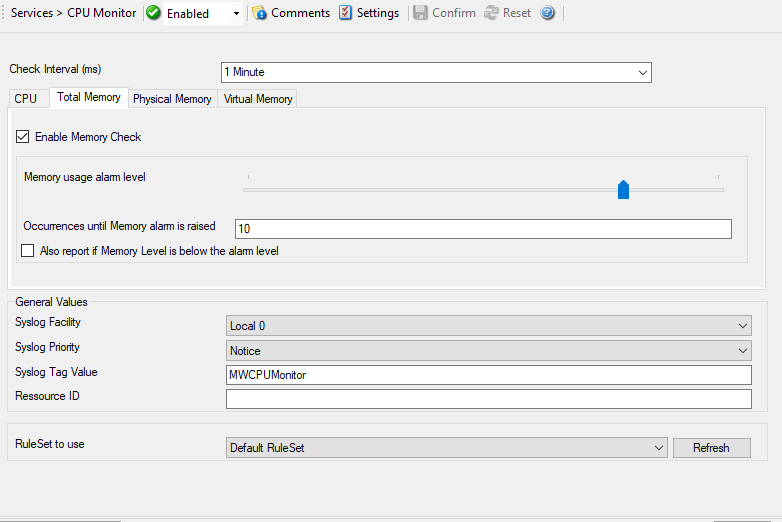
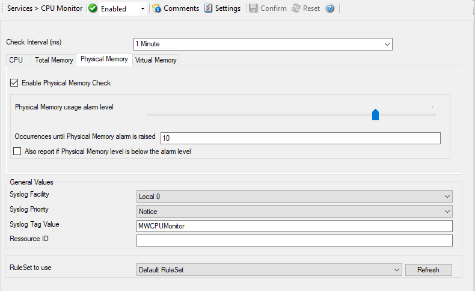
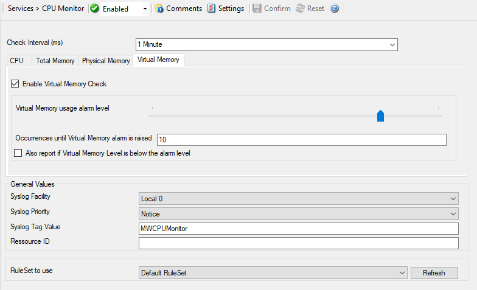

CPU/Memory Monitor
==================

The CPU/Memory monitor has two parts of monitoring, a CPU and a Memory part.
Both parts are checked frequently in a specified check interval. By default
this interval is configured to 60 seconds so a check is done after every 1
minute. Both CPU and memory part can be disabled and enabled. The service
becomes useless if you disable both parts.

* Service - CPU/Memory Monitor*

Here you find a series of tabs namely CPU, Total Memory, Physical Memory, and
Virtual Memory.

Check Interval
^^^^^^^^^^^^^^

**File Configuration field:**
  nSleepTime

**Description:**
  The CPU/Memory Monitor runs periodically. This specifies, how often it should
  run. Please note that the CPU / Memory Monitor waits the configured amount of
  time after the current run is finished. The time is the delay in
  :doc:`milliseconds <../glossaryofterms/millisecond>`.

CPU Tab
^^^^^^^

Enable CPU Check
^^^^^^^^^^^^^^^^

**File Configuration field:**
  nCPUEnable

**Description:**
  If this option is checked then it allows you to monitor the CPU.

CPU usage alarm level
^^^^^^^^^^^^^^^^^^^^^

**File Configuration field:**
  nCPUUsageAlarmLevel

**Description:**
  If the CPU usage reaches this level, an event is generated internally.
  Depending on how the occurrences value is configured, an Information Unit is
  generated.

  **Note: this value is in terms of percentage.**

Occurrences until CPU alarm is raised
^^^^^^^^^^^^^^^^^^^^^^^^^^^^^^^^^^^^^

**File Configuration field:**
  nCPUOccurences

**Description:**
  Defines how often the CPU usage level has to occur in a row until an event is
  raised.

Also report if CPU Level is below the alarm level
^^^^^^^^^^^^^^^^^^^^^^^^^^^^^^^^^^^^^^^^^^^^^^^^^

**File Configuration field:**
  nCPUReportIfBelowAlarm

**Description:**
  If this option is checked it generates an Information Unit during each run
  whether it is below the alarm level or above. This option is useful for
  statistics and debugging.

For Multiprocessor Systems only: Report for each CPU
^^^^^^^^^^^^^^^^^^^^^^^^^^^^^^^^^^^^^^^^^^^^^^^^^^^^

**File Configuration field:**
  nCPUSingle

**Description:**
  This option can only be used if you have a Multiprocessor System. When this
  option is checked the CPU usage is analyzed for each CPU and for the whole
  amount of CPU usage.

Total Memory Tab
----------------

Enable Memory Check
^^^^^^^^^^^^^^^^^^^

**File Configuration field:**
  nMEMEnable

**Description:**
  If this option is checked then it allows you to monitor the memory.

Memory usage Alarm level
^^^^^^^^^^^^^^^^^^^^^^^^

**File Configuration field:**
  nMEMUsageAlarmLevel

**Description:**
  Defines the alarm level for the memory usage. Note that virtual and physical
  memory are calculated together.

  **Note that this value is in terms of percentage.**

Occurrences until Memory alarm is raised
^^^^^^^^^^^^^^^^^^^^^^^^^^^^^^^^^^^^^^^^

**File Configuration field:**
  nMEMOccurences

**Description:**
  Defines how often the memory usage has to be over the memory usage alarm
  level in a row.

Also report if Memory Level is below the alarm level
^^^^^^^^^^^^^^^^^^^^^^^^^^^^^^^^^^^^^^^^^^^^^^^^^^^^

**File Configuration field:**
  nMEMReportIfBelowAlarm

**Description:**
  This also generates an event if the memory usage is below the alarm level. A
  useful option for testing and debugging.

Physical Memory Tab
-------------------

Enable Physical Memory Check
^^^^^^^^^^^^^^^^^^^^^^^^^^^^

**File Configuration field:**
  nMEMPsyEnable

**Description:**
  If this option is checked then it allows you to monitor the physical memory.

Physical Memory usage alarm level
^^^^^^^^^^^^^^^^^^^^^^^^^^^^^^^^^

**File Configuration field:**
  nMEMPsyUsageAlarmLevel

**Description:**
  Defines the alarm level for the physical memory usage.

  **Note that this value is in terms of percentage.**

Occurrences until alarm is raised
^^^^^^^^^^^^^^^^^^^^^^^^^^^^^^^^^

**File Configuration field:**
  nMEMPsyOccurences

**Description:**
  Defines how often the physical memory usage has to be over the physical
  memory usage alarm level in a row.

Also report if Physical Memory level is below the alarm level
^^^^^^^^^^^^^^^^^^^^^^^^^^^^^^^^^^^^^^^^^^^^^^^^^^^^^^^^^^^^^

**File Configuration field:**
  nMEMPsyReportIfBelowAlarm

**Description:**
  This also generates an event if the physical memory usage is below the alarm
  level. A useful option for testing and debugging.

Virtual Memory Properties
-------------------------

Enable Virtual Memory Check
^^^^^^^^^^^^^^^^^^^^^^^^^^^

**File Configuration field:**
  nMEMVirtEnable

**Description:**
  If this option is checked then it allows you to monitor the virtual memory.

Virtual Memory usage alarm level
^^^^^^^^^^^^^^^^^^^^^^^^^^^^^^^^

**File Configuration field:**
  nMEMVirtUsageAlarmLevel

**Description:**
  Defines the alarm level for the virtual memory usage.

  **Note that this value is in terms of percentage.**

Occurrences until Virtual Memory alarm is raised
^^^^^^^^^^^^^^^^^^^^^^^^^^^^^^^^^^^^^^^^^^^^^^^^

**File Configuration field:**
  nMEMVirtOccurences

**Description:**
  Defines how often the virtual memory usage has to be over the virtual memory
  usage alarm level in a row.

Also report if Virtual Memory Level is below the alarm level
^^^^^^^^^^^^^^^^^^^^^^^^^^^^^^^^^^^^^^^^^^^^^^^^^^^^^^^^^^^^

**File Configuration field:**
  nMEMVirtReportIfBelowAlarm

**Description:**
  This also generates an event if the virtual memory usage is below the alarm
  level. A useful option for testing and debugging.

General Values (Common settings for most services)
^^^^^^^^^^^^^^^^^^^^^^^^^^^^^^^^^^^^^^^^^^^^^^^^^^

Syslog Facility
^^^^^^^^^^^^^^^

**File Configuration field:**
  nSyslogFacility

**Description:**
  The :doc:`syslog facility <../glossaryofterms/syslogfacility>`  to be assigned to events created by this service.
  Most useful if the message is to forward to a Syslog server.

Syslog Priority
^^^^^^^^^^^^^^^

**File Configuration field:**
  nSyslogPriority

**Description:**
  The Syslog priority to be assigned to events created by this service. Most
  useful if the message is to forward to a Syslog server.

Syslog Tag Value
^^^^^^^^^^^^^^^^

**File Configuration field:**
  szSyslogTagValue

**Description:**
  The Syslog tag value to be assigned to events created by this service. Most
  useful if the message is to forward to a Syslog server

Resource ID
^^^^^^^^^^^

**File Configuration field:**
  szResource

**Description:**
  The :doc:`resource id <../glossaryofterms/resourceid>` to be assigned to events created by this service. Most useful
  if the message is to forward to a Syslog server.

RuleSet to Use
^^^^^^^^^^^^^^

**File Configuration field:**
  szRuleSetName

**Description:**
  Name of the ruleset to be used for this service. The RuleSet name must be a
  valid RuleSet.
