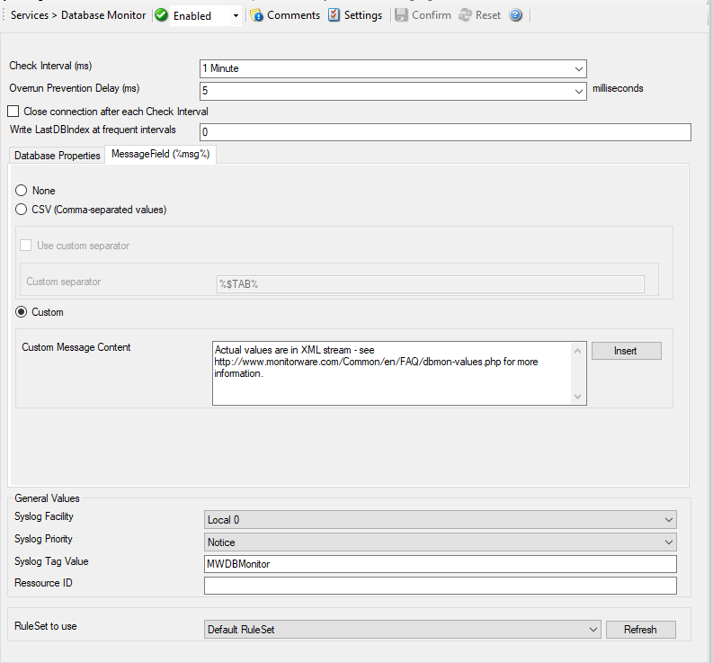

Database Monitor
================

The database monitor is used to monitor database tables. It periodically checks
a database table for new records and if it finds them, generates an event from
each record. A table that is to be monitored by the database monitor must have
an integer ID field that auto-increments.

**Please note that the database monitor transmits all of the data obtained**
within its** :doc:`event properties <../shared/references/eventspecificproperties>`.
This means that you must use an output format suitable to show event properties
if you intend to process the record with a third party application. We strongly
recommend using XML based formatting for this. Alternatively, you can also
select a format for the msg property itself (which is the default message). To
do so, you need to configure the database monitor's advanced option's msg field
settings.

* Service - Database Monitor*

Check Interval (ms)
^^^^^^^^^^^^^^^^^^^

**File Configuration field:**
  nSleepTime

**Description:**
  The database monitor runs periodically. This specifies, how often it should
  run. Please note that the Database Monitor waits for the configured amount of
  time after the current run is finished. The time is the delay in milliseconds.

Overrun Prevention Delay (ms)
^^^^^^^^^^^^^^^^^^^^^^^^^^^^^

**File Configuration field:**
  nPreventOverrunDelay

**Description:**
  This property allows configuring a delay after generating an event. The time
  is the delay in milliseconds.

  If run at a value of zero, the service generates events as fast as the
  machine permits. We have seen scenarios where routers and receivers are not
  able to keep up with this rate, resulting in packet loss. In addition, the
  CPU of the reporting machine is run at 100% - which is not a problem because
  the service runs at a low priority. However, with even a 1-millisecond delay,
  there is no noticeable CPU activity even when large bursts of events are
  forwarded. At one millisecond, the service can still generate 1000 events per
  second.   The default setting is an overrun protection of five millisecond, which
  allows roughly 200 events per second. This should be sufficient for even very
  busy servers.

Close connection after each Check Interval
^^^^^^^^^^^^^^^^^^^^^^^^^^^^^^^^^^^^^^^^^^

**File Configuration field:**
  nForceConnectionClose

**Description:**
  If checked, the database connection will be closed after each checking
  interval. When using a low checking interval, this can have an impact on the
  database performance.

Write LastDBIndex at frequent intervals
^^^^^^^^^^^^^^^^^^^^^^^^^^^^^^^^^^^^^^^

**File Configuration field:**
  nWriteLastDBINdex

**Description:**
  By default, the Last processed DBIndex field will be written after each
  database record. On large database, this can cause additional overhead. In
  order to avoid this problem, you can write the Last DBINdex after 10, 100, or
  even 1000 data records only.

Database Properties Tab
^^^^^^^^^^^^^^^^^^^^^^^

Here you can configure the access data for the database.

DSN
^^^

**File Configuration field:**
  szDBDSN

**Description:**
  The data source name of the database to access. All databases that support
  standard SQL syntax and have an ODBC driver support.

User
^^^^

**File Configuration field:**
  szDBUser

**Description:**
  The User ID to log on to the database system. Please note that the database
  system may not require this setting or may ignore it (e.g. Microsoft SQL
  Server in "integrated" security mode) - please check with your database
  vendor or your administrator if in doubt.

Password
^^^^^^^^

**File Configuration field:**
  szDBPass

**Description:**
  The password to access the database. If the "Enable Encryption" check box is
  checked, a weak symmetrical encryption is applied on the password. Thus, we
  highly recommend to create a specific account with very limited permissions
  if you store a password. This account does only need to have "select"
  permissions.

ID Field Name
^^^^^^^^^^^^^

**File Configuration field:**
  szTableID

**Description:**
  The name of the column in your database table, that will be used as ID field.

Select Clause
^^^^^^^^^^^^^

**File Configuration field:**
  szDBSelect

**Description:**
  You can configure a Select Statement to be issued to the database. This way,
  you have full control over what is fetched from the database.

  .. note::
     If you specify specific fields, the ID field must be present in the select clause;
     otherwise, the service cannot process the records.

Table Name
^^^^^^^^^^

**File Configuration field:**
  szDBTableName

**Description:**
  Enter the name of the table from which the records should be monitored.

Maximum char length (Bytes)
^^^^^^^^^^^^^^^^^^^^^^^^^^^

**File Configuration field:**
  nMAX_VCHAR_LEN

**Description:**
  The maximum supported length in bytes for VARCHAR fields.

Maximum text length (Bytes)
^^^^^^^^^^^^^^^^^^^^^^^^^^^

**File Configuration field:**
  nMAX_LONGVCHAR_LEN

**Description:**
  The maximum support length in bytes for text fields.

Last DB Index
^^^^^^^^^^^^^

**File Configuration field:**
  iLastDBID [Data Value]

**Description:**
  The Database Monitor will store the last processed index of the configured ID
  Field Name into this data value.
  The data value can be controlled using the Reload DB Index number and Reset
  DB Index number buttons or simply by editing the field.
  When saving changes to the Last DB Index, the service will reload the value
  during next check interval and process database records if necessary.

Message Field (%msg%) Tab
-------------------------

* Service - Database Monitor Message Field*

Message Field
^^^^^^^^^^^^^

**File Configuration field:**
  nMessageMode   .. code-block:: text     0 = None
    1 = CSV
    2 = Custom

**Description:**
  This field specifies the content of the "msg" property. By default, msg does
  NOT contain any useful information. This is because all data is provided via
  the event properties. If you actually need this as part of the msg, you can
  either select a custom format or CSV format.

  If CSV is selected, msg contains all field values (not names) in
  comma-separated format. Instead of a comma you can also use any other custom
  separator. The field order is as it was in the select statement. We recommend
  not to use ``select *`` in this case (but specify the fields inside the select
  statement, so that they have a definite order).

  We recommend not to rely on msg with the database monitor. Access via
  properties is much better. If you do not need msg, we recommend to set the msg
  content to "none" as this removes the unnecessary default message.

General Values (Common settings for most services)
^^^^^^^^^^^^^^^^^^^^^^^^^^^^^^^^^^^^^^^^^^^^^^^^^^

Syslog Facility
^^^^^^^^^^^^^^^

**File Configuration field:**
  nSyslogFacility

**Description:**
  The Syslog facility to be assigned to events created by this service. Most
  useful if the message is to forward to a Syslog server.

Syslog Priority
^^^^^^^^^^^^^^^

**File Configuration field:**
  nSyslogPriority

**Description:**
  The Syslog priority to be assigned to events created by this service. Most
  useful if the message is to forward to a Syslog server.

Syslog Tag
^^^^^^^^^^

**File Configuration field:**
  szSyslogTagValue

**Description:**
  The Syslog tag value to be assigned to events created by this service. Most
  useful if the message is to forward to a Syslog server.

Resource
^^^^^^^^

**File Configuration field:**
  szResource

**Description:**
  The Resource ID to be assigned to events created by this service. Most useful
  if the message is to forward to a Syslog server.

RuleSet to Use
^^^^^^^^^^^^^^

**File Configuration field:**
  szRuleSetName

**Description:**
  Name of the ruleset to be used for this service. The RuleSet name must be a
  valid RuleSet.
