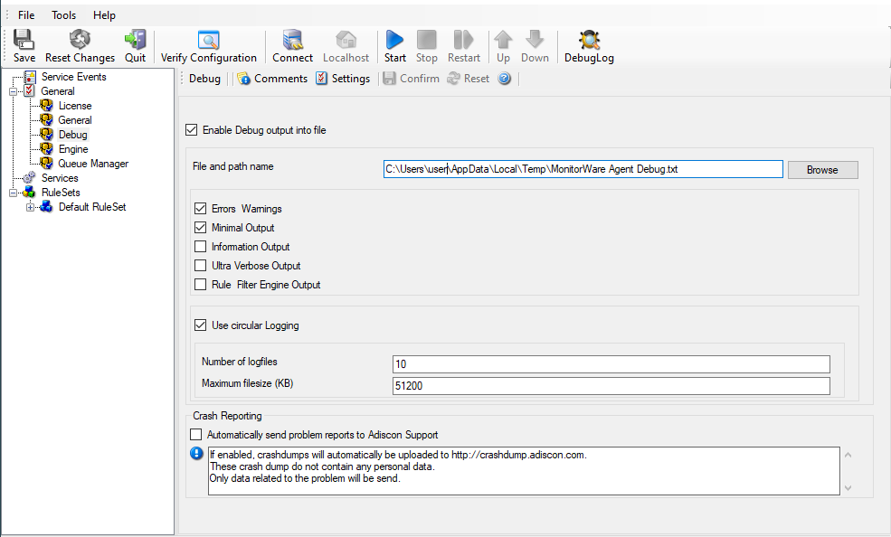

Debug
=====

This tab can be used to debug rule bases. Especially with complex bases, it
might be necessary to learn what application is internally doing while it is
processing them. With the debug log, the service tells you some of these
internal workings.

Other than rule basis testing, the debug log is also helpful when contacting
Adiscon support. An Adiscon support engineer might ask you to set the debug log
to a specific level while doing troubleshooting.

.. note::
   Debug logging requires considerable system resources. The higher the
   log level, the more resources are needed. However, even the lowest level
   considerable slows down the service. As such, we highly recommend turning
   debug logging off for normal operations.

Enable Debug output into file
^^^^^^^^^^^^^^^^^^^^^^^^^^^^^

**File Configuration field:**
  nEnableDebugOutput

**Description**
  If checked, the debug log is enabled and written as the service operates. If
  unchecked, no debug log is written. For performance reasons, it is highly
  recommended that this box is unchecked during normal operations.

File and path name
^^^^^^^^^^^^^^^^^^

**File Configuration field:**
  szDebugFileName

**Description**
  The full name of the log files to be written. Please be sure to specify a
  full path name including the drive letter.
  If just the file and/or path name is specified, that information is local to
  the service default directory. As this depends on a number of parameters, it
  might be hard to find the actual log file. So for consistency purposes, be
  sure to specify a fully qualified file name including the drive.

  Note: If the configured directories are missing, they are automatically
  created by application i.e. the folder specified in "File and Path Name".

Debug Levels
^^^^^^^^^^^^

**File Configuration field:**
  nDebugErrors, nDebugMini, nDebugInternal, nDebugUltra, nDebugRuleEngine

**Description**
  These checkboxes control the amount of debug information being written. We
  highly recommend only selecting "Errors & Warnings" as well as "Minimum Debug
  Output" unless otherwise instructed by Adiscon support.

Use circular Logging
^^^^^^^^^^^^^^^^^^^^

**File Configuration field:**
  nCircularLogging

**Description**
  Support for circular debug logging has been added as the debuglog can
  increase and increase over time. This will avoid an accidental overload of
  the hard disk. Of course you can also customize the amount of files used and
  their size or disable this feature.

Automatically send problem reports to Adiscon Support
^^^^^^^^^^^^^^^^^^^^^^^^^^^^^^^^^^^^^^^^^^^^^^^^^^^^^

**File Configuration field:**
  nReportCrash

**Description**
  If enabled, problem reports will automatically be uploaded to
  ``http://crashdump.adiscon.com``. A problem report is generated if the service
  internally stops working for some unknown reason. The reports are small
  dumpfiles which do not contain any personal data and will help us find and
  fix the problem. Also the dumpfiles are very small and do not exceed 256
  Kbyte. In most cases only 32Kbyte data is send.
