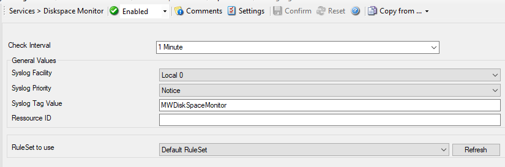

Diskspace Monitor
=================

This monitor checks the available and used space on all hard disks in the
system. All hard disks present in the system are automatically checked. New
disks are automatically detected. One event specifying the maximum size and the
used size is generated per disk. The Disk Space Monitor runs continuously based
on an interval set in the configuration.

* Service - Diskspace Monitor*

Check Interval
^^^^^^^^^^^^^^

**File Configuration field:**
  nSleepTime

**Description:**
  This is the interval in which the service status is checked. This period is
  specified in :doc:`milliseconds <../glossaryofterms/millisecond>`. This
  monitor checks the available and used space on all hard disks in the system.
  All hard disks present in the system are automatically checked. New disks are
  automatically detected. One event specifying the maximum size and the used
  size is generated per disk. The Disk Space Monitor runs continuously based on
  an interval set in the configuration.

  The default is 60,000 ms, which is one minute. This should be sufficient for a
  typical server. If you would like to have the disk space check run less
  often, you might for example use the value of 3,600,000 for one hour (or a
  multiple for multiple hours).

  For performance reasons, we do not recommend using an interval of less than
  30,000 ms.

General Values (Common settings for most services)
^^^^^^^^^^^^^^^^^^^^^^^^^^^^^^^^^^^^^^^^^^^^^^^^^^

Syslog Facility
^^^^^^^^^^^^^^^

**File Configuration field:**
  nSyslogFacility

**Description:**
  The :doc:`syslog facility <../glossaryofterms/syslogfacility>` to be assigned to events created by this service. Most
  useful if the message is to forward to a Syslog server.

Syslog Priority
^^^^^^^^^^^^^^^

**File Configuration fields:**
  nSyslogPriority

**Description:**
  The Syslog priority to be assigned to events created by this service. Most
  useful if the message is to forward to a Syslog server.

Syslog Tag Value
^^^^^^^^^^^^^^^^

**File Configuration field:**
  szSyslogTagValue

**Description:**
  The Syslog tag value to be assigned to events created by this service. Most
  useful if the message is to forward to a Syslog server.

Resource ID
^^^^^^^^^^^

**File Configuration field:**
  szResource

**Description:**
  The :doc:`resource id <../glossaryofterms/resourceid>` to be assigned to
  events created by this service. Most useful if the message is to forward to a
  Syslog server.

RuleSet to Use
^^^^^^^^^^^^^^

**File Configuration field:**
  szRuleSetName

**Description:**
  Name of the ruleset to be used for this service. The RuleSet name must be a
  valid RuleSet.
